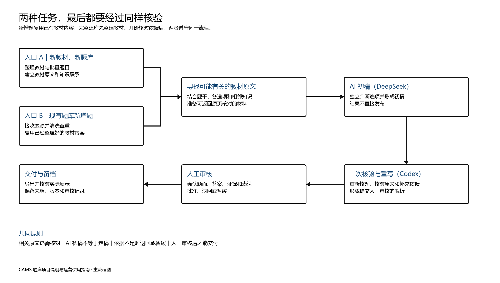

# CAMS 题库项目说明

## 一、速览

### 1. 这个项目解决什么问题

CAMS 题库的目标不是只告诉考生“选哪个”，而是尽量回答三个更重要的问题：

1. 这道题实际在考什么，为什么这样选；
2. 教材依据在哪里，其他选项具体错在哪里；
3. 考生以后遇到相似题目，可以复用什么判断方法。

项目面对的题目主要来自真题回忆、视频截图或第三方题库。这些材料可以帮助了解考试方向，但题干、选项、翻译、参考答案和原解析都可能存在误差。因此，题目不能在简单整理后直接发布，参考答案也不能被当作结论。正式解析需要重新回到当前教材，通过“整理题目、寻找依据、独立判断、复核证据、人工审核”逐步形成。

**一句话理解：解析生成的目的是重新核对题目、答案和教材依据，再把核对结果写成考生能使用的解析。**

### 2. 两种任务，最后都要经过同样核验



完整建库和现有题库新增题目的起点不同：完整建库需要先整理教材和批量题目，新增题则复用已经整理好的教材内容和知识联系。但从寻找依据开始，两者遵守同一套原则：DeepSeek 的结果只是初稿，Codex 必须重新核题和核证，人工审核通过后才能交付。

### 3. 考生能从解析中得到什么

1. **知道考什么：** 用考点定位本题要求识别或区分的能力。
2. **知道为什么：** 理解正确项与题干、教材之间的关系，并看懂错误项的具体问题。
3. **知道怎样复习：** 利用易错提醒和教材依据，把单题经验变成可复用的判断方法。

<!-- PAGE BREAK -->

## 二、为什么采用当前这套处理方法

### 1. 题源需要重新核对

真题回忆、视频截图和第三方题库可以帮助了解考试方向，但可能存在缺字、错位、翻译偏差或参考答案错误。题源提供的是“需要核对的题目”，不能直接替代教材和教研判断。

### 2. 教材优先，中英文互证

解析先从当前教材寻找相关原文，并结合上下文核对适用条件。中文便于理解和表达，英文用于确认术语与原意；找到相关内容只代表进入核对范围，不等于已经证明答案。

### 3. AI 分工，人工终审

| 环节 | 主要作用 | 使用边界 |
|---|---|---|
| DeepSeek 初稿 | 根据题目和待核对材料形成第一版判断与解析 | 不能直接发布 |
| Codex 核验与重写 | 重新核题、核对原文、补充依据并重写解析 | 不能代替人工批准 |
| 人工审核 | 判断题面、答案、依据和表达能否正式使用 | 证据不足时退回或暂缓 |

### 4. 证据不足时不强行确定答案

教材没有直接覆盖、不同来源相互冲突或题面不完整时，应继续查证、退回或暂缓。外部资料必须与教材依据明确区分，未经审核的初稿不能进入正式题库。

**完整的新教材处理、题目整理、教材拆分、检索核验和导出方法，详见《新教材、新题库解析撰写 SOP》；日常运营无需掌握其中的技术执行细节。**

## 三、当前题库的主要特性

| 题库特性 | 实际含义 | 对考生的帮助 | 使用边界 |
|---|---|---|---|
| 题源可追溯 | 保留原始材料，并统一整理题干、选项、题型、语言和答案 | 发现争议时可以返回题源核对，减少漏项和错位 | 保留来源不代表题源答案必然正确，原材料不清时仍需人工补全 |
| 教材证据优先 | 结论尽量回到当前教材的原文、章节和页码 | 学完解析后可以返回教材继续复习 | 相关原文不一定足以直接证明答案 |
| 中英文互证 | 中文负责理解和展示，英文帮助确认术语与原意 | 降低翻译差异造成的概念混淆 | 中英文冲突时必须人工判断 |
| 逐选项判断 | 不只解释正确项，也检查其他选项的错因 | 帮助考生建立排除干扰项的能力 | 没找到依据不能自动等于“错误” |
| 知识联系与易错规则 | 将题目、考点、教材内容和可复用的判断方法联系起来 | 为返回教材复习和判断同类题提供线索 | 用于制作和复核，不代表学习端已具备自动推荐功能 |
| 审核后交付 | 初稿、核验结果和正式发布相互区分 | 减少未经确认的内容进入正式题库 | 自动检查通过不等于人工批准 |

这些特性共同决定了题库的定位：它既是练习材料，也是连接题目与教材的复习入口。考生不应只查看答案字母，而应利用解析中的考点、错因和教材依据完成第二次学习。

## 四、解析各板块为什么这样设计

### 1. 考点：先告诉考生“这道题在考什么”

考点不是简单复制章节标题，而是用一句话指出考生需要识别、区分或判断的能力。例如，同一章节可以同时考定义、职责边界、流程先后、适用条件或风险信号。

它主要解决两个痛点：一是做错后不知道自己缺的是哪部分知识；二是做对了却不知道是掌握了规则还是碰巧猜中。通过考点定位，考生可以把单题经验归入更稳定的知识框架。

### 2. 核心解析：把教材规则和题干信号连起来

核心解析回答“为什么这个选项在本题条件下最合适”。理想结构是：

```text
教材中的规则或定义
-> 题干给出的主体、行为、条件和限定
-> 这些信息如何对应正确项
-> 为什么该项比其他候选项更符合题目所问
```

这部分避免只复述选项，也避免用“因为教材说了”替代推理。考生需要看到的是从教材到题目的判断路径。

### 3. 错误项分析：说明具体错在哪里

错误项并不都属于同一种错误。常见问题包括：

| 错误类型 | 具体表现 | 考生应怎样检查 |
|---|---|---|
| 概念混淆 | 把相近但不同的概念当成同一概念 | 对照定义、对象和用途 |
| 主体错配 | 把董事会、管理层、审计、合规等职责互换 | 先圈出“谁负责” |
| 条件缺失 | 选项只在特定前提下成立，题干没有该前提 | 检查条件是否真的出现 |
| 阶段错位 | 把调查、报告、补救、监督等不同阶段混在一起 | 按流程先后判断 |
| 范围过大或过小 | 使用“所有、仅、必须、完全”等过强表达 | 比较教材原文的程度词 |
| 与题干不匹配 | 表述可能正确，但没有回答本题所问 | 重新确认题干关键词 |
| 证据不足 | 没有足够材料确认选项成立或错误 | 不把“没找到”直接写成“错误” |

逐项分析能帮助考生理解干扰项的设计方式。真正稳定的做题能力，往往来自识别“它为什么差一点”，而不只是记住正确答案。

### 4. 易错提醒：把一道题变成下一道题的判断规则

易错提醒只保留可迁移的结论，例如先看主体、区分监督与执行、注意否定词、识别流程阶段或警惕绝对化表达。它不重复大段解析，也不把个别案例扩大成普遍规则。

考生可以把易错提醒整理成自己的复盘清单。再次练习同类题时，先用清单检查，再查看答案，才能检验规则是否真正掌握。

### 5. 教材依据：让结论可以被核对

教材依据列出解析使用的原文、章节和页码。它有三项作用：

1. 让教研和审核人员确认解析没有编造原文；
2. 让考生返回教材，阅读定义前后的条件、例外和案例；
3. 发现争议时，可以明确讨论的是哪一版教材、哪一段内容。

外部权威资料可以在教材未覆盖时帮助判断，但必须单独标明来源，不能写成教材原文或教材结论。

### 6. 五个板块怎样形成完整学习闭环

```text
考点定位：确认要学什么
-> 核心解析：理解本题如何判断
-> 错误项分析：学会排除干扰项
-> 易错提醒：提炼下次可复用的方法
-> 教材依据：返回原文补足知识背景
```

解析的价值不在于字数多，而在于每个板块承担不同任务，同时避免重复。

### 7. 一个简化例子：普通答案与完整解析有什么区别

以“收到审计发现后应如何回应”这类职责和流程题为例：

| 普通答案型题库 | CAMS 解析进一步提供什么 |
|---|---|
| 给出正确选项 | 指出本题考查“先分析问题根本原因，再确定补救措施”的处理顺序 |
| 简单复述正确项 | 将教材中的根本原因规则与题干中的审计发现联系起来 |
| 只说其他选项不正确 | 分别说明其他选项错在责任主体、处理阶段或监督与执行边界 |
| 学完后只能记住答案 | 提炼“先判断问题所处阶段，再选择对应行动”的复用规则，并提供教材原文位置 |

这个例子说明，解析的重点不是增加篇幅，而是补上“考点、判断路径、选项差异和返回教材”的学习链条。

## 五、考生怎样使用这套题库

> **使用边界：** 本章介绍的是考生怎样利用题库内容完成学习，不代表所有动作都由产品自动完成。错题分类、个人笔记、打乱章节练习和复盘记录，需要考生根据自己使用的学习工具主动完成。

### 1. 系统学习路径

适合希望建立完整知识框架、学习时间相对充足的考生。

#### 阶段一：先建立教材框架

- 先了解教材的章节结构和主要主题，不急于记住所有细节；
- 对英文缩写、机构名称、职责和常见流程建立基础词汇表；
- 阅读时重点区分定义、规则、例外、流程和案例。

#### 阶段二：按章节练题并识别考点

- 完成一道题后，先复述题目实际在问什么，再查看考点；
- 做对的题也要检查理由，区分“真正理解”和“碰巧选中”；
- 做错时先判断属于知识缺失、题干误读还是选项辨析问题。

#### 阶段三：利用解析完成第二次学习

- 用核心解析核对自己的推理顺序；
- 逐项阅读错误项分析，确认每个干扰项的具体问题；
- 将易错提醒改写成自己的检查问题，例如“本题问的是监督还是执行”；
- 返回教材依据，补读原文前后的条件和例外。

#### 阶段四：跨题复盘

- 将错题按概念、主体、流程、条件和范围等错误类型归类；
- 比较不同题目中同一概念的不同问法；
- 复习时先回答自己的易错检查问题，再重新做题；
- 同类题连续稳定判断后，再减少复习频率。

### 2. 短期冲刺路径

适合已经学习过教材、需要尽快发现薄弱点和整理判断规则的考生。

#### 阶段一：用题目进行诊断

- 先独立完成一批题，不边做边查答案；
- 记录不确定题和“虽然做对但理由不清楚”的题；
- 不只统计对错，还要判断错误来自知识、审题还是选项比较。

#### 阶段二：优先处理高价值错题

优先复盘以下题目：

- 正确项和错误项都像是对的；
- 主体、时间、流程阶段或程度词决定答案；
- 参考答案与自己的教材理解不一致；
- 同一知识点反复出错；
- 只能记住答案，无法复述判断理由。

#### 阶段三：压缩为判断规则

- 每道高价值错题只保留一个最关键的判断规则；
- 对主体职责题整理“谁监督、谁执行、谁报告”；
- 对流程题整理先后顺序和触发条件；
- 对定义题整理必要条件与容易混淆的相邻概念；
- 对绝对化选项重点检查教材原文是否真的使用相同程度。

#### 阶段四：混合复核

- 打乱章节重新做题，避免依靠章节提示猜答案；
- 先说出考点和排除理由，再查看解析；
- 仍无法稳定解释的题，回到教材依据而不是继续死记答案。

### 3. 不同错误应该怎样使用解析

| 考生表现 | 优先查看 | 建议动作 |
|---|---|---|
| 不知道题目在问什么 | 考点、题干关键词 | 用自己的话重述问题 |
| 正确项和某个错误项难以区分 | 错误项分析、教材依据 | 比较主体、条件、阶段和范围 |
| 记得答案但换个问法就不会 | 核心解析、易错提醒 | 写出不依赖题号的判断规则 |
| 总在同类职责题上出错 | 考点、错误类型 | 建立角色职责对照表 |
| 对中文术语理解不稳 | 教材中英文依据 | 核对英文术语和中文表达 |
| 对解析结论仍有疑问 | 教材原文和页码 | 阅读上下文，必要时保留疑问 |

题库是备考工具，不是考试结果保证。备考效果还取决于学习基础、投入时间、复盘质量和实际考试情况。

## 六、现有题库怎样增加新题

运营只需要理解新增题的处理逻辑。题源接收、材料整理、证据核验和发布均由项目负责人完成。

### 1. 为什么新题不能直接加入

新增题可能来自真题回忆、视频截图或第三方题库，容易存在缺字、错位、翻译偏差、参考答案冲突和教材覆盖不足等问题。因此，新题不能在简单整理后直接进入正式题库。

### 2. 新题会经过哪些处理

项目负责人先保留题源、整理题面并查重，再让新题进入与完整建库相同的核验流程：

**题源整理与查重 → 寻找教材依据 → DeepSeek 初稿 → Codex 核验重写 → 人工审核 → 发布留档**

流程中的初稿和待确认材料均不能直接发布。

### 3. 新题可能进入哪些状态

新题不会只有“已完成”或“未完成”两种结果。根据题源和证据情况，可能进入：

| 处理状态 | 含义 |
|---|---|
| 可以进入审核 | 题面基本完整，已有较充分依据和等待人工检查的解析 |
| 题源不完整 | 题干、选项、答案或原始画面存在缺失，暂缓处理 |
| 证据不足 | 当前材料不足以支持确定结论，需要继续查证 |
| 参考答案存在争议 | 题库答案与教材或权威资料不能直接一致，需要教研判断 |
| 教材未直接覆盖 | 题目可能需要教材外权威资料，再决定是否纳入 |
| 重复或不适合收录 | 与现有题实质重复，或题源、版权、逻辑问题无法解决 |

### 4. 最终形成什么

1. **审核通过的题目和答案；**
2. **面向考生的完整解析；**
3. **教材依据或外部资料的来源记录；**
4. **暂缓处理或不收录题目的状态记录。**

**无论题目来自哪里，都必须经过证据核验和人工审核，才能进入正式题库。**

## 七、可以怎样介绍这个项目

运营对外使用的题目、解析和教材引用，应以已经审核并明确可发布的内容为准，不使用处理过程中的初稿或待确认材料。

### 1. 建议使用的事实表达

| 项目事实 | 可用表述 | 表达边界 |
|---|---|---|
| 题目会重新核对教材依据 | 解析不是照搬第三方答案，而是回到当前教材重新核对 | 不说所有题目都能在教材中找到唯一原句 |
| 每个选项尽量分别说明 | 不只告诉你正确项，也说明干扰项具体错在哪里 | 证据不足的选项不会强行编写确定错因 |
| 教材依据保留章节和页码 | 有疑问时可以返回教材原文继续学习和核对 | 页码引用不等于解析永远不会出错 |
| 中英文共同参与核验 | 中文便于学习，英文帮助确认术语和教材原意 | 不宣传为官方翻译或官方题库 |
| AI 分工并设置人工门槛 | AI 提高检索和整理效率，正式内容仍需核验和审核 | 不说 AI 能自动保证答案正确 |
| 解析包含考点和易错提醒 | 帮助考生从一道题中提炼可复用的判断方法 | 不承诺记住提醒就能覆盖所有考法 |

### 2. 不应使用的宣传表述

- “题目全部来自官方真题”；
- “答案百分之百准确”或“绝对无争议”；
- “AI 自动完成，无需教研审核”；
- “所有解析都能找到教材中的一模一样原句”；
- “覆盖考试全部考点”或“使用后保证通过”；
- 把教材外资料写成教材原文；
- 把真题回忆中的不完整内容包装成确定题面。

### 3. 适合展开的内容方向

可以围绕以下事实制作内容，但发布前应核对具体示例：

1. 为什么“知道答案”不等于“会做同类题”；
2. 错误项分析怎样帮助识别主体、条件和流程陷阱；
3. 一道题怎样返回教材原页完成复习；
4. 中英文术语不一致时为什么要核对英文原意；
5. 真题回忆和第三方题库为什么需要重新核证；
6. 系统学习和短期冲刺应该怎样使用同一份解析；
7. 为什么证据不足时暂缓发布比强行给答案更可靠。

对外使用具体题目、教材原文或第三方材料时，还需要同时确认版权、引用范围和发布平台规则。

## 八、特殊情况怎样处理

### 1. 教材没有直接覆盖时怎么办

先继续查找教材中的邻近内容；确实没有直接覆盖时，可以查阅监管机构、政府网站等权威外部资料。外部资料必须单独标明。仍然无法确认时，题目应暂缓或不收录。

### 2. 发现解析问题后怎么办

保留问题题目、原解析和证据位置，重新核对题面与教材，形成新的审核版本。不能直接覆盖历史记录，也不能只修改答案字母而不检查整份解析。

**责任边界：** 新增题的接收、整理、核证、审核和题库发布由项目负责人完成；运营负责理解项目，并基于已经审核的内容进行准确表达。
