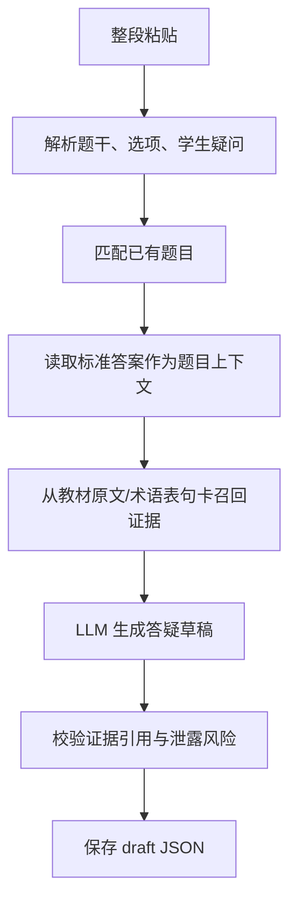

# 学生答疑模块工作计划

## 目标

把老师粘贴的一整段学生提问，处理成一份可审阅的答疑草稿 JSON。第一阶段只交付命令行能力，不接前端、不入正式库。

## 边界

- 允许使用 `data/questions.json` 中的题干、选项和标准答案。
- 不允许把 `data/qa.json` 中的历史教研答复作为生成上下文。
- 不允许把题库里的教研解析作为生成上下文。
- 最终依据必须回到教材原文句卡。
- 证据不足时不强行回答，标记为需要教研复核。
- 面向老师展示时不暴露 `v6s_N00043` 这类内部句卡 ID。

## 第一阶段

交付文件：

- `pipeline/input_parser.py`
- `pipeline/question_matcher.py`
- `pipeline/evidence_retriever.py`
- `pipeline/run_pipeline.py`
- `prompts/02_generate_reply.md`
- `outputs/drafts/*.json`

## 第二阶段

接入本地工作台前端：

- 新增学生答疑输入面板。
- 展示解析流程：输入拆解、匹配题目、证据池、生成草稿、校验结果。
- 展示历史草稿列表，支持折叠和删除。
- 草稿暂存，不写入正式 `qa.json`。

## 第三阶段

云端部署：

- 后端 API 独立部署或复用新题解析 API 服务。
- 启动时复用 BGE/BM25 检索缓存。
- 增加超时、失败提示和草稿持久化。
