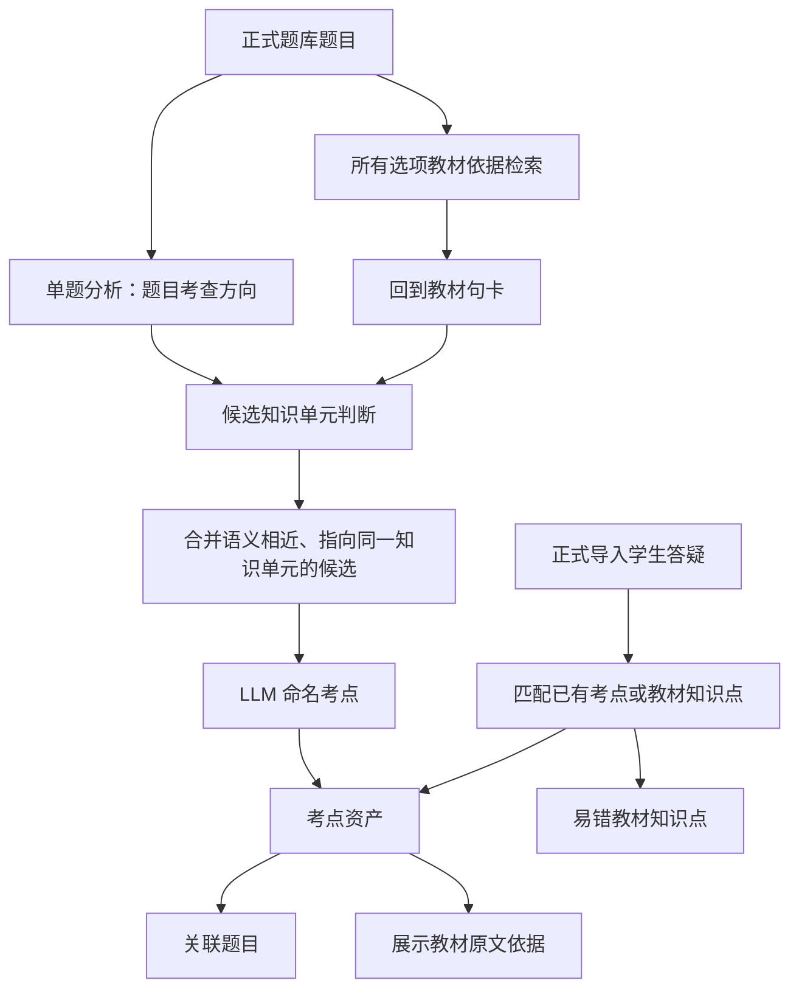

# CAMS 工作台考点机制说明

本文档用于规定 CAMS 工作台中“考点、教材知识点、易错点、题目考查方向、句卡依据”之间的理想关系。后续脚本、数据资产和前端展示应按本文档逐步改造。

## 一句话原则

考点不是裸句卡，也不是单道题。考点由正式题库中“题目选项证据”连到的教材句卡触发：凡是题目任一选项的教材依据能够回到真实教材句卡，就先进入考点候选；语义相近、指向同一教材知识单元的候选再合并为一个考点。

正确选项和错误选项都可以贡献考点连线。错误选项如果有教材依据，说明它也是题目涉及或用于辨析的知识；高频干扰项本身也可能代表重要知识。

学生答疑不直接生成考点；它只作为已有考点或教材知识点的易错信号。

## 核心概念

### 句卡

句卡是教材原文的最小证据单元，来源于 `cards_v6_sentence.json`。

句卡包含 `card_id`、`citation`、`knowledge`、`chapter_path`、行号、页码映射等信息。句卡本身不是考点；当它被正式题库中某个选项证据引用时，才成为考点候选的教材依据。

### 教材知识点

教材知识点是从教材句卡中抽出的基础知识内容。它可以被阅读页展示，也可以被学生答疑标记为易错相关。

如果一个知识点只有教材句卡，没有正式题目任一选项证据关联，则不叫考点，只叫教材知识点。

### 题目考查方向

题目考查方向是单道题层面的总结，用于回答“这道题换掉表面情境后，仍然在考什么”。

它应该概括教材知识、使用场景和判断逻辑，例如：

> 考查学生能否区分洗钱处置阶段与离析阶段的典型行为。

题目考查方向不等于考点。题目考查方向是单题分析结果，用于帮助理解题目背后的核心能力、辅助合并和命名；考点仍以题目选项证据能回到教材句卡为基础。

### 考点

考点必须至少关联 1 道正式导入题库中的题目，且该关联可以来自正确选项，也可以来自错误选项。

考点主要由以下信息共同确定：

- 题目考查方向。
- 正确选项和错误选项对应的教材句卡依据。
- 教材原文中的主证据卡、辨析证据卡和补充证据卡。
- 多道题之间是否指向同一知识单元。

考点标题由 LLM 生成，但必须基于题目、选项证据、题目考查方向和教材句卡，不得脱离教材原文发挥。

### 高频考点

高频考点是题目频次标签，不是答疑标签。

按正式导入题库计算，正确选项和错误选项都可以贡献题目关联。去重后关联题目数大于等于 3 的考点，才标记为高频考点。

同一道题即使有多个选项命中同一考点，也只能计为 1 道题。

### 易错点

易错点是学生答疑信号，不等于高频考点。

正式导入的学生答疑如果关联到某个考点，则该考点可同时标记为易错点。

正式导入的学生答疑如果只关联到教材知识点、但没有正式题目关联，则它是易错教材知识点，不算考点。

网页中新输入的新题解析和学生答疑草稿暂不写入静态考点体系。

## 理想生成流程



## 关系规则

### 题目与句卡

题目不直接等于考点。题目应先经过解析，找到所有选项对应的教材句卡；能回到真实教材句卡的选项证据，才可以形成考点候选。

错误选项不是废信息。错误选项如果能回到教材句卡，说明它也是本题涉及、比较、排除或辨析的知识点，可以参与考点候选、题目计数和高频统计。后续合并时应保留其“错误项/干扰项/辨析项”来源，避免把它误解为本题正确答案。

### 句卡与考点

一个考点可以对应多张句卡。

句卡在考点中应区分角色：

- 主证据卡：最直接支撑考点的教材原文。
- 辨析证据卡：来自错误选项或相邻概念，用于说明题目排除、比较、混淆或边界。
- 补充证据卡：补充场景、边界、条件、例外或相关定义。
- 背景证据卡：帮助理解，但不宜作为核心依据。

考点必须能追溯到真实教材句卡和对应教材原文。KG、历史解析、答疑、旧题解析只能辅助召回和理解，不能替代教材原文依据。

### 答疑与考点

学生答疑不直接生成考点。

答疑可以产生两类结果：

- 如果答疑指向已有考点，则为该考点增加易错信号。
- 如果答疑只指向教材知识点，但没有正式题目关联，则形成易错教材知识点。

只有正式导入的学生答疑参与静态资产重建。网页临时输入的答疑只保存草稿，不写入考点体系。

## 前端展示口径

### 考点

显示条件：去重后的正式题目数大于等于 1。

题目数应统一使用：

```text
unique(question_ids + option_bindings[].question_id)
```

### 高频考点

显示条件：去重后的正式题目数大于等于 3。

高频只由题目频次决定，不由学生答疑决定。

### 易错点

显示条件：正式导入学生答疑数大于等于 1。

易错点可以和考点同时存在，也可以只是教材知识点上的易错提示。

### 教材知识点

显示条件：有教材句卡，但没有正式题目关联。

教材知识点不应被标为考点或高频考点。

## 资产改造要求

后续改造应逐步让代码和数据资产符合以下要求：

1. 统一题目计数口径，所有位置都使用去重后的题目数。
2. 区分“考点、高频考点、易错点、教材知识点”四类展示身份。
3. 高频考点只由正式题库题目数量决定；正确选项和错误选项的选项证据都可贡献题目关联。
4. 学生答疑只作为易错信号，不参与高频判断。
5. 考点标题由 LLM 基于题目考查方向、选项证据和教材原文生成。
6. 每个考点必须能回到教材句卡和原文。
7. 新题解析和网页学生答疑暂不写入静态考点体系。
8. 前端不得把内部句卡 ID 当成主要展示内容，必要时只作为调试或隐藏信息。

## 当前代码需要重点对齐的位置

当前前端和数据脚本中仍存在旧口径，需要后续逐步修正：

- `workbench-store.js`：题目索引和 `getQuestionsForExamPoint` 需要纳入 `option_bindings[].question_id` 并去重。
- `workbench-reader.js`：旁注标签需要按“考点 / 高频考点 / 易错点 / 教材知识点”重新判断。
- `workbench-panel.js`：考点列表、详情页、题目计数和筛选器需要使用统一口径。
- `build_exam_points_from_option_evidence.py`：当前偏向从正确选项主证据卡直接生成候选考点，后续应改为“所有选项证据连线 + 语义合并 + 频次统计”。
- `build_teaching_assets.py`：当前会把基础教材句卡并入统一考点层，后续需要明确区分教材知识点和正式考点。

## 考点资产建构步骤

后续工程实现应先重建符合本文定义的考点资产，再让前端接入新资产。不要只在前端给旧资产打标签补丁。

### 前置依赖文件

考点资产重建需要以下输入文件：

| 文件 | 作用 | 是否可作为最终依据 |
| --- | --- | --- |
| `data/teaching_assets/questions.json` | 正式题库。提供题干、选项、答案、教研解析等题目信息。 | 否。它提供题目来源，不替代教材依据。 |
| `data/teaching_assets/option_evidence_map.json` | 选项级教材依据。提供每个选项对应的 `evidence_cards`、判断、解释和易错信息。当前版本来自 `ch2-plus-v6-except` 混合证据池，里面仍可能包含 `ch2s_...` 和 `v6x_...` 旧卡 ID。 | 部分可以。只有能迁移或回表到 `cards_v6_sentence.json` 中 `v6s_N...` 正式句卡的 `evidence_cards` 才能作为最终教材依据。 |
| `data/teaching_assets/cards_v6_sentence.json` | 全书 V6 句级教材证据池。 | 是。考点最终必须回到这里的真实句卡和原文。 |
| `data/teaching_assets/chapters/ch2_extracted.json` | 第二章阅读页结构。用于判断句卡是否能在当前阅读页定位。 | 否。它用于定位和展示。 |
| `data/page_maps/card_page_map_v6.json` | 句卡到教材页码的映射。 | 否。它用于显示页码。 |
| `data/teaching_assets/qa.json` | 正式导入学生答疑。 | 否。它只提供易错信号。 |
| `data/teaching_assets/qa_bindings.json` | 答疑与题目/句卡的绑定。 | 否。它只用于把易错信号挂到已有考点或教材知识点。 |

辅助资产可以参与召回、校验或追溯，但不得替代教材句卡：

- `question_card_map.json`：题目到句卡的粗映射，只作参考。
- `kg_data.json`：知识图谱，只作辅助召回或导航。
- `card_relations.json`：句卡关系，只作扩展召回。
- `cards_ch2.json`、`cards_v6_except_ch2_sentence.json`、`cards_ch2_plus_v6_except_ch2_sentence.json`：旧版四角色法使用过的证据池，只能作为迁移来源或召回参考。它们的 `ch2s_...`、`v6x_...` ID 不能直接进入最终考点依据。
- 历史教研解析、旧答疑回复、新题解析草稿：只能辅助理解或人工比对，不进入最终教材依据。

当前旧卡残留的原因是：早期四角色法允许使用 `ch2-plus-v6-except` 作为证据范围，该证据池由 `cards_ch2.json` 和 `cards_v6_except_ch2_sentence.json` 合并而成。`run_step1.py` 产出的选项级证据、`run_step2_option_mapping.py` 写出的 `option_evidence_map.json`，以及后续 `build_exam_points_from_option_evidence.py` 生成的候选考点，都把这些旧卡 ID 当作当时的合法证据。因此，资产重建前必须先做旧卡到正式 `v6s_N...` 句卡的迁移或重新检索，不能假设现有 `option_evidence_map.json` 已全部换成新卡。

### 建构过程

#### 1. 读取正式题库

从 `questions.json` 读取正式导入题目。只有正式题库中的题目可以参与静态考点资产建设。

网页中新输入的新题解析草稿不参与本轮考点资产建设。

#### 2. 生成或读取题目考查方向

对每道题生成单题层面的“题目考查方向”。

题目考查方向用于说明这道题真正考查的教材知识、使用场景和判断逻辑。它不是考点本身，但会参与后续考点命名和多题合并。

示例：

> 考查学生能否区分洗钱处置阶段与离析阶段的典型行为。

#### 3. 读取选项级教材依据

从 `option_evidence_map.json` 读取每道题各选项的教材依据。

正式考点主要从以下信息中产生：

- 题目考查方向。
- 题目全部选项。
- 全部选项对应的直接或高置信度教材句卡。
- 正确项、错误项、干扰项和相邻概念之间的辨析关系。

错误选项如果能回到教材句卡，也可以生成或链接考点。它的作用不是证明“错误答案正确”，而是说明本题把该知识点作为比较、排除、干扰或辨析对象。

#### 4. 回到真实教材句卡

所有候选依据都必须回到 `cards_v6_sentence.json` 中真实存在的 `card_id` 和 `citation`。

现有 `option_evidence_map.json` 中的 `ch2s_...`、`v6x_...` 旧卡必须先经过迁移：

1. 优先用确定性的旧卡到新卡映射表转换为 `v6s_N...`。
2. 没有映射表时，用 `quote/citation/knowledge/chapter_path` 与 `cards_v6_sentence.json` 做文本回表。
3. 回表结果必须记录 `original_card_id`、`canonical_card_id`、`match_method`、`confidence` 和原文片段。
4. 低置信度或多候选命中的证据不得直接进入正式考点，应进入缺依据修复清单。

如果一个候选考点有题目关联，但无法回到真实教材句卡，则不能进入稳定考点资产，应进入缺依据修复清单。

当前状态：

- 第二章旧 `ch2s_...` 句卡已经迁移到统一 `v6s_N...` 坐标；活跃 `option_evidence_map.json` 不再保留 `ch2s_...`。
- 旧第二章卡池已归档到 `data/archive/legacy_ch2_cards_20260624_213613/`。
- 对全书句卡抽取时遗漏的旧项目符号，已补入 `cards_v6_sentence.json`，使用 `v6s_N90001` 起的补充句卡 ID。
- `v6x_...` 扩展证据不能作为最终正式依据长期保留；它必须通过旧 ID 引用清理步骤回表到 `v6s_N...`。不能高置信回表的项目进入人工确认或缺依据清单。

#### 4.1 清理旧 ID 引用

旧卡源文件归档后，下游资产中仍可能残留历史生成的旧 ID 引用，尤其是 `v6x_...`。这类引用不是旧卡文件本身，而是旧证据 ID 被写进了 `option_evidence_map.json`、候选考点资产或阅读页映射资产。

清理脚本：

`data_pipeline/migrate_legacy_card_refs_to_v6s.py`

默认 dry-run：

```powershell
python "cams工作台\data_pipeline\migrate_legacy_card_refs_to_v6s.py"
```

确认报告无误后写回：

```powershell
python "cams工作台\data_pipeline\migrate_legacy_card_refs_to_v6s.py" --apply
```

脚本扫描范围：

- `data/teaching_assets/option_evidence_map.json`
- `data/teaching_assets/exam_points_from_option_evidence_mvp.json`
- `data/teaching_assets/exam_points_teaching_mvp.json`
- `data/teaching_assets/sentence_exam_point_map.json`
- `data/option_evidence_map.json`
- `data/exam_points_from_option_evidence_mvp.json`

映射规则：

1. `exact_quote`：旧卡文本与正式句卡完全一致。
2. `substring_quote`：旧卡文本是正式句卡原文的一部分。
3. `normalized_substring`：归一化后旧卡文本包含于正式句卡。
4. `text_similarity`：高相似度文本匹配，低于自动阈值时进入人工确认。

写回只处理结构化卡片引用：

- `card_id`
- `card_ids`
- `source_card_ids`
- `evidence_card_ids`
- `source_card_details[].card_id`
- 阅读页映射中的 `annotations[].card_id`

写回不会自动替换长文本或结构 ID 里的旧 ID，例如 `ep_opt_v6x_00484`。这类 `embedded_string_ref` 只进入报告，因为直接替换可能导致考点 ID 撞名或破坏历史审计描述。考点 ID 的重命名应放到后续“考点资产重建”步骤统一处理。

写回时会保留迁移追溯字段，例如 `from_original_card_id` 和 `card_id_migration.from`。这些字段用于审计来源，不再视为待迁移引用。

2026-06-24 apply 后状态：

- 初次自动写回结构化引用：3996
- 人工决策后继续写回结构化引用：98
- 当前仍需处理的结构化旧 ID 引用：0
- 已按人工决策批准或修正 6 个旧 ID：`v6x_00294 -> v6s_N02174`、`v6x_01136 -> v6s_N90024`、`v6x_01882 -> v6s_N03581`、`v6x_02473 -> v6s_N04143`、`v6x_03053 -> v6s_N04701`、`v6x_00380 -> v6s_N90025`
- `v6s_N90024` 和 `v6s_N90025` 是本轮补充的正式句卡，分别用于承接 OFAC 制裁句和客户身份识别必要性句。
- 追溯字段与嵌入式旧 ID 文本只报告不自动替换。

关键验证：

- `v6x_00363` 已能通过 `substring_quote` 映射到 `v6s_N02223`。
- `v6x_00364` 已能通过 `substring_quote` 映射到 `v6s_N02223`。

dry-run 产物：

- `outputs/old_id_reference_migration/legacy_refs_report.json`
- `outputs/old_id_reference_migration/mapping_candidates.json`
- `outputs/old_id_reference_migration/manual_review_old_ids.json`
- `outputs/old_id_reference_migration/unmapped_old_ids.json`
- `outputs/old_id_reference_migration/dry_run_changed_refs.json`
- `outputs/old_id_reference_migration/report.md`

#### 5. 形成单题候选考点

对每道题，根据“题目考查方向 + 全部选项依据句卡”形成若干候选考点。

单题候选考点默认采用“大考点优先”的口径。多选题中，多个选项如果共同服务于同一题目考查方向、同一使用场景或同一类判断任务，应先合并为一个候选考点；后续如果发现该考点过大、题目统计失真或教研反馈不便使用，再拆分为更细考点。

例如：

- “银行终止客户关系的正当理由”应先作为一个大考点，而不是一开始拆成“无法降低洗钱风险时终止客户关系”和“声誉风险导致终止客户关系”两个细考点。
- 多个正确选项分别体现代持安排、不记名股票、严格保密法律等低透明度机制时，可先合并为“低透明度公司结构的洗钱风险识别”这一类大考点。

每个候选考点应包含：

- `question_id`
- `exam_intent`，即题目考查方向
- `title`，由 LLM 生成的候选考点名称
- `core_card_ids`，主证据句卡
- `contrast_card_ids`，辨析证据句卡，通常来自错误选项或相邻概念
- `supporting_card_ids`，补充证据句卡
- `background_card_ids`，背景证据句卡
- `option_roles`，记录句卡来自正确项、错误项、干扰项还是辨析项
- `reason`，为什么这些句卡构成这个候选考点
- `confidence`

重建脚本必须把输入证据分区：

- `correct_option_card_ids/correct_option_cards`：来自正确选项，通常优先作为 `core_card_ids`。
- `incorrect_option_card_ids/incorrect_option_cards`：来自错误选项，可进入 `contrast_card_ids/supporting_card_ids/background_card_ids`，也可在题目考查确实涉及该知识时形成候选考点。
- `all_option_card_ids/all_option_cards`：所有能回到教材句卡的选项证据，是候选考点生成和题目计数的基础。
- 脚本校验不再拦截“candidate_points 使用错误选项证据”，但必须要求记录选项来源和角色，防止把错误项依据误写成正确答案依据。

#### 6. 合并同一知识单元

将多个题目中主题一致、教材依据一致或高度相近的候选考点合并为同一个正式考点。

合并时应综合判断：

- 题目考查方向是否相同或高度相近。
- 主证据句卡是否相同或语义等价。
- 补充句卡是否共同指向同一教材知识单元。
- LLM 对考点标题和范围的判断是否一致。

合并优先级高于过早拆分。只要候选点可以被一个清晰的大考点标题概括，并且不会把完全无关的教材主题混在一起，就优先合并。拆分应作为后续优化动作，而不是初始构建动作。

合并后，一个考点可以关联多道题，也可以包含多张句卡。

#### 7. 生成正式考点标题

正式考点标题由 LLM 根据题目考查方向、题目选项证据和教材句卡生成。

标题应像教研整理出的知识点或能力要求，不应直接照抄选项文本。

较好的标题风格：

- 考查学生能否识别洗钱处置阶段的典型手法。
- 考查学生能否区分代理银行业务中的嵌套关系风险。
- 考查学生能否判断第三方关系建立前的反腐败红旗信号。

#### 8. 挂接正式答疑易错信号

读取 `qa.json` 和 `qa_bindings.json`，把正式导入的学生答疑挂到已有考点或教材知识点上。

答疑不直接生成考点。

挂接结果分两类：

- 如果答疑指向已有正式考点，则该考点增加易错信号。
- 如果答疑只指向教材知识点，但没有正式题目关联，则形成易错教材知识点，不算考点。

#### 9. 生成阅读页定位映射

用考点和教材知识点中的句卡，结合 `chapters/ch2_extracted.json`，生成阅读页定位映射。

阅读页定位应区分：

- 正式考点。
- 高频考点。
- 易错点。
- 教材知识点。

如果某个考点依据句卡不在当前第二章阅读页中，它仍可存在于考点资产中，但不应强行作为第二章阅读页旁注显示。

#### 10. 校验与审计

构建完成后必须输出审计结果。

至少校验：

- 每个正式考点是否至少关联 1 道正式题目。
- 每个正式考点是否至少有 1 条真实教材句卡依据。
- 高频考点是否满足去重题目数大于等于 3。
- 易错点是否只来自正式导入学生答疑。
- 是否存在有题目但无教材依据的候选点。
- 是否存在教材知识点被误放入正式考点资产。
- 是否存在网页临时新题或临时答疑污染静态资产。

### 产物

理想状态下，考点构建应输出以下产物：

| 产物 | 内容 | 前端用途 |
| --- | --- | --- |
| `exam_points_teaching_mvp.json` | 正式考点。只包含至少关联 1 道正式题目、且能回到教材句卡的考点。 | 考点列表、考点详情、题目关联、阅读页正式考点旁注。 |
| `textbook_knowledge_points.json` | 教材知识点。包含无正式题目关联、但可在阅读页提示的教材句卡知识。 | 阅读页教材知识点提示，不进入考点/高频判断。 |
| `misconception_links.json` | 易错信号映射。记录正式学生答疑关联到哪些考点或教材知识点。 | 显示易错点、关联答疑。 |
| `exam_point_evidence_gaps.json` | 缺依据候选点。记录有题目关联但无法回到教材句卡的候选点。 | 内部修复清单，默认不面向教研展示。 |
| `sentence_teaching_point_map.json` | 阅读页定位表。统一记录句卡/段落对应的考点和教材知识点。 | 阅读页高亮、旁注、点击跳转。 |
| `exam_point_build_report.md` | 构建审计报告。 | 内部验收和排查。 |

如果短期为了兼容旧前端，仍保留 `exam_points_teaching_mvp.json` 作为统一入口，则必须在每条记录中显式写入类型字段：

```json
{
  "teaching_object_kind": "exam_point",
  "is_exam_point": true,
  "is_high_frequency": false,
  "is_misconception": true,
  "linked_question_ids": ["2.1_1"],
  "linked_qa_ids": [],
  "source_card_ids": ["v6s_N00018"]
}
```

短期兼容可以接受，但长期应把正式考点和教材知识点拆成不同资产，避免前端继续靠猜。

## 不变原则

教材原文是最终依据。

任何考点、易错点或教材知识点的展示，都应能追溯到真实句卡及其教材原文。

## 当前五题试跑记录

### 结构干跑与 DeepSeek 调用状态

输出目录：

`outputs/rebuild_trial_5q/`

本轮按新定义生成了 5 道题的 `question_packs.json`，并完成了正确选项证据与错误选项证据的分区：

- `correct_allowed_card_ids/correct_allowed_cards`：只来自正确选项，可进入正式候选考点。
- `trap_allowed_card_ids/trap_allowed_cards`：只用于易错/混淆说明，不得进入正式候选考点。

真实调用 `deepseek-v4-pro` 时曾返回 `503 Service temporarily unavailable`，说明当时主模型服务不可用，不能据此评价流程质量。随后已用 `--skip-llm` 做结构干跑，确认脚本仍可生成 5 道题输入包和 2 条缺依据记录；结构干跑不会生成候选考点。

脚本 `scripts/run_rebuild_trial_5q.py` 已补充模型降级逻辑：

- 主模型默认仍为 `deepseek-v4-pro`。
- 可通过环境变量 `REBUILD_TRIAL_FALLBACK_MODELS` 或 `LLM_FALLBACK_MODELS` 配置备用模型。
- 未配置时默认尝试 `deepseek-chat,deepseek-reasoner`。
- 输出中会记录 `model`、`actual_model` 和 `model_attempts`，便于审计到底使用了哪个模型。

### Codex 手工代跑版

输出目录：

`outputs/rebuild_trial_5q_codex_manual/`

由于 `deepseek-v4-pro` 临时不可用，Codex 读取同一批 `question_packs.json` 后，按新定义手工完成 5 题候选考点试跑。该结果用于验证流程逻辑，不等同于生产 LLM 批跑结果。

本轮结果：

- 题目数：5
- 候选考点数：5
- 校验问题：0
- 合并预览：0
- 缺依据候选：2

五个候选考点为：

| 题目 | 候选考点 |
| --- | --- |
| `2.7_6` | 低透明度公司结构的洗钱风险识别 |
| `2.2_20` | 代理银行业务关键风险来源识别 |
| `2.3_21` | 货币服务企业典型业务范围识别 |
| `2.4_16` | 专业守门人被利用洗钱的典型方式识别 |
| `2.1_15` | 银行终止客户关系的正当风险理由 |

旧 ID 引用清理 apply 后重跑本轮五题 trial，`evidence_gap_count` 已从 2 降为 0。`2.7_6` 选项 A 原先未能回表的旧 `v6x_00363` / `v6x_00364` 证据已回到正式句卡 `v6s_N02223`。
