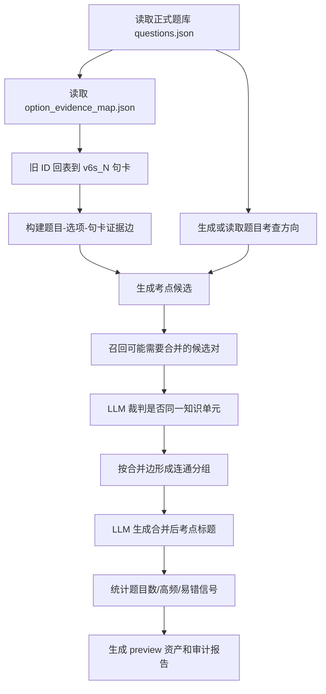
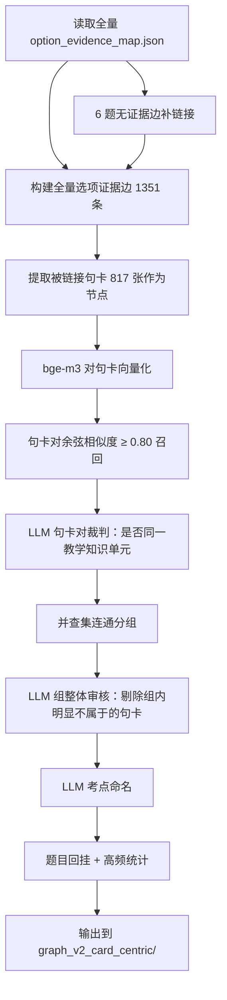

# 图谱化考点提取工作区

本文档定义"图谱化考点提取"的新口径、建构流程和工程实现方案。本工作区用于独立试验新的考点资产构建方式，避免继续在旧口径资产上打补丁。

## 目标

把 CAMS 正式题库、选项级教材依据和教材句卡组织成一张"题目-选项-教材知识"图谱，再把语义相近、指向同一教材知识单元的节点合并为考点。

核心目标有三个：

1. 让考点链接更完整，不只看正确选项，也看错误选项和干扰项。
2. 让高频考点来自真实题目连线数量，而不是人工主观标记。
3. 让每个考点都能追溯到教材原文句卡、题目、选项和证据来源。

## 工作区结构

```text
图谱化考点提取/
  README.md
  workspace/
    inputs/          # 输入资产快照或软引用说明
    intermediate/    # 中间图谱、候选点、候选合并对
    outputs/         # 最终 preview 资产
    reports/         # 审计报告、人工复核报告
    scripts/         # 新流程脚本
    prompts/         # LLM 提示词
    tests/           # 小样本测试与回归检查
```

## 核心定义

### 教材句卡

教材句卡是教材原文的最小证据单元，来源于 `cards_v6_sentence.json`。句卡本身不是考点。

只有当句卡被正式题库的选项证据引用时，它才进入考点候选范围。没有题目选项连线的句卡，只能叫教材知识点。

### 选项证据边

选项证据边是本流程的基础边，表示：

```text
题目 -> 选项 -> 教材句卡
```

正确选项和错误选项都可以产生选项证据边。错误选项不是废信息；如果它能回到教材句卡，说明这道题把该知识点作为比较、排除、干扰或辨析对象。

每条边必须记录：

- `question_id`
- `option`
- `option_text`
- `is_correct_answer`
- `canonical_card_id`
- `support_type`
- `evidence_status`
- `match_confidence`

### 考点候选

考点候选是由一条或多条选项证据边触发的教材知识单元。

候选可以来自正确选项，也可以来自错误选项。候选阶段不急着判断"正式考点标题"，先保证题目、选项、句卡和来源角色都被记录下来。

### 考点

考点是多个考点候选经过语义合并后形成的教学知识单元。

一个考点必须满足：

- 至少关联 1 道正式题库题目。
- 至少有 1 条能回到 `cards_v6_sentence.json` 的教材句卡依据。
- 能说明它由哪些题目、选项和句卡连线形成。

考点不是单张句卡，也不是单道题；它是题目选项证据连线沉淀出来的知识单元。

### 高频考点

高频考点由题目连线数量决定。

统计规则：

```text
unique(linked_question_ids) >= 3
```

正确选项和错误选项都参与计数。同一道题即使多个选项命中同一个考点，也只计 1 次。

### 易错点

易错点来自正式导入的学生答疑信号，不参与高频判断。

学生答疑可以挂到已有考点，也可以挂到没有题目连线的教材知识点上。网页临时输入的新题解析和学生答疑草稿不写入静态考点体系。

### 题目考查方向

题目考查方向是单题层面的 LLM 摘要，用于回答：

```text
这道题换掉表面情境后，仍然在考什么？
```

它用于帮助候选合并和考点命名，但不是考点本身。考点仍必须回到选项证据边和教材句卡。

## 建构流程



## 关键步骤如何实现

### 1. 输入资产准备

第一版不复制大文件，只在 `workspace/inputs/` 里保存输入资产清单和校验信息。正式读取仍使用工作台现有数据：

- `cams工作台/data/teaching_assets/questions.json`
- `cams工作台/data/teaching_assets/option_evidence_map.json`
- `cams工作台/data/teaching_assets/cards_v6_sentence.json`
- `cams工作台/data/page_maps/card_page_map_v6.json`
- `cams工作台/data/teaching_assets/qa.json`
- `cams工作台/data/teaching_assets/qa_bindings.json`

### 2. 旧 ID 回表

所有证据必须回到正式 `v6s_N...` 句卡。

实现方式：

1. 优先复用现有旧 ID 迁移结果。
2. 如果发现新的 `ch2s_...` 或 `v6x_...`，先用确定映射表转换。
3. 没有确定映射时，用 quote、knowledge、chapter_path 和正式句卡做文本回表。
4. 低置信、多候选或无法回表的证据进入 `reports/evidence_gaps.md`，不进入正式 preview。

### 3. 构建选项证据边

脚本从 `option_evidence_map.json` 中逐题、逐选项读取证据卡，生成统一边表：

```json
{
  "edge_id": "q2.1_1_1_A_v6s_N00001",
  "question_id": "2.1_1",
  "option": "A",
  "option_text": "",
  "is_correct_answer": false,
  "canonical_card_id": "v6s_N00001",
  "edge_role": "incorrect_option_evidence",
  "support_type": "direct",
  "match_confidence": "high"
}
```

这个边表是后续所有考点候选、高频统计和审计的基础。

### 4. 生成单题考点候选

候选生成不再只看正确选项。

实现规则：

- 每道题把全部可用选项证据交给 LLM。
- LLM 输出 1 个或多个考点候选。
- 每个候选必须引用输入中的 `edge_id` 或 `card_id`，不能编造证据。
- 正确项、错误项都可以进入候选，但必须记录来源角色。
- 如果某个错误项只是无教材依据的干扰，不生成候选。

候选结构示例：

```json
{
  "candidate_id": "cand_2.1_1_01",
  "question_id": "2.1_1",
  "exam_intent": "考查学生能否识别洗钱处置阶段的典型手法。",
  "title": "洗钱处置阶段的典型手法识别",
  "source_edge_ids": ["q2.1_1_A_v6s_N00001"],
  "source_card_ids": ["v6s_N00001"],
  "option_roles": [
    {"option": "A", "is_correct_answer": false, "role": "contrast"}
  ],
  "confidence": "medium"
}
```

### 5. 召回候选合并对

不让 LLM 两两比较全部候选，先用脚本召回"可能需要合并"的候选对。

召回信号：

- 共享相同 `source_card_ids`。
- 句卡 quote 或 knowledge 文本相似。
- 题目考查方向相似。
- 标题文本相似。
- 章节路径相近。
- 可选：embedding 相似度高。

产物放入：

```text
workspace/intermediate/merge_pair_candidates.json
```

### 6. LLM 合并裁判

LLM 只做裁判，不自由生成新知识。

裁判标准：

- 是否指向同一条教材知识。
- 是否属于同一使用场景或判断逻辑。
- 教研是否会把它们放在同一个考点下讲。
- 不能仅因为都属于反洗钱大主题就合并。

输出示例：

```json
{
  "merge": true,
  "confidence": "high",
  "reason": "两个候选都指向第三方关系建立前的反腐败红旗识别。",
  "merged_title": "第三方关系建立前的反腐败红旗识别"
}
```

### 7. 图连通分组

把每个候选考点看成图节点。

LLM 判断 `merge=true` 的候选对形成边。最后用连通分量得到合并后的考点组。

```text
A-B 可合并
B-C 可合并
=> A/B/C 属于同一个考点组
```

第一版要保守：

- 合并对召回可以宽一点，避免漏掉候选。
- LLM 裁判要严一点，避免乱合并。
- 低置信合并不自动应用，进入人工复核报告。

### 8. 生成正式考点标题

每个考点组再让 LLM 看组内题目考查方向、选项文本、句卡原文和来源角色，生成一个教研可读标题。

标题风格：

- 洗钱处置阶段的典型手法识别
- 第三方关系建立前的反腐败红旗识别
- 代理银行业务中的嵌套关系风险辨析
- 低透明度公司结构的洗钱风险识别

标题不应直接照抄某个选项，也不应大到"反洗钱基础知识"。

### 9. 统计高频和易错

合并后重新统计：

```text
linked_question_ids = unique(all source_edge.question_id)
linked_question_count = len(linked_question_ids)
is_high_frequency = linked_question_count >= 3
```

学生答疑只挂接易错信号：

```text
is_misconception = linked_qa_count >= 1
```

高频和易错可以同时存在，但不能互相替代。

### 10. 输出 preview 资产

第一阶段只输出 preview，不覆盖现有前端正式资产。

建议产物：

- `workspace/outputs/option_evidence_edges.json`
- `workspace/outputs/exam_point_candidates.json`
- `workspace/outputs/merge_decisions.json`
- `workspace/outputs/exam_points_graph_preview.json`
- `workspace/outputs/sentence_exam_point_map_graph_preview.json`
- `workspace/reports/build_report.md`
- `workspace/reports/manual_review.md`

## 验收指标

第一轮小样本验收看这些指标：

1. 每个考点都能追溯到题目、选项、句卡。
2. 错误项证据进入考点时，来源角色清楚，不会被误读成正确答案依据。
3. 合并后考点标题不像选项复述，也不过度抽象。
4. 高频考点的题目数按去重题目计数。
5. 相比旧流程，阅读页和考点详情中的题目链接明显增加。
6. 低置信回表、低置信合并、无句卡依据都进入报告，不进入稳定资产。

## 当前阶段计划

### 第 0 阶段：定义固定

已完成本文档，明确新口径：

```text
所有题目选项证据 -> 教材句卡 -> 考点候选 -> 语义合并 -> 正式考点
```

### 第 1 阶段：五题试跑

新增脚本生成选项证据边和候选考点，只跑 5 题：

1. 构建 `option_evidence_edges.json`。
2. 生成 `exam_point_candidates.json`。
3. 召回合并候选对。
4. LLM 判断合并。
5. 输出 preview 报告。

### 第 2 阶段：第二章全量 preview

在五题质量可接受后，跑第二章 179 题。

产物仍留在本工作区，不直接覆盖前端。

### 第 3 阶段：前端接入评估

只有当 preview 报告质量可接受时，才讨论是否替换现有前端考点资产。

## v2 方法：以句卡为中心的聚类

### 背景

v1 试跑（trial_5q_*）以 LLM 生成的"考点候选"为合并节点，存在三个问题：

1. 候选本身是 LLM 产物，同一道题换 prompt 就可能生成不同候选，合并结果跟着漂。
2. 候选间合并召回只用了字符级 Jaccard，不是真正的语义向量匹配，中文近义表达容易漏召回。
3. 候选粒度不统一，合并图结构不稳定。

v2 改为以**被题目链接到的句卡**为节点，绕开上述问题：

- 节点稳定：817 张句卡是教材原文，固定不变。
- 关系客观：句卡之间的语义关系是客观的，合并产物直接对应"教材知识单元"。
- 可复现：不依赖 LLM 生成中间候选，LLM 只做裁判和命名。

### 核心定义调整

**考点候选（v2 口径）**：被正式题库选项证据链接到的句卡本身就是考点候选。817 张被链接的句卡即候选层，不再单独生成中间候选。

**考点（v2 口径）**：817 张句卡节点经过向量召回 + LLM 裁判 + 连通分组后形成的句卡聚类，每个聚类对应一个教学知识单元。

### 全量数据现状

| 资产 | 数量 |
|---|---|
| 题库 questions.json | 179 题 |
| 证据映射 option_evidence_map.json | 179 题（全覆盖） |
| 句卡库 cards_v6_sentence.json | 5199 张 |
| 选项证据边总数 | 1351 条 |
| ├─ 正确项边 | 608 |
| └─ 错误项边 | 743 |
| 被链接的句卡（去重） | 817 张 |
| 无证据边的题目 | 6 道（2.1_25/27/33/42、2.4_47、2.8_1） |

章节分布：2.1=50题、2.2=20、2.3=24、2.4=48、2.5=7、2.6=6、2.7=7、2.8=17。

### v2 流程



### v2 关键参数

| 参数 | 取值 | 说明 |
|---|---|---|
| 向量模型 | bge-m3（本地） | 中文向量模型，无 API 成本 |
| 召回阈值 | 余弦相似度 ≥ 0.80 | 保守策略，只合并明显同义/同一知识单元的句卡 |
| LLM 裁判 | 两层 | 第一层：句卡对裁判；第二层：连通分组后组整体审核 |
| 6 题补链接 | 向量+BM25 召回 + LLM 裁判 | 对 6 道无证据边的题目，从 5199 张句卡中召回 top-K，LLM 裁判是否成立 |
| 候选层 | 817 张被链接句卡 | 不再生成中间候选 |
| 输出目录 | `workspace/outputs/graph_v2_card_centric/` | 与现有 trial_5q_* 并列 |

### v2 预期产物

- `option_evidence_edges.json`：全量边表（含 6 题补链接）
- `card_embeddings.json`：817 张句卡的 bge-m3 向量
- `card_merge_pairs.json`：句卡对召回 + LLM 裁判结果
- `card_clusters.json`：连通分组结果
- `exam_points_graph_v2.json`：最终考点（含题目回挂、高频标记）
- `build_report.md`：构建报告
- `evidence_gaps.json`：缺口报告（含 6 题补链接结果）

### v2 验收指标

在 v1 验收指标基础上增加：

1. 节点稳定性：817 张句卡固定不变，多次运行聚类结果应一致（除 LLM 裁判波动外）。
2. 聚类粒度：保守策略下，每个考点组平均句卡数应在 2-8 张之间，避免单句卡成组或几十张句卡聚成一组。
3. 6 题补链接：补链接的边必须有 LLM 裁判依据，低置信补链接进入缺口报告。
4. 与 v1 对比：v2 考点数量应多于 v1（因为粒度更细），但每个考点的题目链接数应更稳定。
