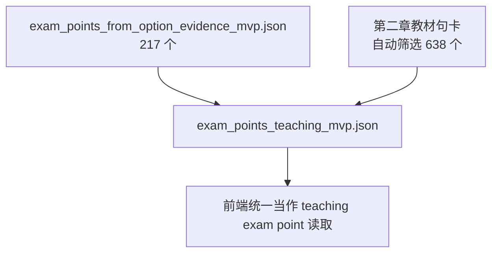
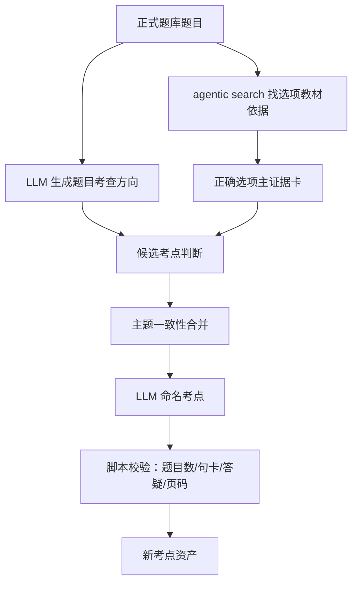

# 考点机制落地改造方案

本文档是 `README.md` 中理想考点定义的工程落地说明。它先盘点当前资产和代码现状，再解释现有偏差，最后给出分阶段改造方案。

## 0. 当前阶段目标

当前处于第 0 阶段：先把定义、资产、脚本、前端口径理清楚，不立即重建资产，也不立即改 UI。

第 0 阶段要回答三件事：

1. 当前项目里有哪些考点相关资产，它们分别从哪里来、给谁用。
2. 为什么当前会出现“没有题目关联的考点”。
3. 新定义如何落到数据字段、脚本和前端展示上。

## 1. 当前资产盘点

当前工作台前端主要读取 `cams工作台/data/teaching_assets/` 下的静态资产。核心加载逻辑在 `cams工作台/js/workbench-store.js`。

### 1.1 教材与阅读页资产

| 资产 | 当前数量 | 作用 | 定义口径 |
| --- | ---: | --- | --- |
| `cards_v6_sentence.json` | 5174 张句卡 | 全书 V6 句级教材证据池 | 句卡，教材原文依据，不是考点 |
| `chapters/ch2_extracted.json` | 第二章阅读页 | 前端左侧教材阅读页 | 阅读页段落和段落关联句卡 |
| `card_page_map_v6.json` | 按句卡映射 | 展示教材页码 | 页码辅助资产 |

### 1.2 题目与答疑资产

| 资产 | 当前数量 | 作用 | 定义口径 |
| --- | ---: | --- | --- |
| `questions.json` | 179 道题 | 第二章正式题库 | 可参与静态考点体系 |
| `qa.json` | 37 条答疑 | 正式导入学生答疑记录 | 只作为易错信号 |
| `qa_bindings.json` | 37 条绑定 | 答疑与题目/继承句卡的绑定 | 只用于给已有考点或教材知识点挂易错信号 |

### 1.3 题目到教材证据资产

| 资产 | 当前数量 | 作用 | 定义口径 |
| --- | ---: | --- | --- |
| `question_card_map.json` | 179 条 | 题目到句卡的粗映射 | 参考资产，不作为最终教材依据 |
| `option_evidence_map.json` | 179 道题 | 选项级教材依据，来自四角色法/agentic search | 当前考点生成的主输入 |

`option_evidence_map.json` 是当前较可信的题目-句卡连接来源。它记录每道题每个选项的 `evidence_cards`、`evidence_status`、`judgement`、`common_trap` 等字段。

### 1.4 考点展示资产

| 资产 | 当前数量 | 作用 | 当前问题 |
| --- | ---: | --- | --- |
| `exam_points_from_option_evidence_mvp.json` | 217 个 | 从正确选项和选项证据反推出来的候选考点 | 更接近新定义中的“考点”，但命名和聚类仍粗糙 |
| `exam_points_teaching_mvp.json` | 855 个 | 前端实际读取的统一教学点资产 | 混合了考点和教材知识点 |
| `sentence_exam_point_map.json` | 622 个段落，1508 条句子映射，806 个可映射点 | 阅读页定位表 | 跟随旧的统一考点层，未区分考点/教材知识点 |

前端现在优先读取 `exam_points_teaching_mvp.json`。这意味着：只要某个对象进入这个文件，就可能被当成“考点类对象”展示。

## 2. 为什么会出现没有题目关联的“考点”

结论：这些不是新定义下的考点，而是旧脚本自动生成的 `basic_textbook_point`，本质应该叫“教材知识点”。

### 2.1 数量统计

当前 `exam_points_teaching_mvp.json` 一共有 855 个条目。

按新定义的“去重题目数”统计：

| 类型 | 数量 |
| --- | ---: |
| 去重题目数 = 0 | 638 |
| 去重题目数 >= 1 | 217 |
| 去重题目数 >= 3 | 2 |
| 关联正式答疑数 >= 1 | 50 |
| 去重题目数 = 0 且关联正式答疑数 >= 1 | 0 |

也就是说，当前 638 个无题目关联对象，全部没有答疑信号，都是基础教材句卡包装出来的对象。

### 2.2 来源逻辑

当前 `build_teaching_assets.py` 做了两件事：

1. 读取 `exam_points_from_option_evidence_mvp.json`，把 217 个题目反推点转换为 `question_derived`。
2. 扫描第二章阅读页中的句卡，把没有被题目反推点覆盖、且类型像定义/流程/风险指标/法规/分类的句卡，包装成 `basic_textbook_point`。

因此 `exam_points_teaching_mvp.json` 实际混合了两类东西：



当前 638 个无题目关联条目的共同特征：

- `display_layer = basic_textbook`
- `created_from = textbook_sentence_card`
- `source_types = ["basic_textbook_point"]`
- `question_ids = []`
- `option_bindings = []`
- `qa_ids = []`
- `source_card_ids` 通常只有 1 张教材句卡

例子：

- “洗钱是将非法所得转为合法的过程。”
- “产生洗钱行为的上游犯罪包括非法销售武器、贩卖毒品、走私、挪用公款、内幕交易、行贿受贿和网络欺诈等。”
- “洗钱定义包括：明知财产为犯罪所得，为隐瞒或掩饰非法来源或协助上游犯罪者逃避法律后果而转换或转移财产。”

这些内容适合在阅读页作为教材知识点提示，但不应再叫考点，更不应进入“高频考点”判断。

### 2.3 另一个现状问题：有题但无原文依据

当前还有 7 个对象有题目关联，但没有 `source_card_ids/source_card_details`，例如：

- “90天”
- “交易所得可能导致洗钱犯罪指控的非法活动”
- “处置”
- “筹码倾倒”

这些来自正确选项，但证据状态是 `none` 或 `needs_manual`。按新定义，它们不能作为稳定考点展示，至少应标记为“缺教材依据”，并在后续资产重建时修复或剔除。

## 3. 当前前端口径偏差

### 3.1 题目计数不统一

新定义要求：

```text
题目数 = unique(question_ids + option_bindings[].question_id)
```

但当前代码存在多个口径：

- `workbench-store.js` 的 `getQuestionsForExamPoint` 只读取 `question_ids`。
- `workbench-reader.js` 的阅读页旁注使用 `question_ids.length + option_bindings.length`，没有按题目去重。
- `workbench-panel.js` 多处只使用 `question_ids.length`。

这会导致旁注、详情页、列表统计不一致。

### 3.2 标签语义混用

当前阅读页旁注中，凡是有题目或答疑信号，容易显示成“高频考点”或“高频考点 · 易错”。

按新定义，这不对：

- 1 道题关联只能叫“考点”。
- 3 道及以上题目关联才叫“高频考点”。
- 学生答疑只能产生“易错点”信号，不能让一个点变成高频。
- 没有题目关联的基础教材句卡只能叫“教材知识点”。

### 3.3 资产层混合了不同对象

`exam_points_teaching_mvp.json` 当前同时包含：

- 题目反推考点：217 个。
- 教材知识点：638 个。

这使前端必须靠 `display_layer`、`created_from`、`source_types`、题目数、答疑数等字段进行二次判断。短期可以前端判断，长期应在资产层拆清。

## 4. 新定义到字段的落地映射

### 4.1 统一派生字段

后续代码中应统一生成以下派生字段或 helper：

```text
linked_question_ids = unique(question_ids + option_bindings[].question_id)
linked_question_count = linked_question_ids.length
linked_qa_ids = unique(qa_ids)
linked_qa_count = linked_qa_ids.length
source_card_count = unique(source_card_ids + source_card_details[].card_id + external_source_card_ids).length
```

### 4.2 展示身份判断

| 身份 | 判断规则 | 说明 |
| --- | --- | --- |
| 考点 | `linked_question_count >= 1` 且有可追溯教材依据 | 由正式题库题目支撑 |
| 高频考点 | `linked_question_count >= 3` 且有可追溯教材依据 | 高频只看题目，不看答疑 |
| 易错点 | `linked_qa_count >= 1` | 可以叠加到考点或教材知识点 |
| 教材知识点 | `linked_question_count = 0` 且有教材句卡 | 不是考点 |
| 缺依据候选点 | `linked_question_count >= 1` 但无教材依据 | 暂不应作为稳定考点展示 |

### 4.3 题目考查方向与考点的边界

题目考查方向是单题层面的产物。它可以辅助：

- 正确选项证据筛选。
- 考点命名。
- 多题合并时判断是否同主题。

但它本身不等于考点，也不应该直接作为考点资产入库。

## 5. 分阶段改造方案

### 第 0 阶段：定义与工程盘点

目标：把定义、资产链路、问题清单和改造方案写清楚。

产物：

- `README.md`：理想机制定义。
- `考点机制落地改造方案.md`：工程落地方案。

验收标准：

- 明确什么是考点、教材知识点、高频考点、易错点。
- 明确为什么当前存在无题目关联“考点”。
- 明确后续脚本和前端应统一使用什么字段口径。

### 第 1 阶段：前端口径统一，不重建资产

目标：用现有资产先把展示层改正确。

主要修改：

1. 在 `workbench-store.js` 增加统一 helper：
   - `getLinkedQuestionIdsForExamPoint`
   - `getQuestionCountForExamPoint`
   - `getQaCountForExamPoint`
   - `getExamPointDisplayKind`
2. 修改 `buildExamPointIndexes`：
   - `ep.question_ids`
   - `ep.option_bindings[].question_id`
   都应进入 `examPointByQuestionId`。
3. 修改 `getQuestionsForExamPoint`：
   - 返回去重后的正式题目列表。
4. 修改阅读页旁注：
   - `linked_question_count >= 3` 显示“高频考点”。
   - `linked_question_count >= 1` 显示“考点”。
   - `linked_qa_count >= 1` 另显示“易错点”。
   - `linked_question_count = 0` 显示“教材知识点”。
5. 修改考点列表筛选：
   - `全部`
   - `考点`
   - `高频考点`
   - `易错点`
   - `教材知识点`
   - 先隐藏“缺依据/待复核”等内部筛选。
6. 修改详情页统计：
   - `关联题目 X 道 / 学生答疑 Y 条 / 教材依据 Z 处`
   - X 使用统一去重口径。
7. `option_bindings` 默认折叠为“题目选项依据”。

验收标准：

- 旁注、列表、详情页的题目数一致。
- 无题目关联对象不再被叫做考点。
- 高频不再由答疑触发。
- 高频和易错可同时出现，但显示为两个独立标签。

### 第 2 阶段：资产层拆分考点与教材知识点

目标：让数据结构自身符合新定义，减少前端靠猜。

建议产物：

| 新资产 | 内容 |
| --- | --- |
| `exam_points_teaching_mvp.json` | 只放正式考点，即 `linked_question_count >= 1` 且有教材依据 |
| `textbook_knowledge_points.json` | 放教材知识点，即无题目关联但有教材句卡 |
| `misconception_points.json` 或内嵌字段 | 放正式答疑形成的易错信号 |
| `sentence_teaching_point_map.json` | 阅读页统一定位表，可同时映射考点和教材知识点 |

如果短期不想拆多个文件，也至少应在同一个资产里明确字段：

```json
{
  "teaching_object_kind": "exam_point | textbook_knowledge_point",
  "is_exam_point": true,
  "is_high_frequency": false,
  "is_misconception": true
}
```

验收标准：

- 脚本产物中不再把 `basic_textbook_point` 混叫为 exam point。
- 前端不需要依赖旧 `display_layer` 猜对象类型。
- 资产说明文档能解释每个文件的角色。

### 第 3 阶段：考点生成脚本升级

目标：从“正确选项主证据卡生成考点”升级为“题目考查方向 + 正确选项依据 + 多句卡合并”。

建议流程：



关键规则：

- 考点标题由 LLM 生成。
- LLM 只能引用候选教材句卡。
- 主题合并可以使用脚本规则、向量聚类和 LLM 判定结合，但最终必须可追溯。
- 错误选项主要进入易错/混淆解释，不默认生成正式考点。
- 缺少教材依据的候选点进入待修复清单，不进入稳定考点展示。

验收标准：

- 考点标题不再像选项文本。
- 一个考点可以合理包含多张主/补充句卡。
- 多道题指向同一知识单元时能合并。
- 题目考查方向与考点标题边界清楚。

### 第 3 阶段核心步骤细化

第 3 阶段正式改造前，应先做小范围试跑。试跑只写入 `考点确认/outputs`，不得覆盖前端正式资产。

#### 3.1 读取选项级教材依据

输入文件：`data/teaching_assets/option_evidence_map.json`。

脚本先把题目、选项和证据卡展开成标准明细行：

```json
{
  "question_id": "2.1_1",
  "option": "A",
  "is_correct_answer": true,
  "evidence_status": "direct",
  "support_type": "direct",
  "card_id": "v6x_00484",
  "quote": "教材原文",
  "reason": "为什么这张卡支持该选项",
  "common_trap": ""
}
```

读取规则：

- 单选、多选都按 `is_correct_answer` 判断正确选项，不靠字符串猜。
- 正式考点主要从正确选项和题目考查方向产生。
- 错误选项保留为易错/混淆材料，不默认生成正式考点。
- `direct` 证据优先作为主证据。
- `indirect` 证据可作为补充证据。
- `none`、`needs_manual` 或无卡证据进入缺依据候选清单。

#### 3.2 回到真实教材句卡

输入文件：`data/teaching_assets/cards_v6_sentence.json`。

所有候选证据必须映射回真实 V6 句卡。映射结果建议记录为：

```json
{
  "original_card_id": "v6x_00484",
  "canonical_card_id": "v6s_N05028",
  "match_method": "same_id | exact_quote | normalized_quote | text_similarity",
  "confidence": 0.94,
  "quote": "教材原文"
}
```

映射策略：

1. 如果 `card_id` 已存在于 `cards_v6_sentence.json`，直接使用。
2. 如果不存在，用 `quote/citation/knowledge` 与句卡原文做规范化精确匹配。
3. 精确匹配失败时，再做文本相似匹配，设置最低置信度阈值。
4. 能定位到当前阅读页的句卡，后续可作为旁注依据。
5. 不在当前阅读页但属于全书真实句卡的证据，可以作为外部教材依据保留。
6. 无法映射到真实句卡的候选点进入 `exam_point_evidence_gaps.json`。

#### 3.3 形成单题候选考点

每道题生成 1 个或少量候选考点。采用“脚本组包 + LLM 判断 + 脚本校验”。

LLM 输入：

- 题干、选项、正确答案。
- 题目考查方向。
- 正确选项主证据句卡。
- 正确选项补充证据句卡。
- 错误选项和 `common_trap`，仅用于识别混淆点。

LLM 输出：

```json
{
  "question_id": "2.1_1",
  "exam_intent": "考查学生能否识别欧盟反洗钱指令的核心目标。",
  "candidate_points": [
    {
      "title": "欧盟反洗钱指令的核心目标",
      "core_card_ids": ["v6s_N05028"],
      "supporting_card_ids": [],
      "background_card_ids": [],
      "reason": "该题正确选项考查欧盟 AMLD 建立统一监管环境的目标。",
      "confidence": "high"
    }
  ],
  "trap_notes": []
}
```

脚本校验：

- `core_card_ids/supporting_card_ids/background_card_ids` 必须来自真实句卡。
- 正式候选考点必须至少有 1 张正确选项证据卡。
- 无教材依据的候选点不得进入正式候选考点。
- 一道题通常只生成 1 个候选考点；只有确实考查两个独立知识单元时才允许多个。

#### 3.4 合并同一知识单元

合并不能只依赖向量聚类。建议三层处理：

第一层：硬规则合并。

- 主证据句卡完全相同。
- 主证据句卡属于同一句群或同一教材原文位置。
- 题目考查方向高度一致，且核心句卡有重合。

第二层：相似候选对召回。

- 用候选标题、题目考查方向、核心句卡文本做 embedding 或文本相似度。
- 这一步只召回可能合并的候选对，不直接决定合并。

第三层：LLM 合并裁判。

```json
{
  "merge": true,
  "reason": "两者都考查第三方关系建立前的反腐败红旗信号。",
  "merged_scope": "第三方关系建立前的反腐败红旗信号识别"
}
```

合并原则：宁可少合并，也不要乱合并。乱合并会污染高频考点判断。

#### 3.5 生成正式考点标题

合并完成后，再由 LLM 生成正式标题，不直接使用选项文本。

建议输出两个字段：

```json
{
  "title": "洗钱处置阶段典型手法识别",
  "teaching_focus": "考查学生能否识别洗钱处置阶段的典型手法。"
}
```

标题规则：

- 不照抄选项。
- 不直接摘抄教材原文。
- 不写成泛泛的“了解某概念”。
- 要体现教材知识、使用场景和判断逻辑。
- 必须能被主证据句卡支撑。

#### 3.6 五题试跑产物

五题试跑暂定输出：

| 产物 | 说明 |
| --- | --- |
| `outputs/rebuild_trial_5q/question_packs.json` | 5 道题的 LLM 输入包 |
| `outputs/rebuild_trial_5q/candidate_points.json` | 单题候选考点 |
| `outputs/rebuild_trial_5q/merge_preview.json` | 小样本合并预览 |
| `outputs/rebuild_trial_5q/evidence_gaps.json` | 缺教材依据候选点 |
| `outputs/rebuild_trial_5q/report.md` | 质量审计报告 |

### 第 4 阶段：本地全流程验证

目标：在本地完成数据重建、前端验证、视觉走查。

验证内容：

- 题目数统计是否一致。
- 高频阈值是否正确。
- 易错是否只由正式答疑触发。
- 教材知识点是否不再被叫做考点。
- 考点详情是否能回到教材原文和页码。
- 新题解析和网页学生答疑是否只保存草稿，不污染静态考点体系。

### 第 5 阶段：云端同步

目标：本地验证通过后再同步云端。

云端同步前需要确认：

- 静态资产已重建。
- 前端代码已部署。
- 新题解析 API 和学生答疑 API 不会写入静态考点资产。
- 如有后端缓存，需要清理或重启。

## 6. 需要后续确认的问题

目前定义已经足够进入第 1 阶段。但进入第 2、3 阶段前，仍建议确认：

1. 资产层是否拆成多个文件，还是先在一个文件里增加 `teaching_object_kind`。
2. 教材知识点是否需要进入独立目录/筛选，还是只在阅读页旁注中出现。
3. 缺教材依据但有题目关联的候选点，是前端隐藏、弱提示，还是进入修复清单。
4. 题目考查方向是否要单独保存到题目资产中，还是只作为考点生成中间产物。
