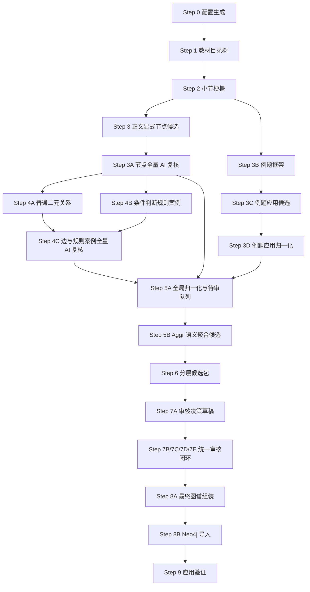

# v4.4 Step 说明

本文档用于说明 v4.4 工作区的真实执行流程。这里特意区分两个词：

- `step-text`：交流稿、方案文档、提示词中的解释性步骤，用来帮助人理解设计思想。
- `正式 Step`：本目录中可以运行的脚本步骤，以文件名前缀为准，例如 `03_extract_explicit_nodes.py`。

后续讨论“现在到 Step 几”时，以正式 Step 为准。

## 一、v4.4 的核心变化

v4.4 继承 v4.3 的主体流程：先构建教材目录树，再按小节生成摘要、节点、关系，最后归一化、审核、入库。v4.4 的新增重点是把“知识组”正式纳入最终图谱，解决节点过细后在 Neo4j 中呈现为大量散点的问题。

与 v4.2 的关键区别仍然保留：条件判断不再被压成一条普通边，也不再把“无解、唯一解、无穷多解”等状态轻易升级为核心概念。条件判断进入专门的规则案例层：

```text
核心定理/公式/方法
  --HAS_RULE_CASE-->
规则案例 RuleCase
  --APPLIES_TO-->
适用对象
  --HAS_CONDITION-->
条件表达式 ConditionExpression
  --HAS_OUTCOME-->
结论/状态 Outcome
```

示例：

```text
线性方程组解的判定定理 --HAS_RULE_CASE--> 无解判定
无解判定 --APPLIES_TO--> 非齐次线性方程组
无解判定 --HAS_CONDITION--> r(A)<r(A|b)
无解判定 --HAS_OUTCOME--> 线性方程组无解
```

这样做的原因是：条件判断本质上是“在某条件下得到某结论”的规则，不宜直接写成 `线性方程组 --某状态关系--> 无解`。直接连边虽然直观，但会丢掉条件，也容易让图谱误以为该状态无条件成立。

v4.4 进一步增加三项设计：

- 所有最终节点、边、规则案例保留 `source_code`，作为紧凑来源编码，例如 `gaodai_shang:C03:S05:U01`。教材来源是元数据，不默认建成可见的教材结构节点。
- Step 8A 自动生成确定性 `KnowledgeGroup`，包括按小节生成的 `SectionGroup` 和按规则案例所属节点生成的 `RuleGroup`。这些组不由 LLM 自由发明，也不在 Step 7 审核阶段临时改图。
- Step 8 展开规则案例时，为条件表达式和结论节点生成保守的 `REFERS_TO` 边，使“系数矩阵的秩等于 n”这类条件能回连到 `系数矩阵`、`矩阵的秩` 等核心知识点。

## 二、正式 Step 总览



## 三、各正式 Step 的职责

### Step 0：配置生成

脚本：`00_prepare_config.py`

生成 `v4_3_config.json`，记录输入教材、输出目录、节点类型、边类型、LLM 配置和 Tree-KG API 适配信息。

当前清华 Tree-KG 公共接口在本地探测中返回过 403，因此 v4.3 把它作为“可选适配器”，默认仍走本地 DeepSeek 调用。

### Step 1：教材目录树

脚本：`01_build_textbook_tree.py`

读取结构化 Markdown，识别章、节、小节、锚点，区分内容精华、典型例题和习题。

习题默认不进入抽取；典型例题不进入正文核心节点抽取，但进入例题应用层。

### Step 2：小节梗概与关键词

脚本：`02_generate_section_summaries.py`

按内容精华小节生成轻量导航信息，只包括：

- 小节梗概 `summary`
- 关键词 `key_terms`

Step 2 不再整理定义、定理、公式、方法、属性状态或条件判断线索，也不判断条件逻辑。它只帮助后续步骤快速了解小节主题；正式节点、普通关系和规则案例必须在后续步骤中直接依据当前小节原文生成。

脚本会同时检查 LLM 原始输出和归一化后的摘要结果。如果模型在 Step 2 中额外输出 `definition_spans`、`rule_case_hints`、`relation_hints` 等候选字段，会记录到 `section_summary_warnings.jsonl`，但这些字段不会进入后续抽取依据。

### Step 3：正文显式节点候选

脚本：`03_extract_explicit_nodes.py`

从内容精华小节抽取核心节点候选。正式全书流程中，Step 3 只负责“生成候选与本地校验标注”，不再直接决定哪些节点进入后续关系抽取。

- `Concept`
- `Method`
- `Formula`
- `Theorem`
- `ProblemClass`

定义不作为独立节点，写入相关节点的 `definition` 字段。

属性值不作为独立节点，默认进入 `attributes` 或 `state_notes`。Step 3 不抽条件判断和 `rule_cases`；如果原文给出条件判断、充要条件、判别准则或分情况结论，交给 Step 4B 处理。

正式全书流程中，Step 3 使用 `--keep-rejected-candidates`，把结构化候选统一写入 `nodes_pre_audit.jsonl`。这一步的本地校验结果会保存在 `review_status`、`validation_warnings`、`review_reason` 等字段里，供 Step 3A 复核参考。

### Step 3A：节点全量 AI 复核

脚本：`03a_audit_explicit_nodes.py`

对 Step 3 产出的 `nodes_pre_audit.jsonl` 做全量复核。复核按小节批量进行：输入当前小节原文和该小节全部节点候选，要求 AI 对每个候选输出 `accept` 或 `review`。

- `accept`：写入正式 `nodes.jsonl`，作为可直接进入主图候选的节点。
- `review`：写入 `node_review_queue.jsonl`，进入 Step 5/6/7 的统一复核。
- `accept` 与 `review` 节点都会写入 `nodes_for_step4.jsonl`，作为 Step 4A/4B 的完整抽边节点池。

Step 3A 不改写节点、不合并同义词、不新增节点、不产边。它只是节点质量闸门：决定节点能否直接入主图候选，但不从 Step 4 的关系抽取上下文中删除待审节点。这样既能减少 Step 7 的大面积节点质检，又能避免因为待审节点被提前移除而漏掉相关关系。

Step 3A 可以把本地 `auto_accept` 的节点降级为 `review`，但不能把本地硬规则已经标为 `reject` 的节点直接升级为正式 `accept`。例如节点缺少名称、名称只是“定理1”、证据不在当前小节原文中、节点类型不合法，这类情况即使 AI 复核输出 `accept`，脚本也会改为 `review`，并记录原始 AI 判断和覆盖原因。这样做是为了保留人工复核机会，同时避免硬 schema 错误直接进入主图。

Step 4A/4B 使用 `nodes_for_step4.jsonl` 抽取关系和规则案例。凡是连接待审节点的普通边，或挂在待审节点上的规则案例，会在 Step 5 自动转入 review，不能直接进入主图。

Step 3A 会额外保留：

- `raw_node_audit.jsonl`：AI 原始复核输出
- `node_audit_decisions.jsonl`：结构化复核决策
- `nodes_for_step4.jsonl`：Step 4 使用的完整节点池
- `node_audit_warnings.jsonl`：复核缺失、格式异常或被打回 review 的记录

### Step 3B：例题框架

脚本：`03b_extract_example_frames.py`

只处理典型例题，输出 `ExampleFrame`，包括题型、方法、使用工具、得到结果等证据。

它不直接产正式 KG 节点和边。

### Step 3C：例题应用候选

脚本：`03c_convert_example_frames.py`

把 `ExampleFrame` 转成应用层候选：

- 例题中可复用的方法 `Method`
- 可复用题型 `ProblemClass`
- 应用关系 `USES` / `GETS`

这些候选默认需要审核，不直接进入核心主图。

### Step 3D：例题应用归一化

脚本：`03d_normalize_example_applications.py`

对例题应用候选做名称归一、核心节点匹配、重复合并。

推荐使用 `--clean-flow` 保留可疑候选进入 Step 5/7 审核，不在 Step 3D 提前删除或改写。

### Step 4A：正文普通二元关系

脚本：`04_extract_explicit_edges.py`

只在 Step 4 完整节点池内抽取普通显式关系。这里的节点池使用 `nodes_for_step4.jsonl`，包含 Step 3A 已接受节点和待审节点，目的是避免“节点还没最终拍板，所以相关关系被提前漏掉”。

- `SUPERIOR`：下位到上位
- `EQUATIVE`：同位、并列、同类
- `PART_OF`：部分到整体
- `HAS_PROPERTY`：对象到性质/准则/关于该对象的结论性命题
- `USES`：使用者到被使用工具
- `GETS`：方法/公式/定理得到结果
- `DERIVES`：推导依据到被推出结论

Step 4A 禁止输出条件判断关系，禁止输出 `HAS_CONDITION`、`HAS_OUTCOME`、`HAS_RULE_CASE`，也禁止旧关系名 `DERIVED_FROM`。

Step 4A 不自动修正边方向。若 LLM 输出“性质节点 -> 对象节点”的 `HAS_PROPERTY` 或 `SUPERIOR`，校验器只标记方向可疑，不在代码中替它改写。方向错误主要通过更明确的 prompt 和后续统一复核处理。

正式流程不启用自动语义补边。也就是说，Step 4A 只抽取原文显式支持的普通二元关系，不额外根据节点名称或类型自动补出“看起来应该有”的边。

过去实验中的 `--semantic-augment` 不属于正式流程。它曾用于生成保守的语义归属候选，例如：

```text
n阶行列式 --HAS_PROPERTY--> 两行互换反号性质
化为上三角形行列式方法 --USES--> n阶行列式
```

这类边可能有助于补强“对象-性质”“方法-对象/工具”的核心语义关系，但也容易把模型没有明确抽出的关系变成代码层面的自动补丁。当前正式流程先不做自动补边；如果后续发现确有必要，应在统一复核或单独补充实验环节中提出、审核并落盘。

正式全书流程中，Step 4A 使用 `--keep-rejected-candidates`，把结构化普通边候选统一写入 `edges_pre_audit.jsonl`。这一步只负责生成候选和记录本地校验标记，不再直接决定正式边和待审边；最终分流交给 Step 4C。

### Step 4B：条件判断与规则案例

脚本：`04b_extract_rule_cases.py`

只处理条件判断型知识，输出 `RuleCase` 候选：

- `RuleCase`：规则案例，如“无解判定”“唯一解判定”“可逆判定”
- `Condition`：条件表达式或条件短语
- `Outcome`：结论、状态或结果
- `condition_logic`：`SUFFICIENT` / `NECESSARY` / `IFF` / `PIECEWISE` / `AND` / `OR` / `UNKNOWN`

Step 4B 只把规则案例挂到已有的 `Theorem`、`Formula` 或 `Method` 节点上，不新增节点，不输出普通边。只有原文明确写“当且仅当、充要条件、充分必要条件”时才用 `IFF`；普通“如果……那么……”默认不是 `IFF`。

规则案例的 `evidence_span` 必须是当前小节原文中的连续片段，并且要同时支持条件和结论。缺少条件、缺少结论、缺少证据或证据不在原文中，都会被本地校验标记为硬问题，后续不能被 AI 复核直接自动放行。

正式全书流程中，Step 4B 同样使用 `--keep-rejected-candidates`，把结构化规则案例候选统一写入 `rule_cases_pre_audit.jsonl`。这一步只负责生成条件判断候选和记录本地校验标记，不直接决定主图准入。

### Step 4C：边与规则案例全量 AI 复核

脚本：`04c_audit_edges_and_rule_cases.py`

对 Step 4A 的 `edges_pre_audit.jsonl` 和 Step 4B 的 `rule_cases_pre_audit.jsonl` 做全量复核。复核按小节进行：输入当前小节原文、该小节普通边候选、该小节规则案例候选，要求 AI 对每一条候选输出 `accept` 或 `review`。

- `accept`：边或规则案例本身质量足够稳定，写入正式 `edges.jsonl` 或 `rule_cases.jsonl`，进入 Step 5。
- `review`：边或规则案例存在方向、类型、证据、条件逻辑等问题，写入 `edge_review_queue.jsonl` 或 `rule_case_review_queue.jsonl`，进入 Step 7 统一复核。

Step 4C 不新增候选、不改写候选、不自动补边，也不做同义合并。它只做“审批/分流”：判断 Step 4A/4B 已经生成的候选是否可以作为正式候选继续向下走。

和 Step 3A 一样，Step 4C 可以把本地通过的普通边或规则案例降级为 `review`，但不能把本地硬规则已经标为 `reject` 的候选直接升级为正式 `accept`。例如边端点不在节点池、关系类型非法、自环、证据不在当前小节、证据为空、边类型与节点类型不匹配、规则案例缺条件/缺结论/缺证据等，即使 AI 复核输出 `accept`，脚本也会改为 `review`，并保留原始 AI 判断和覆盖原因。

需要特别区分两类“进 review”：

- 如果 Step 4C 认为边或规则案例本身有问题，它会直接进入 Step 7。
- 如果 Step 4C 认为边本身合理，但边连接的节点仍处于 Step 3A 待审状态，Step 5 会因为端点节点未准入而把这条边随节点一起转入 Step 7。这不是边质量失败，而是依赖关系保护，防止边挂到一个尚未确认的节点上。

### Step 5A：全局归一化与待审队列

脚本：`05_global_normalize_and_review.py`

把正文节点、Step 4C 复核后的正文边、Step 4C 复核后的规则案例、例题应用候选合并成统一候选包，并分出：

- 自动进入主候选的核心节点/边
- 待审节点
- 待审普通边
- 待审规则案例
- 拒绝归档项

Step 5A 不替代 Step 4C 做边质量审批，也不做新的语义判断。它只做机械整理：

- 字段归一化：补充 `kg_layer`、`step5_status`、`source_code`、`source_codes`、`evidence_spans_merged`。
- 机械去重：节点按 `node_id` 去重，边按 `source_node_id + target_node_id + type + kg_layer` 去重。
- 来源保留：重复节点或重复边不会被当作错误丢弃，而是把来源编码、别名、属性和 evidence 合并到保留项中。
- 依赖传播：连接待审节点的普通边、挂在待审节点上的规则案例，不能直接进入主图候选，会随对应节点进入 Step 7 统一复核。
- 队列整理：Step 4C 已经判为 review 的普通边和规则案例必须进入 Step 5A 审核队列，不能在全局整理时丢失。

Step 5A 的去重不是同义合并。比如 `矩阵的秩` 和 `秩` 如果名称不同、`node_id` 不同，不会在 Step 5A 被合并；这类问题交给 Step 5B 生成聚合候选。

### Step 5B：Aggr 语义聚合候选

脚本：`05b_generate_aggr_candidates.py`

借鉴 Tree-KG 中 Aggr 的思想，识别“概念上可能相同或高度相关，但在不同章节以不同名称出现”的节点对。它只生成聚合候选，不执行合并、不迁移关系、不删除节点。

候选生成依据：

- 节点类型相同。
- 名称或别名相似。
- 定义、描述、证据等上下文相似。
- 局部角色相似，即入边/出边类型结构相近。
- 两个节点之间没有明确 `SUPERIOR` 或 `PART_OF` 这类上下位/组成关系；如果有，说明更可能是层级关系，不应合并。

输出 `aggr_candidates.jsonl`，每条候选默认 `review_status="review"`，进入独立的聚合候选审核视图。当前 Step 7B 不会自动执行节点合并；真正合并时应显式记录：主实体保留、别名合并、描述补充、关系迁移、被合并节点标记为 `merged`，不能物理删除。

### Step 6：分层候选包

脚本：`06_build_layered_candidates.py`

把 Step 5A 和 Step 5B 结果整理成阶段一分层包：

- `explicit_core`
- `example_application`
- `rule_case`
- `review_pending`
- `review_pending_merge_candidate`
- `rejected_archive`

这一层仍不做最终人工决策，也不写 Neo4j。

### Step 7A：构造统一审核项

脚本：`07a_build_review_items.py`

读取 Step 6 的待审层：

- `review_pending_nodes.jsonl`
- `review_pending_edges.jsonl`
- `review_pending_rule_cases.jsonl`
- `review_pending_merge_candidates.jsonl`

统一转换为 `review_items.jsonl`。每条审核项包含 `item_kind`、`source_item`、`context`、`allowed_actions`、`default_action` 和 `risk_flags`。这一步不调用 LLM，不做决策。

### Step 7B：AI 全量审核建议

脚本：`07b_ai_review_items.py`

对 `review_items.jsonl` 做全量审核，输出 `ai_review_decisions.jsonl`。建议动作包括：

- 节点、普通边、规则案例：`accept` / `reject` / `rewrite` / `defer`
- 聚合候选：`accept_merge` / `reject_merge` / `defer`

Step 7B 只给建议，不直接改图。模型默认可配置为 GPT-5.5 或实际可调用的高智力模型；脚本支持 `--mock`、`--resume`、`--batch-size`、`--max-workers` 和 `--max-budget-usd`。

### Step 7C：规则校验与冲突复核

脚本：`07c_validate_and_resolve_conflicts.py`

先用工程规则校验 Step 7B 的建议：

- 接受边时，源节点和目标节点必须存在。
- 接受规则案例时，owner 节点必须存在，条件和结论不能为空。
- 接受聚合时，两个节点类型必须一致，且不能存在 `SUPERIOR` 或 `PART_OF` 阻断关系。
- `rewrite` 必须提供合法的改写结构。

无冲突的建议直接进入 `validated_review_decisions.jsonl`。有冲突的建议进入 `conflict_review_items.jsonl`，可交给高智力模型做二次冲突复核。复核后仍违反硬约束的项目会被强制 `defer` 或 `reject_merge`，写入 `decision_validation_errors.jsonl`。AI 不能越过硬工程约束。

### Step 7D：应用审核结果

脚本：`07d_apply_review_results.py`

应用 Step 7C 的有效决策，生成审核通过候选包：

- `approved_core_nodes.jsonl`
- `approved_core_edges.jsonl`
- `approved_application_nodes.jsonl`
- `approved_application_edges.jsonl`
- `approved_rule_cases.jsonl`
- `merge_plans.jsonl`
- `review_archive.jsonl`
- `deferred_items.jsonl`
- `decision_trace.jsonl`

`accept_merge` 不直接粗暴合并节点，只生成 `merge_plans.jsonl`。真正执行“主实体保留、别名合并、来源合并、关系迁移、被合并节点标记为 merged”放到 Step 8A。

### Step 7E：审核报告与追踪

脚本：`07e_review_report.py`

汇总 Step 7A-D 的输入、决策、冲突、归档、暂缓和通过结果，输出 `review_closure_report.md`。Step 7 到此只完成审核闭环，不生成知识组，不导入 Neo4j。

### Step 8A：最终图谱组装

脚本：`08a_assemble_final_graph.py`

读取 Step 7D 的审核通过候选包和 `merge_plans.jsonl`，组装最终导入包。这里负责：

- 执行通过审核的 merge plan；
- 生成最终核心节点/边、应用层节点/边、规则案例；
- 生成 `KnowledgeGroup` 块状结构。

`SectionGroup`：按 `section_node_id` 自动生成，一个小节一个组，通过 `HAS_MEMBER` 指向本小节通过审核的核心知识点。

`RuleGroup`：按规则案例的 `owner_node_id` 自动生成，一个拥有规则案例的定理、公式或方法对应一个规则组，通过 `HAS_ANCHOR` 指向所属核心节点，并通过 `HAS_MEMBER` 指向它的规则案例。

`TopicGroup`、`MethodGroup` 暂不自动生成。未来如果需要主题组或方法组，应由 LLM 提议、进入审核队列，再由人工或高智力审核脚本确认。

Step 8A 会输出 `step8_assembly_hard_warnings.jsonl` 和 `step8_assembly_soft_warnings.jsonl`。如果存在硬警告，例如合并主节点缺失、合并后边端点缺失、规则案例 owner 缺失、最终边自环未归档等，脚本会生成最终包但返回非零状态，并要求停在导入前处理。

### Step 8B：Neo4j 导入

脚本：`08_import_neo4j.py`

读取 Step 8A 最终图谱包。核心节点/边和应用层节点/边直接导入；规则案例先展开为规则层节点和边，再导入 Neo4j。

v4.4 同时导入 `KnowledgeGroup` 与知识组关系。知识组关系是导航关系，不等同于数学语义关系。

规则案例展开时会生成：

- `RuleCase`
- `ConditionExpression`
- `Outcome`
- `HAS_RULE_CASE`
- `APPLIES_TO`
- `HAS_CONDITION` / `HAS_CONDITION_AND`
- `HAS_OUTCOME`
- `REFERS_TO`

其中 `REFERS_TO` 用于表达“条件表达式或结论文本中提到了某个核心知识点”。例如：

```text
有解判定 --HAS_CONDITION--> 系数矩阵与增广矩阵的秩相等
系数矩阵与增广矩阵的秩相等 --REFERS_TO--> 系数矩阵
系数矩阵与增广矩阵的秩相等 --REFERS_TO--> 增广矩阵
系数矩阵与增广矩阵的秩相等 --REFERS_TO--> 矩阵的秩
```

如果 Step 8A 已经产生硬警告，Step 8B 会在读取最终包时直接拒绝入库。规则案例缺少所属节点、条件、结论或证据，最终边端点不存在，或最终节点/边类型不合法，都属于需要先处理的导入前问题。

### Step 9：应用验证

脚本：`09_application_validation.py`

连接 Step 8 已导入的 Neo4j 图谱，使用一组面向智学助手真实场景的验收问题进行验证。当前默认测试覆盖：

- 核心知识点是否能查到；
- 学生不会某知识点时，是否能找到相关支撑知识；
- 给定知识点时，是否能推荐相关方法、公式或性质；
- 两个知识点之间是否存在可解释路径；
- 条件判断类问题是否能从规则案例层返回适用对象、条件、结论和证据。

Step 9 只读 Neo4j，不修改图谱。它的产物是应用验证报告和原始查询结果，用来判断当前图谱是否能服务学习路径、知识追溯、方法推荐和条件判断问答。如果测试失败或只部分通过，应回到抽取规则、关系定义、审核策略或导入展开逻辑中修正，而不是在 Step 9 直接补边。

v4.4 的 Step 9 必须同时报告两个口径：

- 结构孤立节点：把所有边都算进去，包括 `HAS_MEMBER`、`HAS_ANCHOR`。
- 语义孤立节点：忽略知识组边，只看数学语义关系和规则层关系。

原因是知识组会让图谱在结构上更连通，但不能替代核心数学语义边。应用验证时必须区分“便于导航”和“语义关系充分”。

## 四、关系类型分层

### 教材结构层

```text
HAS_SUBSECTION
INTRODUCES
HAS_EXAMPLE
```

### 核心普通关系层

```text
SUPERIOR
EQUATIVE
PART_OF
HAS_PROPERTY
USES
GETS
DERIVES
```

### 条件判断规则层

```text
HAS_RULE_CASE
APPLIES_TO
HAS_CONDITION
HAS_CONDITION_AND
HAS_CONDITION_OR
HAS_OUTCOME
HAS_OUTCOME_AND
HAS_OUTCOME_OR
REFERS_TO
```

### 知识组导航层

```text
HAS_MEMBER
HAS_ANCHOR
RELATES_TO_GROUP
```

当前已实现 `HAS_MEMBER` 和 `HAS_ANCHOR`。`RELATES_TO_GROUP` 是预留关系，用于未来表达核心节点与主题组、方法组之间的导航连接。

### 派生/展示层

```text
PREREQUISITE_OF
HAS_POSSIBLE_STATE
```

这两类不由 Step 4 直接抽取，可在后续应用验证或图查询展示中从核心图与规则层推导。

## 五、条件判断的处理口径

遇到下列表达时，优先进入规则案例层：

- 若 A，则 B
- 当 A 时，B
- A 当且仅当 B
- A 的充要条件是 B
- 分情况讨论，每种情况有明确结论

不推荐：

```text
线性方程组 --状态关系--> 无解
条件表达式 --DERIVES--> 无解
线性方程组 --GETS--> 无解
```

推荐：

```text
判定定理 --HAS_RULE_CASE--> 无解判定
无解判定 --APPLIES_TO--> 线性方程组
无解判定 --HAS_CONDITION--> 秩条件
无解判定 --HAS_OUTCOME--> 无解
```

如果应用端需要快速查询“线性方程组可能有哪些状态”，可以在展示层派生：

```text
线性方程组 --HAS_POSSIBLE_STATE--> 无解
```

但这条边必须标明是派生/展示边，不替代规则层的条件结构。

## 六、知识组的处理口径

知识组的目标不是替代概念、定理、公式、方法之间的数学关系，而是提供一个中间层，让应用端可以把同一小节、同一规则主题或同一方法族中的细粒度节点组织起来。

当前实现只允许两类确定性知识组：

- `SectionGroup`：由教材小节自动生成，组名采用小节名，来源编码来自 `section_node_id`。
- `RuleGroup`：由已通过审核的规则案例自动生成，组名采用“所属知识点 + 规则组”。

暂不允许 LLM 直接生成自由知识组，原因是自由主题组容易把“教材位置相近”“概念语义相近”“解题方法相近”混在一起，导致组边含义不清。后续如果引入 `TopicGroup` 或 `MethodGroup`，必须进入审核环节，并明确组的创建依据。

## 七、来源编码原则

`source_code` 是紧凑来源字段，不是默认图谱节点。建议格式：

```text
教材ID:章:节:小节
教材ID:章:节:小节:段
教材ID:章:节:小节:句
```

当前脚本主要使用到小节级，例如：

```text
gaodai_shang:C03:S05:U01
```

这样做的好处是：Neo4j 中的知识图谱仍以数学知识为主，不被教材目录节点淹没；但每个节点和边仍能追溯到教材来源。

## 八、审核产物原则

v4.4 明确要求：被拒绝、改写或暂缓的内容不能无痕消失。

- 拒绝项进入 `final_archived_items.jsonl`
- 暂缓项进入 `final_review_pending.jsonl`
- 改写项保留原件，并把改写结果写入最终包
- 所有动作进入 `decision_trace.jsonl`

这保证后续可以追溯：某个候选为什么没进图，是被拒绝、被改写，还是仍待审。
