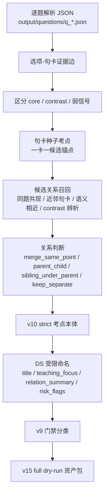
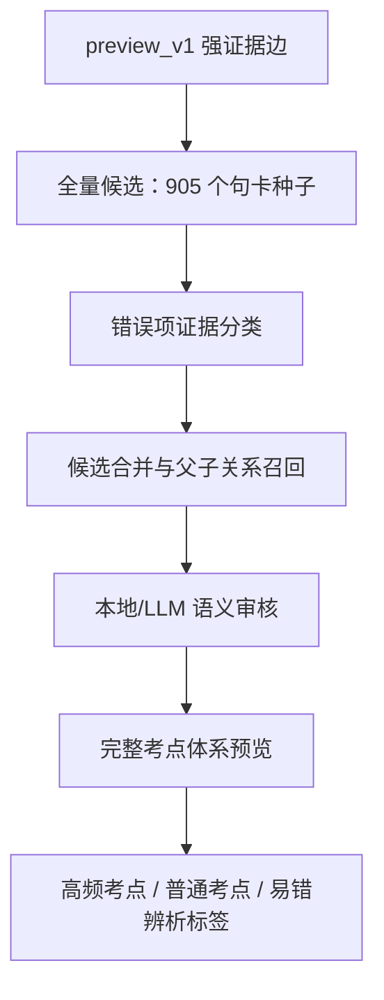

# 考点生成

从选项证据输出中提取、合并、生成正式知识点级考点。

## 当前确认流程（2026-07-02）

本模块当前已经确认的主线不是早期的单步实验，而是完整的、可复现的 **题目驱动考点生成流程**。它能提取的是“题目反复考到的教材知识点/考点”，不是完整的教材知识图谱。后续如要得到更强的知识组织感，需要在此基础上补一层“教材知识图谱”。

当前口径：

- 考点来自题目与教材句卡的连接，不由 LLM 自由发明。
- 正确选项链接到的句卡是 `core`，错误选项中有教学辨析价值的句卡是 `contrast`。
- 一个句卡只要被题目链接，就可以成为候选考点；多句卡是否合并，需要经过语义关系判断和门禁。
- `question_count >= 3` 为高频考点，`question_count < 3` 为普通考点。
- 有 `contrast` 的点可以带“易错/辨析”信号，但错误项是否真正有教学价值需要单独复核。
- DS/LLM 只做受限命名、考查方向总结和风险提示；考点是否存在，主要由题目-句卡边和工程规则决定。



### 输入

当前主输入来自：

```text
../选项证据生成/新题解析模块复用/output/questions/q_*.json
```

每道题的逐题 JSON 提供：

- 题干、选项、答案；
- 每个选项链接到的教材句卡；
- 证据等级与判断结果；
- 是否需要人工复核。

### 生成逻辑

1. **质量门禁**
   - AI 答案与标准答案明显不一致、验证未通过、或标记需要教师复核的题，先不进入正式强证据池。
   - 这一步保证后续考点不是由错误解析污染出来的。

2. **选项-句卡强证据边**
   - 正确选项的直接证据进入 `core`。
   - 错误选项的直接证据如果能形成概念辨析，进入 `contrast`。
   - 间接证据、无证据、候选证据只作为弱信号或待审信息。

3. **句卡种子考点**
   - 被题目链接的正式句卡先作为候选考点锚点。
   - 这一步形成“题目考了哪些教材句卡”的基础图谱。

4. **关系召回与判断**
   - 召回可能相关的句卡/考点：同题共现、同选项多卡、相邻教材句卡、语义相近、同章节、contrast 辨析等。
   - 关系判断分为：
     - `merge_same_point`：同一教材知识点，允许合并；
     - `parent_child`：父子知识关系；
     - `sibling_under_parent`：同一上位概念下的并列点；
     - `keep_separate`：相关但不合并；
     - `needs_review`：证据不足，待审。

5. **v10 strict 考点本体**
   - 形成当前稳定的考点本体。
   - 当前 full dry-run 使用的是 `822` 个 v10 strict 考点本体。
   - 该层仍以题目驱动为主，不等同于完整教材知识图谱。

6. **DS 受限命名**
   - DS 输入只包含当前考点已有的题目、选项、句卡原文、关系记录。
   - DS 输出：
     - `title`：短考点名；
     - `teaching_focus`：题目考查方向；
     - `relation_summary`：题目和句卡如何支撑该考点；
     - `card_roles` / `question_roles`；
     - `risk_flags`。
   - DS 不允许新增没有题目/句卡/子点支撑的考点。

7. **v9 工程门禁**
   - 脚本不重新命名，只把命名结果和工程风险转成复核队列。
   - 当前 rules_v4b 分类为：

| status | 当前数量 | 含义 |
|---|---:|---|
| `ready_candidate` | 85 | 成熟候选考点，可作为第一批干净考点池 |
| `light_review` | 69 | 基本成立，轻量复核 |
| `contrast_review` | 118 | 易错/辨析价值需要确认 |
| `single_question_candidate` | 480 | 只有 1 题支撑的普通考点，建议折叠或低优先级展示 |
| `evidence_supplement_candidate` | 62 | 多数不是考点错，而是缺上位教材知识节点或上下文 |
| `merge_boundary_review` | 7 | 多句卡合并边界需要确认 |
| `title_review` | 1 | 标题过长或命名需调整 |

8. **v15 full dry-run 资产包**
   - 将 v10 本体、DS 命名、v9 门禁、关系层信息打包成复核资产。
   - 当前已完成全量：

| 指标 | 数量 |
|---|---:|
| v10 strict 考点本体 | 822 |
| 命名结果 | 822 |
| 门禁结果 | 822 |
| 题目-句卡边 | 1457 |
| missing named/admission | 0 |
| extra named/admission | 0 |
| source drift | 0 |

最终 dry-run 产物：

```text
work/preview_v15_full_dry_run_v15_current_v10_822_ds_full_prompt_v3_rules_v4b/
├── full_dry_run_asset.json
├── risk_queues.json
├── summary.json
└── full_dry_run_report.md
```

### 生产脚本入口

正式用于生产和复核页原型的脚本清单已单独整理到 `PRODUCTION.md`，机器可读清单见 `production_manifest.json`。如只需要用当前稳定版本重新打包 v15 资产包，运行：

```powershell
.\run_current_full_dry_run.ps1
```

该入口只使用已有 v10/v8/v9/v14 产物，不调用 DeepSeek。

如需从逐题证据重新跑到 v15、但复用已有 DS 命名输出，运行：

```powershell
.\run_current_pipeline_no_api.ps1
```

注意：当前生产版本不能直接用 v5 默认参数复现；v5 必须使用全量关系队列参数，否则会生成 823 个 v10 点，和当前 822 条命名/门禁结果错位。

### 当前结论

当前流程 **可以提取考点**，但提取的是“题目驱动的考点”。它已经能比较准确地回答：

> 这批题反复考到了教材里的哪些句卡/知识点？

它还不能完整回答：

> 这些知识点在教材体系中的上位概念、并列关系、父子关系和场景分类是什么？

因此下一阶段的重点不是继续怀疑句卡是否足够长，而是补充或重建更精准的 **教材知识图谱层**，让结构从：

```text
题目考点 -> 原文句卡
```

升级为：

```text
题目考点 -> 教材知识节点 -> 原文句卡
```

### 保留说明

下面的 `Preview v1` 到 `Preview v15` 记录了这个流程的历史演进、试验、修正和校准过程。它们暂时保留，后续需要和业务方确认哪些属于历史实验、哪些属于正式链路，再统一删除、归档或改写。

## 当前建议主线：Preview v1 保守种子考点

2026-06-29 新增 `preview_v1_seed_points.py`，用于在不污染旧产物的情况下，从
`../选项证据生成/新题解析模块复用/output/questions/q_*.json` 生成第一版结构化预览。

这条线暂时**不做 LLM 合并和命名**，只回答一个问题：

> 在现有逐题证据产物中，哪些正式句卡已经和题目形成了稳定、可追溯的强证据连接？

### 运行方式

```bash
python preview_v1_seed_points.py
```

输出目录：

```text
work/preview_v1/
├── summary.json            # 总体统计与口径说明
├── seed_points.json        # 正式种子考点：一卡一锚点，只含非待审题强证据
├── strong_edges.json       # 进入正式种子的强证据边
├── flagged_questions.json  # 待审题；不进入正式种子，但保留其强证据边
├── evidence_gaps.json      # 标准答案选项没有强证据的缺口
├── weak_signals.json       # 弱信号：indirect/none/needs_manual 等
└── report.md               # 人读报告与 Top 种子点
```

### Preview v1 口径

- 输入使用 `output/questions/q_*.json`，暂不依赖 `question_option_card_bindings.jsonl`。
- 当前可读逐题文件为 706 个；上游 `summary.json` 记录 `total_questions=720`，缺口先记录在报告中，不阻塞预览。
- 以下任一情况成立，整题进入 `flagged_questions.json`，不进入正式种子：
  - AI 答案与标准答案不一致。
  - `pipeline.validate.validation_status != "passed"`。
  - `final.needs_teacher_review = true`。
- 正式种子只使用强证据：
  - `direct_single`
  - `direct_multi`
  - `semantic_direct`
  - `negative_direct`
- 错误选项的强证据进入 `contrast` 角色，因为错误项也可能承载辨析型考点。
- `indirect_context`、`none`、`needs_manual`、`candidate_card_ids`、混合型 `card_ids` 只作为弱信号保留，不直接生成正式种子。

### Preview v1 当前统计

最近一次运行结果：

| 指标 | 数量 |
|---|---:|
| 输入逐题 JSON | 706 |
| 正式通过题 | 482 |
| 待审题 | 224 |
| 正式种子考点 | 905 |
| 高频种子预览（去重题目数 ≥ 3） | 85 |
| 强证据边 | 1591 |
| 标准答案选项证据缺口 | 246 |
| 弱信号记录 | 1660 |

Preview v1 的结果不是最终前端考点资产，而是后续“候选合并、LLM 命名、频次统计”的干净底座。

## Preview v2 合并候选召回

2026-06-29 新增 `preview_v2_merge_candidates.py`，用于在 Preview v1 的种子点基础上召回“可能需要合并”的种子对。

这条线仍然**不自动合并、不调用 LLM**，只生成候选边和候选组件，供人工或后续 LLM 裁判使用。

### 运行方式

```bash
python preview_v2_merge_candidates.py
```

输出目录：

```text
work/preview_v2/
├── summary.json                         # 候选召回统计
├── merge_candidate_pairs.json           # 全量候选对
├── selected_merge_candidate_pairs.json  # 审查候选对
├── candidate_components.json            # 高分候选边形成的候选组件
└── merge_candidate_report.md            # 人读报告
```

### Preview v2 口径

- 召回对象来自 `work/preview_v1/seed_points.json`。
- 单题种子暂时只通过“同题多卡”或“同章节近邻”参与召回；后续可以再放开全量语义召回。
- 同一题连接多张强证据卡时，形成 `same_question` 候选边。
- 同一题内 `core` 与 `contrast` 共同出现时，标记 `possible_discrimination`，例如“洗钱阶段辨析”这类考点。
- 句卡编号距离 `<=3` 且至少共享一个题目章节时，形成 `near_card_id_same_section` 候选边。
- `focus_type` 只作为软信号，计入 `same_focus_type_soft`，不作为硬边界。
- `score` 只用于排序和控预算，不代表自动合并结论。
- 候选组件只使用 `score >= 100` 的候选边，避免低分候选边连成无意义大团。

### Preview v2 当前统计

最近一次运行结果：

| 指标 | 数量 |
|---|---:|
| 输入种子点 | 905 |
| 强证据边 | 1591 |
| 候选对总数 | 1725 |
| 审查候选对 | 1725 |
| 进入组件的高分候选边 | 37 |
| 候选组件 | 23 |

候选来源：

| 来源 | 数量 |
|---|---:|
| same_question | 1391 |
| same_focus_type_soft | 1273 |
| possible_discrimination | 525 |
| near_card_id_same_section | 474 |

## Preview v3 审查后考点组预览

2026-06-29 新增 `preview_v3_reviewed_groups.py`，用于把 Preview v2 的高分组件审查结论固化成可复跑产物。

这条线仍然**不调用外部 LLM/API**。23 个组件的判断来自本地 Codex/子代理人工式审查。

### 运行方式

```bash
python preview_v3_reviewed_groups.py
```

输出目录：

```text
work/preview_v3/
├── summary.json                       # v3 统计
├── component_review_sample.json       # 23 个组件的审查结论
├── reviewed_components.json           # 组件 + 审查结论
├── unresolved_components.json         # split/unsure 组件
├── merged_seed_groups_preview.json    # 审查后考点组预览
└── report.md                          # 人读报告
```

### Preview v3 口径

- `should_merge` 组件：合并为一个预览考点组，状态为 `merged_by_local_review`。
- `split` 组件：暂不合并，保留拆分理由，相关 seed 仍单独保留。
- `unsure` 组件：暂不合并，进入待审，相关 seed 仍单独保留。
- 未进入高分组件的 seed：作为 `single_seed` 单独保留。
- v3 仍不是最终前端考点资产；后续还需要处理跨组件重复、单 seed 命名和待审题回收。

### Preview v3 当前统计

最近一次运行结果：

| 指标 | 数量 |
|---|---:|
| 输入种子点 | 905 |
| 已审组件 | 23 |
| should_merge | 16 |
| split | 3 |
| unsure | 4 |
| 审查后预览考点组 | 885 |
| merged_by_local_review | 16 |
| single_seed | 869 |
| 高频组预览（去重题目数 ≥ 3） | 74 |

典型合并组：

- `PEP加强尽调要求`：`v6s_N02062`、`v6s_N02287`、`v6s_N03216`
- `FIU接收、分析并分发STR/SAR`：`v6s_N04701`、`v6s_N04713`
- `外国空壳银行及代理账户禁令`：`v6s_N02761`、`v6s_N02766`、`v6s_N05057`
- `美国爱国者法案第319(a)条：代理账户等额没收`：`v6s_N02777`、`v6s_N02778`

## Preview v4 高频考点命名预览

2026-06-29 新增 `preview_v4_name_high_frequency.py`，用于在 Preview v3 的考点组预览基础上，
把去重题目数 `>= 3` 的高频组挂上本地审查后的短标题和考查方向。

这条线仍然**不调用外部 LLM/API**。命名来自本地 Codex/子代理分批审查，目标是先看高频考点是否“像教研能用的考点名”，暂不处理低频/单题考点的正式命名。

### 运行方式

```bash
python preview_v4_name_high_frequency.py
```

输出目录：

```text
work/preview_v4/
├── summary.json                       # v4 统计
├── high_frequency_named_points.json   # 74 个已命名高频考点组
├── exam_points_preview.json           # 885 个预览组；低频组保留但未命名
└── report.md                          # 人读报告
```

### Preview v4 口径

- 高频阈值：去重题目数 `question_count >= 3`。
- 只命名高频组；低频组保留 `not_named_low_frequency` 状态。
- `title` 是短教材知识点名，例如“政治公众人物强化尽调”“拆分交易规避报告”。
- `teaching_focus` 承载考法表达，统一用“考查学生能否……”开头。
- 每个命名保留 `naming_basis` 和 `risk`，便于后续人工复核。
- v4 不是最终前端资产；Egmont、OFAC、执法响应等相邻考点仍建议进入 v5 做重复/父子层级审查。

### Preview v4 当前统计

最近一次运行结果：

| 指标 | 数量 |
|---|---:|
| 输入预览组 | 885 |
| 高频组 | 74 |
| 已命名高频组 | 74 |
| 低频未命名组 | 811 |
| 缺失命名 | 0 |

## Preview v5 完整考点体系规划

Preview v4 只完成了高频组命名，**不是完整考点体系的结束**。当前强证据句卡中仍有大量长尾：

| 句卡引用题目数 | 数量 | 处理状态 |
|---|---:|---|
| 1 题 | 662 | 未系统归并 |
| 2 题 | 158 | 未系统归并 |
| ≥ 3 题 | 85 个种子，合并后 74 个高频组 | 已完成 v4 命名预览 |

v5 的目标是把所有被题目强证据连接的句卡都纳入考点候选，而不是只处理高频组。

### 业务定义

- 考点更偏**教材知识点**，不是纯题目技巧。
- 被题目强证据连接的句卡都进入考点候选，包括 1 次、2 次、3 次及以上引用的句卡。
- 1 次、2 次引用的句卡也算考点候选；如果能并入高频考点，则并入后自然增加该考点覆盖；不能并入则作为普通考点保留。
- 错误选项的强证据也可以进入考点体系，但必须是“有效混淆项”，不能把普通排除项、胡编项、无教学价值的错项生成考点。
- 考点最终分为：
  - `高频考点`
  - `普通考点`
  - `易错/辨析标签`
- `易错/辨析` 是考点或知识点上的标签，不是另一套独立体系。
- 父考点和子考点都可以展示，且都算考点；父考点必须有明确教材知识含义。

### 正确项与错误项规则

选项证据进入考点体系时保留角色：

| 角色 | 来源 | 进入规则 |
|---|---|---|
| `core` | 正确选项强证据 | 默认进入考点候选 |
| `contrast` | 错误选项强证据 | 只有有效混淆项进入考点候选 |
| `supporting` | 背景/间接证据 | 暂不生成考点，只保留为辅助材料 |

错误项初筛建议输出三类：

| 类型 | 是否进入考点 | 说明 |
|---|---|---|
| `confusing_contrast` | 是 | 错误项本身是教材知识点，且与正确项/题干存在可教学的混淆关系 |
| `pure_exclusion` | 否 | 只是排除性证据、胡编项、无教学价值错项 |
| `needs_review` | 暂缓 | 是否属于有效混淆不确定 |

有效混淆项的判断标准：

1. 错误项本身能回到明确教材句卡。
2. 它不是无依据项、胡编项或纯排除项。
3. 它与题干、正确项或同题其他选项存在可教学的概念混淆关系。
4. 它能说明“这个教材知识点不能错用到当前场景”。

例子：

- `处置阶段 / 离析阶段 / 融合阶段` 的错配，属于有效混淆，可以形成易错/辨析标签。
- 题目问 FIU 职能，错误项引用 FATF 职能，如果它用于区分“机构专属职责”，也可以算有效混淆。
- 选项没有明确教材依据、只是明显错误或随意排除，不进入考点生成。

### 频次统计规则

高频统计应同时保留总计数和分角色计数：

```json
{
  "question_count": 5,
  "core_question_count": 2,
  "contrast_question_count": 4,
  "is_high_frequency": true,
  "tags": ["易错/辨析"]
}
```

- 同一道题内同一考点只计 1 次，避免多选项重复加权。
- `core` 和有效 `contrast` 都计入 `question_count`。
- `question_count >= 3` 可以标记为高频考点。
- 只由错误项贡献的考点也可以成立，但应带 `易错/辨析` 标签。
- 如果有父子结构，父考点和子考点分别统计；父考点可额外保留子树汇总题目数。

### 父子考点规则

相邻概念不一定强行平铺合并，可以形成父子结构：

```text
洗钱阶段辨析
├── 处置阶段识别
├── 离析阶段识别
└── 融合阶段识别
```

规则：

- 父考点本身也必须是明确考点，不能只是目录容器。
- 子考点各自保留自己的题目数、证据卡和角色统计。
- 父考点可保留子树汇总题目数，用于展示整体重要性。
- 前端可以同时展示父考点和子考点，但需要避免同一位置旁注重复堆叠。

### v5 计划输出

v5 先不急于命名全部低频点，先输出归并与层级预览：

```text
work/preview_v5/
├── summary.json                         # v5 统计
├── all_candidate_points.json            # 1/2/3+ 引用句卡全量候选
├── contrast_classification.json         # 错误项 confusing/pure_exclusion/needs_review 初筛
├── merge_parent_child_candidates.json   # 合并与父子候选
├── exam_point_system_preview.json       # 完整考点体系预览
└── report.md                            # 人读报告
```

重点回答：

- 哪些 1 次/2 次句卡被并入已有高频考点。
- 哪些 2 次句卡形成普通考点。
- 哪些 1 次句卡暂时保留为单题普通考点。
- 哪些考点带有 `易错/辨析` 标签。
- 哪些候选需要人工拍板。

## 当前有效方法（v5 起）

> 本节替代早期 `step1_aggregate.py`、`step2_cluster.py`、`step3_merge.py`、`step4_name.py` 那条实验草案。
> 旧脚本和旧产物仍保留作参考，但后续工程实现以 Preview v1-v5 口径为准。

### 当前输入

v5 以 Preview v1 的干净强证据底座为起点：

```text
work/preview_v1/
├── seed_points.json        # 905 个句卡种子点
├── strong_edges.json       # 1591 条强证据边
├── flagged_questions.json  # 224 道待审题，当前阶段暂不回收
├── evidence_gaps.json      # 246 个证据缺口，当前阶段暂不补召回
└── weak_signals.json       # 弱信号，当前阶段暂不生成考点
```

当前阶段明确**先不处理**：

- AI 答案与教研答案不一致、`needs_review`、`needs_teacher_review` 的题。
- 正确选项没有强证据的 `evidence_gaps`。
- `indirect_context`、`candidate_card_ids`、`none` 等弱证据。

这些内容后续可以单独开“回收/补证据”阶段，不能混入 v5 的正式考点归并。

### 当前流程



### 全量候选规则

- 905 个句卡种子全部进入 v5 候选池。
- 不再只处理 `question_count >= 3` 的高频组。
- `question_count = 1` 的句卡也算考点候选；不能并入其他点时，保留为普通考点。
- `question_count = 2` 的句卡优先审查：能并入高频或其他普通考点则并入，不能并入则形成普通考点。
- `question_count >= 3` 的句卡或考点组是高频候选，但仍可吸收语义一致的 1 次、2 次长尾句卡。

### 选项角色规则

| 角色 | 来源 | 当前处理 |
|---|---|---|
| `core` | 正确选项强证据 | 默认进入考点候选与计数 |
| `contrast` | 错误选项强证据 | 先分类；只有有效混淆项进入考点候选与计数 |
| `supporting` | 间接/背景证据 | 当前不生成考点，只保留为辅助信息 |

错误项不能一刀切进入考点体系。v5 需要在选项边层面输出：

| 类型 | 是否计入考点 | 说明 |
|---|---|---|
| `confusing_contrast` | 是 | 错误项是教材知识点，且用于制造可教学的概念混淆 |
| `pure_exclusion` | 否 | 只是排除项、明显胡编项、无教学价值错项 |
| `needs_review` | 暂缓 | 是否为有效混淆不确定 |

有效混淆项的执行标准：

1. 错误项本身能回到明确教材句卡。
2. 它不是无依据项、胡编项或纯排除项。
3. 它与题干、正确项或同题其他选项存在可教学的概念混淆关系。
4. 它能说明“这个教材知识点不能错用到当前场景”。

示例：

- `处置阶段 / 离析阶段 / 融合阶段` 的错配，属于有效混淆。
- 题目问 FIU 职能，错误项引用 FATF 职能，如果用于区分机构专属职责，也属于有效混淆。
- 选项只是明显错误、无教材依据或普通排除项，不进入考点生成。

### 合并与父子关系

v5 不再只做平面合并。每一对候选关系应判断为：

| 判断 | 含义 |
|---|---|
| `merge_same_point` | 同一教材知识点，合并为一个考点 |
| `parent_child` | 一个是更大教材知识点，另一个是其子点 |
| `sibling_under_parent` | 两者不合并，但可放在同一父考点下 |
| `keep_separate` | 相关但不是同一考点，也不形成父子结构 |
| `needs_review` | 证据不足，需要人工判断 |

父子结构示例：

```text
洗钱阶段辨析
├── 处置阶段识别
├── 离析阶段识别
└── 融合阶段识别
```

规则：

- 父考点本身也算考点，不能只是目录容器。
- 父考点和子考点都要能回到教材原文句卡。
- 父考点和子考点分开展示、分开统计。
- 父考点是否高频只按自身 `question_count` 判断，不按子树汇总判断。
- 父考点可额外保留 `subtree_question_count`，表示包含子点后的总覆盖；该字段只作参考和展示，不决定父考点是否高频。
- 前端展示时要避免同一教材位置出现父点、子点重复堆叠。

### 频次与标签

同一道题内同一考点只计 1 次，避免多选项重复加权。

```json
{
  "question_count": 5,
  "core_question_count": 2,
  "contrast_question_count": 4,
  "is_high_frequency": true,
  "tags": ["易错/辨析"]
}
```

规则：

- `core` 和有效 `contrast` 都计入 `question_count`。
- `question_count >= 3` 标记为 `高频考点`。
- `question_count < 3` 标记为 `普通考点`。
- 只由有效错误项贡献的点也可以成立，但必须带 `易错/辨析` 标签。
- `contrast_question_count > 0` 的点可带 `易错/辨析` 标签；是否高亮展示由前端另行决定。

### v5 输出结构建议

```json
{
  "id": "EP-0001",
  "title": "洗钱阶段辨析",
  "point_type": "高频考点",
  "tags": ["易错/辨析"],
  "parent_id": null,
  "children": ["EP-0002", "EP-0003", "EP-0004"],
  "card_ids": ["v6s_N00042", "v6s_N00054"],
  "question_ids": ["2.1_4", "3.1_8"],
  "question_count": 5,
  "core_question_count": 2,
  "contrast_question_count": 4,
  "subtree_question_count": 8,
  "evidence_quotes": [
    {
      "card_id": "v6s_N00042",
      "quote": "教材原文..."
    }
  ],
  "review_status": "auto_or_reviewed"
}
```

### v5 实现步骤

1. 读取 `preview_v1/seed_points.json` 与 `preview_v1/strong_edges.json`。
2. 生成 `all_candidate_points.json`，覆盖 1 次、2 次、3 次及以上引用句卡。
3. 对 `contrast` 边做 `confusing_contrast / pure_exclusion / needs_review` 初筛。
4. 召回合并与父子候选：
   - 同题共现。
   - 同一或相邻教材句卡。
   - 引用同一批题或同一章节。
   - 语义相近的教材原文。
   - 高频考点吸收 1 次、2 次长尾句卡。
5. 对候选关系做 `merge_same_point / parent_child / sibling_under_parent / keep_separate / needs_review` 判断。
6. 输出 `exam_point_system_preview.json` 和人读报告。

### v5 已定执行规则与抽样校准

1. `有效混淆项` 的自动判断先抽样校准。实现时先输出 20-50 条 `contrast` 分类样例给人工查看，再扩大处理范围。
2. 父考点是否高频只看父考点自身 `question_count`，不看 `subtree_question_count`。子树汇总只作参考和展示。
3. 同一错误选项如果引用多张句卡，可以全部进入候选；前提是这些句卡之间或它们与该错误选项之间存在明确语义逻辑关系，不能把无关句卡一起放入考点体系。
4. 低频点先不急着命名；先完成归并、父子层级和易错/辨析标签，再统一命名。
5. 错误项直接证据不等于自动定稿。`support_type=direct` 且能回到教材概念时，可先进入 `confusing_contrast` 候选；但边界模糊的错误项仍进入 `needs_review`。
6. `support_type=negative` 的错误项只在能形成清晰概念辨析时计入；单纯正反词、反证选项或胡编排除项进入 `pure_exclusion`。
7. 只由有效错误项贡献的句卡也可以成为普通考点，但必须带 `易错/辨析` 标签。
8. 同选项多卡只说明“关系强”，不直接等于合并。后续判断仍需区分 `merge_same_point`、`parent_child`、`sibling_under_parent` 和 `keep_separate`。
9. 父考点允许没有自己的单独句卡。只要它由多个可回到教材原文的子考点稳定支撑，就可以作为虚拟父考点进入体系。
10. 只因句卡编号相邻产生的候选噪声较大。全量候选保留，但主审查队列只优先纳入“相邻 + 同题/同选项/同 focus_type”等有额外信号的候选。
11. 高频吸收低频采取“宁可多召回、再审查”的策略：低频句卡可优先送入高频考点的合并/父子候选，但不能自动并入。
12. LLM 后续只做受限裁判：输入题干、选项、候选句卡原文和已有边信息，输出 `merge_same_point / parent_child / sibling_under_parent / keep_separate / needs_review`；不允许自由发现新考点。
13. 前端展示默认由工程层控制：优先展示 `高频考点` 与带 `易错/辨析` 标签的点；普通考点可进入详情、搜索或折叠区域。
14. 命名采用双层结构：短标题作 `title`，如“洗钱处置阶段与离析阶段辨析”；教学表达作 `teaching_focus`，如“考查学生能否区分……”。低频点在归并与层级稳定前暂不统一命名。

### Preview v5 结构预览脚本

2026-06-29 新增 `preview_v5_structure_preview.py`。该脚本不调用外部 LLM/API，用规则先生成完整结构预览和审查队列：

```bash
python preview_v5_structure_preview.py
```

输出目录：

```text
work/preview_v5/
├── summary.json
├── all_candidate_points.json
├── contrast_classification.json
├── contrast_classification_sample.json
├── merge_parent_child_candidates.json
├── exam_point_system_preview.json
├── review_only_points.json
├── llm_relation_judgement_sample.json
├── llm_contrast_judgement_sample.json
└── report.md
```

最近一次运行结果：

| 指标 | 数量 |
|---|---:|
| 候选句卡考点 | 905 |
| 正式预览考点 | 831 |
| 仅保留待审候选 | 74 |
| 强证据边 | 1591 |
| contrast 边 | 443 |
| `confusing_contrast` | 163 |
| `needs_review` | 254 |
| `pure_exclusion` | 26 |
| v5 规则后高频点 | 70 |
| 普通点 | 835 |
| 带 `易错/辨析` 标签的点 | 124 |
| 全量关系候选 | 3775 |
| 主审查队列 | 600 |

主审查队列分布：

| 类型 | 数量 |
|---|---:|
| `merge_or_parent_child_candidate` | 352 |
| `sibling_under_parent_candidate` | 110 |
| `merge_same_point_candidate` | 78 |
| `parent_child_or_keep_separate_candidate` | 60 |

注意：`exam_point_system_preview.json` 仍是结构预览，不是前端最终资产。关系候选尚未经过 LLM/人工裁判，低频点标题仍是句卡原文占位。

`question_count=0` 的候选点不进入 `exam_point_system_preview.json`，单独进入 `review_only_points.json`。这些点通常只来自 `needs_review` 或 `pure_exclusion` 错误项证据，保留用于追溯；只有后续人工/LLM 将其错误项证据提升为有效混淆时，才回流为正式考点。

`llm_relation_judgement_sample.json` 与 `llm_contrast_judgement_sample.json` 是后续受限 LLM 裁判的输入样本。relation 样本会显式标注 `context_scope`：题目触发的候选边使用 `question_context`，包含题干、选项、答案和角色信息；教材近邻触发的候选边使用 `card_only_nearby_text`，只允许基于两张句卡原文和近邻信号判断。生成这些文件不代表已经调用 LLM。

关系主审查队列会跳过 `question_count=0` 的待审候选点；这些候选仍保存在 `review_only_points.json`，但不会参与第一轮合并/父子/兄弟裁判。`card_only_nearby_text` 属于低优先级教材近邻信号，后续应和题目触发的 `question_context` 样本分开解释，不自动提升为正式关系。

### 受限裁判小规模测试

2026-06-30 使用子代理模拟受限裁判，未调用外部 API，未自动应用结果。

说明：下表记录的是已人工/子代理审阅过的 20 条小样本结果；脚本也可以通过环境变量生成更大的待审输入，例如 `PREVIEW_V5_RELATION_SAMPLE_PER_TYPE=25` 会生成 100 条 relation 输入样本，`PREVIEW_V5_CONTRAST_JUDGEMENT_SAMPLE_LIMIT=50` 会生成 50 条 contrast 输入样本。扩大样本只是待审输入，不等于已经定稿。

2026-06-30 又完成一轮 100 relation + 100 contrast 的受限裁判实验，结果保存在 `work/preview_v5/batch_judgement_20260630_100x100/judgement_report.md`。主要结论：relation 中真正可合并的比例很低，父子/兄弟关系占多数；contrast 中约七成 `needs_review` 可升级为 `confusing_contrast`，但疑似答案绑定异常、quote 过薄、近似正确选项必须继续拦截。

如果要把 relation 候选放大到更接近全量的规模，可以直接用下面的入口：

```powershell
$env:PREVIEW_V5_RELATION_REVIEW_LIMIT = "3814"
$env:PREVIEW_V5_MAX_RELATION_CANDIDATES_PER_POINT = "999"
python preview_v5_structure_preview.py
```

这组参数只是在 v5 里放大 relation 候选与主审查队列，不改变后续裁判口径；contrast 仍按原规则保留抽样和拦截。

Relation 样本 20 条结果：

| 裁判结果 | 数量 |
|---|---:|
| `merge_same_point` | 0 |
| `parent_child` | 8 |
| `sibling_under_parent` | 11 |
| `keep_separate` | 1 |
| `needs_review` | 0 |

Contrast `needs_review` 样本 20 条结果：

| 裁判结果 | 数量 |
|---|---:|
| `confusing_contrast` | 8 |
| `pure_exclusion` | 9 |
| `needs_review` | 3 |

测试结论：

- 新提示词能有效抑制过度合并；同一法规下的并列条款多被判为 `sibling_under_parent`，总述-展开多被判为 `parent_child`。
- `same_question_core_core`、`same_option_multi_card` 只能作为候选召回信号，不能作为合并结论。
- contrast 裁判能把一部分待审错误项提升为 `confusing_contrast`，但标题型、背景型、证据薄弱的错项仍需保留 `needs_review`。
- 下一轮适合小规模扩大：relation 可先跑约 100 条，contrast 可先跑约 50 条，并保留人工抽检。

## Preview v6 结构草稿

2026-06-30 新增并修复 `preview_v6_structure_draft.py`。v6 不调用外部 LLM，也不写回正式前端资产；它只把 v5 已经生成的三个稳定产物转成一版“结构草稿”：

```text
work/preview_v5/all_candidate_points.json
work/preview_v5/contrast_classification.json
work/preview_v5/merge_parent_child_candidates.json
        ↓
work/preview_v6/
├── summary.json
├── relation_draft.json
├── contrast_draft.json
├── exam_point_system_draft.json
└── report.md
```

本轮修复点：

- v6 改为直接读取 v5 现成产物，不再错误寻找早期的 `seed_points.json` / `strong_edges.json`。
- 旧版 `label_relation()` 改名为 `legacy_label_relation()`，新版 `label_relation()` 作为当前生效规则。
- `merge_same_point` 保持极少，只在近似重复文本或明确别名/旧称时自动给出。
- `same_question_core_core`、`same_option_multi_card` 只作为关系召回信号，不再直接推出合并结论。
- `card_only_nearby_text` 维持低置信度；默认只保留或弱父子，不自动提升为正式关系。
- `sibling_under_parent_candidate` 优先保留为兄弟/辨析关系，避免被高频吸收信号误压成父子。
- 2026-06-30 追加校准：标题-细则、定义-机制、总述-具体项可以直接形成 `parent_child`；同题同选项不再自动推出父子关系，只能作为相关召回信号。
- 2026-06-30 追加校准：contrast 不再机械按 `negative/conflict` 丢弃；但 direct 证据若选项与 quote 概念焦点不一致，则保留 `hold_for_review`。

新增回归检查脚本：

```bash
python check_preview_v6_regression.py
```

该脚本固定检查 6 条 relation 与 6 条 contrast 的关键样本，覆盖本轮复核中暴露的标题-细则、定义-机制、并列义务、逃税/避税、传票/SAR 焦点错位等边界。

当前 v6 最近一次输出：

| 指标 | 数量 |
|---|---:|
| 候选句卡考点 | 905 |
| 正式预览点位 | 828 |
| 仅待审保留 | 77 |
| relation 草稿边 | 3228 |
| contrast 草稿边 | 443 |

relation 草稿分布：

| 裁判草稿 | 数量 |
|---|---:|
| `keep_separate` | 2913 |
| `sibling_under_parent` | 231 |
| `parent_child` | 67 |
| `merge_same_point` | 17 |

contrast 草稿动作：

| 动作 | 数量 |
|---|---:|
| `hold_for_review` | 255 |
| `count_in_exam_point` | 182 |
| `trace_only` | 6 |

v6 的业务边界：

- 可以用来观察完整考点体系的结构倾向。
- 可以辅助挑出下一轮需要 LLM/人工复核的 relation 边；当前结构草稿已经接近大批量 dry-run，可继续做修规则后的复核，不适合直接覆盖正式资产。
- 不适合直接上前端或覆盖正式资产。
- 低频点标题仍然大多是句卡原文占位，后续还需要单独命名。

### Preview v6 独立复核结果

2026-06-30 完成两轮本地独立复核，均未调用外部 API，也未写回正式资产。

第一轮由子代理写入 `work/preview_v6/agent_review_20260630/`：

- `agent_relation_review.json`
- `agent_review_report.md`

复核范围：

| 类型 | 复核条数 | 一致 | 不一致 |
|---|---:|---:|---:|
| relation | 16 | 9 | 7 |
| contrast | 15 | 9 | 6 |
| 合计 | 31 | 18 | 13 |

第二轮只读抽样复核：

- relation 抽看 10 条，覆盖 `merge_same_point`、`parent_child`、`sibling_under_parent`、`keep_separate`、`needs_review`。
- contrast 抽看 9 条，覆盖 `count_in_exam_point`、`hold_for_review`、`trace_only`。
- 结论与第一轮一致：v6 可作为结构草稿观察，但不能直接作为正式考点树发布。

本轮复核发现的具体问题：

- relation 容易把“同题同选项”或“高频吸收”误解释成父子关系。例：`v6s_N02786__v6s_N02787` 当前为 `parent_child`，复核认为更像同一规则群下的并列义务，应为 `sibling_under_parent`。
- relation 也会把清晰的标题-细则关系判得偏弱。例：`v6s_N02777__v6s_N02778` 当前为 `sibling_under_parent`，复核认为第 319(a) 条标题与具体查封规则更像 `parent_child`。
- `keep_separate` 有时过保守。例：`v6s_N00139__v6s_N00141` 当前为 `keep_separate`，复核认为“全面制裁或特定制裁”与“SDN 名单交易禁止”更像上位概念到细则。
- `needs_review` 有时也过保守。例：`v6s_N01302__v6s_N01303` 当前为 `needs_review`，复核认为“低开发票定义”与“差额价值转移机制”可判为 `parent_child`。
- contrast 不能机械按 `negative/conflict` 降为 `trace_only`。例：`2.1_49::D::v6s_N00443::contrast` 涉及“逃税/避税”合法性辨析，复核认为应作为 `confusing_contrast` 进入易错/辨析标签。
- contrast 的 `hold_for_review` 中有一部分其实可升级为 `confusing_contrast`，但仍需要结合题干、选项文本和 quote 判断，不能只看证据状态字段。

因此，v6 之后的工作不是继续扩大产物规模，而是先修正关系裁判规则：

1. 把 `same_question_core_core`、`same_option_multi_card` 明确降级为召回信号，只能提示“相关”，不能直接决定父子或合并。
2. 对标题-细则、定义-机制、总述-列举增加显式规则或受限 LLM 裁判提示。
3. 对 FATF 两份文件、制裁名单对象、OFAC 义务等并列列举场景，优先判为 `sibling_under_parent`。
4. 对 contrast 增加“有效混淆”判断：真实教材概念、能回到原文、且与题干/正确项形成可教学辨析时，才进入 `count_in_exam_point`。
5. 继续保留 `trace_only`，用于纯反证、胡编项、无教学价值的排除项。

当前建议：先按上述问题修 v6 规则，再跑 50-100 条 relation 与 50 条 contrast 的复核样本；通过后再考虑生成正式前端资产。

## Preview v7 物化样本

2026-07-01 新增 `preview_v7_materialize_sample.py`，用于验证一件事：

> 能否把“考点 - 题目 - 句卡”用可复现、可追溯的方式连起来。

v7 不是正式前端资产，也不是最终命名结果。它只把 v5/v6 的稳定产物转成一版可审样本，帮助检查关系物化方式是否成立。

### 运行方式

```bash
python preview_v7_materialize_sample.py
```

可用环境变量控制样本大小：

```powershell
$env:PREVIEW_V7_PARENT_CHILD_LIMIT = "40"
$env:PREVIEW_V7_SIBLING_LIMIT = "40"
$env:PREVIEW_V7_KEEP_TRACE_LIMIT = "10"
$env:PREVIEW_V7_CONTRAST_COUNT_IN_LIMIT = "30"
python preview_v7_materialize_sample.py
```

### v7 输入

```text
work/preview_v5/all_candidate_points.json      # v5 全量句卡候选点
work/preview_v6/relation_draft.json            # v6 relation 草稿
work/preview_v6/contrast_draft.json            # v6 contrast 草稿
work/preview_v1/strong_edges.json              # 题目-选项-句卡强证据边
        -> work/preview_v7_sample/
```

注意：v7 不能只读 `relation_draft.json`。为了保证追溯，必须回连 `strong_edges.json`，否则只能知道“某题连了某卡”，但不知道是哪个选项、什么角色、什么证据等级。

### v7 输出

```text
work/preview_v7_sample/
├── summary.json
├── exam_point_system_materialized_sample.json # 样本考点树/组
├── exam_point_question_card_edges.json        # 考点-题目-选项-句卡边表
├── relation_judgement_records.jsonl           # relation 裁判/物化记录
├── contrast_judgement_records.jsonl           # contrast 裁判/物化记录
├── materialize_conflicts.json                  # 多父冲突等问题
└── materialize_report.md
```

### LLM/子代理边界

LLM 不是完全不能“生成”考点。正确边界是：

- 可以在已有候选组内做命名、拆分、合并、父子/兄弟裁判。
- 可以生成虚拟父考点，但虚拟父点必须由子点、句卡和 relation 记录支撑。
- 不允许脱离题目证据边和教材句卡，自由发现一套没有来源的新考点。
- 每次 LLM/子代理裁判都必须保存输入、输出、模型/代理来源、时间和版本，写入 judgement records。

也就是说，“新考点”可以是候选组的整理结果，但不能是无根生成物。

### v7 当前样本统计

最近一次运行结果：

| 指标 | 数量 |
|---|---:|
| v5 候选句卡点 | 905 |
| v1 强证据边 | 1591 |
| v6 relation 草稿 | 3228 |
| 本轮选择 relation | 107 |
| 本轮选择句卡 | 166 |
| 样本考点/结构点 | 174 |
| 直接考点 | 151 |
| 虚拟父点 | 23 |
| 多句卡考点 | 10 |
| 父子链接 | 95 |
| 题目-选项-句卡边表 | 698 |
| 多父冲突 | 2 |

本轮 relation 样本分布：

| 类型 | 数量 |
|---|---:|
| `parent_child` | 40 |
| `sibling_under_parent` | 40 |
| `merge_same_point` | 17 |
| `keep_separate` | 10 |

### 当前观察

- v7 已经能生成多句卡考点，例如“拆分交易/规避报告限额”一组可连到多张句卡和多道题。
- v7 已经能生成父子结构，例如“FIU 接收、分析并分发 STR/SAR”可挂下若干子点。
- 边表已经能追到 `question_id / section / option / option_text / role / key_is_correct / judgement / evidence_grade / evidence_status / focus_type / card_id / quote`。
- 仍有少量多父冲突，说明 relation 草稿还不能无脑全量物化，需要继续抽查与校准。
- 当前标题仍多为句卡原文占位；命名阶段应在结构稳定后单独进行。

### 下一步

1. 先抽查 v7 样本中的多句卡点、父子点、虚拟父点。
2. 对 relation 样本引入受限 LLM/子代理裁判，输出 judgement records，但不直接覆盖。
3. 根据人工/LLM 裁判修正 v6/v7 物化规则。
4. 再扩大 v7 样本范围。
5. 结构稳定后，再进入统一命名阶段，生成正式前端可用资产。

## Preview v8 命名与关系说明样本

2026-07-01 新增 `preview_v8_naming_sample.py`，用于把 v7 物化样本中的部分点送入“受限命名”流程。

本阶段先不调用外部 LLM。为了验证流程一致性，先用子代理代替 LLM 执行同一份 prompt 和 JSON schema。后续如果接 DeepSeek，只替换执行器，不改变输入、提示词、输出格式和校验逻辑。

### 运行方式

```bash
python preview_v8_naming_sample.py
```

首次运行会生成命名输入和提示词：

```text
work/preview_v8_naming_sample/
├── agent_prompt.md
├── agent_naming_input.json
├── agent_naming_output.schema.json
└── summary.json
```

子代理或 LLM 按 `agent_prompt.md` 和 `agent_naming_input.json` 写入：

```text
work/preview_v8_naming_sample/agent_naming_output.json
```

再次运行脚本会校验并整合输出：

```text
work/preview_v8_naming_sample/
├── validation.json
├── named_exam_points_sample.json
├── naming_records.jsonl
└── naming_report.md
```

### v8 输入内容

每个命名任务包含：

- v7 当前标题、点类型、父子关系、子点摘要。
- 句卡原文与来源点。
- 题干、选项、正确/错误角色、证据等级、证据原文。
- relation 物化记录，包括 `merge_same_point / parent_child / sibling_under_parent` 的来源和理由。

### v8 命名边界

- 可以命名考点。
- 可以写 `teaching_focus`，统一以“考查学生能否……”开头。
- 可以说明句卡角色：`definition / rule / example / red_flag / contrast / detail / parent / child / alias / other`。
- 可以说明题目角色：`direct_test / discrimination_test / scenario_application / definition_recall / other`。
- 可以提出 `split_recommendation`，但脚本不会自动改 v7 结构。
- 不允许脱离输入题目、选项、句卡和 relation 记录自由生成新考点。

### v8 当前样本结果

首次子代理完整处理 20 条时耗时过长，因此改为分批小样本先闭环。当前已完成 20/20 条命名，校验无 error、无 warning。

已完成批次：

- `batch1`：默认 first5，完成 5 条。
- `batch2`：完成 3 条直接/多句卡点。
- `batch2rest`：补齐 `batch2` 中 2 条虚拟父点。
- `batch3`：完成 5 条，其中 4 条为虚拟父点，重点验证结构父点命名。
- `batch4`：完成 5 条普通/直接点，重点验证常规考点命名。
- `merged`：合并 `batch1,batch2,batch2rest,batch3,batch4`，生成 `_merged` 系列产物。

| 指标 | 数量 |
|---|---:|
| 输入任务 | 20 |
| 已命名 | 20 |
| 未命名 | 0 |
| 校验 error | 0 |
| 校验 warning | 0 |

置信度分布：

| 置信度 | 数量 |
|---|---:|
| high | 13 |
| medium | 7 |

风险标记分布：

| 风险 | 数量 |
|---|---:|
| none | 12 |
| weak_merge | 3 |
| too_broad | 2 |
| parent_direction_uncertain | 2 |
| evidence_thin | 2 |
| contrast_uncertain | 1 |

已命名样例：

| ID | 标题 | 置信度 | 风险 |
|---|---|---|---|
| EP7-0016 | 拆分交易及红旗识别 | high | none |
| EP7-0042 | 政治公众人物增强尽调 | medium | too_broad, contrast_uncertain |
| EP7-0136 | 金融情报机构职责 | medium | parent_direction_uncertain |
| EP7-0081 | 外国代理账户记录保留 | medium | evidence_thin |
| EP7-0051 | 独立审计报告线 | high | none |
| EP7-0077 | 爱国者法案319(a)代理账户扣押 | high | evidence_thin |
| EP7-0116 | 监控名单与制裁筛查 | medium | weak_merge |
| EP7-0048 | KYC制度四大要素 | high | none |
| EP7-VP-0008 | PEP及高风险客户尽调 | high | none |
| EP7-VP-0007 | FATF两类司法名单 | high | none |
| EP7-VP-0023 | 金融情报机构信息协作 | medium | weak_merge |
| EP7-VP-0002 | 代理银行风险管理要求 | medium | weak_merge |
| EP7-VP-0012 | FATF与FSRB分工职责 | high | none |
| EP7-VP-0021 | 执法请求审查与集中管理 | high | none |
| EP7-0098 | 合规官问责与董事会责任 | high | none |
| EP7-0133 | 配合执法面谈取证 | high | none |
| EP7-0009 | 代理行风险尽调依据 | high | none |
| EP7-0076 | 319(a)代理账户没收 | medium | too_broad, parent_direction_uncertain |
| EP7-0087 | OFAC名单交易冻结 | high | none |
| EP7-0134 | FIU报告接收分发 | high | none |

### v8 当前观察

- 命名质量比原文占位明显更接近教研可读口径。
- `teaching_focus` 能表达“题目考查方向”，例如“考查学生能否识别将现金存取或金融票据购买拆成低于报告限额的拆分交易及其常见红旗。”
- 风险标记有价值：能主动暴露 PEP 考点边界偏宽、FIU 父子方向不确定、外国代理账户记录保留部分题证据偏薄、监控名单合并边界偏弱。
- 虚拟父点命名初步可行：`PEP及高风险客户尽调`、`FATF两类司法名单`、`FATF与FSRB分工职责` 等没有直接句卡或直接句卡较弱的结构点，能由子点、题目证据和 `sibling_under_parent` 关系记录支撑。
- 当前 20 条样本已经闭环；下一步应从这 20 条里抽查风险点，判断 `weak_merge / too_broad / parent_direction_uncertain` 是否确实对应结构边界问题，再决定是否扩大到更多 v7 点。

### v8 典型样例：独立审计报告线

`EP7-0051 独立审计报告线` 是当前 20 条样本中较稳定的高质量考点，可作为“好考点”的参照。

它最初不是一个人工写好的考点，而是从分散的题目-句卡强证据中聚合出来：

1. v1 从逐题解析中提取强证据边，只保留 `direct_single / direct_multi / semantic_direct / negative_direct` 等强证据。
2. 多道题分别命中两张正式句卡：
   - `v6s_N02268`：审计职能部门是第三道防线，应向董事会审计委员会报告，并独立评估银行的风险管理和控制情况。
   - `v6s_N03420`：审计必须独立进行，审计人员不应由组织内部的反洗钱/反恐融资合规部门员工担任，并应直接向董事会或指定董事委员会报告。
3. v5/v6 关系判断发现这两张句卡都围绕 AML 审计独立性、第三道防线和报告线，不是两个无关知识点，而是同一教材知识单元下的互补依据。
4. v7 将该结构物化为可追溯节点：
   - 考点 ID：`EP7-0051`
   - 句卡：`v6s_N02268`、`v6s_N03420`
   - 题目：`3.2_24`、`5.1_29`、`4.2_29`、`4.2_30`、`4.2_50`、`4.2_63`
   - 边表仍保留题目、选项、角色、证据等级和教材原文 quote。
5. v8 只在这些输入材料内做受限命名，得到：
   - `title`：`独立审计报告线`
   - `teaching_focus`：`考查学生能否识别反洗钱审计应独立于合规职能，并向董事会、董事会审计委员会或指定董事委员会报告。`
   - `confidence`：`high`
   - `risk_flags`：`none`

该样例质量较高的原因：

- 题目都围绕审计独立性、第三道防线、报告对象或整改监督。
- 两张句卡不是同一句重复，而是同一知识单元的互补教材依据。
- 命名没有脱离原文，也没有把多个松散制度硬揉在一起。
- 可以从最终考点反查到每道题、每个选项证据和每张句卡原文。

### v8 sample50 扩展验证

2026-07-01 根据当前口径继续扩大样本：

- 先扩大样本，再根据风险表现确定规则。
- 虚拟父点可以作为正式考点展示。
- 前端或正式资产中应同时展示父点和子点。
- 本轮仍使用子代理，不调用外部 DeepSeek；流程稳定后再考虑替换执行器。

为避免样本扩容改变选择集导致旧批次错位，v8 脚本新增环境变量：

```powershell
$env:PREVIEW_V8_SAMPLE_LIMIT = "50"
```

默认仍为 20；设置为 50 时，选择器按更大的桶配比重新选择样本。sample50 目标集固定在：

```text
work/preview_v8_naming_sample/agent_naming_input_sample50_all.json
```

旧 20 条命名结果全部落在 sample50 目标集内；新增缺口为 30 条，拆成：

```text
agent_naming_input_sample50_missing1.json
agent_naming_input_sample50_missing2.json
agent_naming_input_sample50_missing3.json
agent_naming_input_sample50_missing4.json
agent_naming_input_sample50_missing5.json
agent_naming_input_sample50_missing6.json
```

合并后的 sample50 产物：

```text
work/preview_v8_naming_sample/
├── agent_naming_output_sample50_full.json
├── validation_sample50_full.json
├── named_exam_points_sample50_full.json
├── naming_records_sample50_full.jsonl
└── naming_report_sample50_full.md
```

sample50 校验结果：

| 指标 | 数量 |
|---|---:|
| 输入任务 | 50 |
| 命名输出 | 50 |
| 校验 error | 0 |
| 校验 warning | 0 |

置信度分布：

| 置信度 | 数量 |
|---|---:|
| high | 23 |
| medium | 27 |

风险标记分布：

| 风险 | 数量 |
|---|---:|
| none | 22 |
| weak_merge | 13 |
| parent_direction_uncertain | 8 |
| contrast_uncertain | 7 |
| evidence_thin | 6 |
| too_broad | 3 |

扩展验证观察：

- sample50 可以稳定跑通，说明“题目-句卡-考点”的可追溯命名流程可以继续扩大。
- 扩容后无风险样本比例下降，说明风险标记不是装饰项，确实在暴露结构边界。
- `weak_merge` 主要集中在多句卡合并、虚拟父点和部分低频辨析点，例如 `监控名单与制裁筛查`、`代理银行风险管理要求`、`赌场洗钱方式辨析`。
- `parent_direction_uncertain` 主要集中在父子层级方向较难判断的点，例如 `319(a)代理账户没收`、`第313条空壳银行禁令`、`FATF相互评估内容`。
- `contrast_uncertain` 主要集中在错误项/辨析项是否真正有教学价值的问题，例如 `可疑活动报告提交`、`客户信息披露的保密限制`、`反洗钱违规刑民事处罚`。
- `evidence_thin` 说明虽然题目有链接，但进入命名输入的 quote 或句卡覆盖可能偏薄，后续可能需要提高 `MAX_QUESTIONS_PER_POINT / MAX_CARDS_PER_POINT` 或改输入压缩策略。
- `missing4` 批次首次运行耗时过长，后续用更短指令收敛后完成。说明虚拟父点批次比普通点更耗时，正式流程中应考虑单独 prompt 或更强的输入压缩。

sample50 结论：

- 当前流程不是“不能用”，而是已经能产出可追溯考点草稿。
- 但还不宜无脑全量生产。下一步应优先抽查风险点，形成 `weak_merge / parent_direction_uncertain / contrast_uncertain / evidence_thin` 的处理规则，再扩大到 100 条或全量。

## Preview v9 准入门禁

2026-07-01 新增 `preview_v9_admission_gate.py`，用于把 v8 sample50 的命名风险标记转成工程决策。

v9 不重新命名、不改变 v7/v8 的考点结构，只判断每个样本点能否进入候选正式资产，或者应该进入哪类复核队列。

### 运行方式

```bash
python preview_v9_admission_gate.py
```

### v9 输入

```text
work/preview_v8_naming_sample/named_exam_points_sample50_full.json
```

### v9 输出

```text
work/preview_v9_admission_gate/
├── summary.json
├── admission_decisions.json
├── admission_decisions.jsonl
├── rule_review_sample.json
├── rule_review_agent.json
├── formal_candidate_draft.json
└── admission_report.md
```

### v9 当前门禁规则

初版 v9 把风险样本压得过粗，尤其把 `evidence_thin`、`weak_merge`、`contrast_uncertain` 大量混入普通 `needs_review`。随后抽取 16 条风险样本写入 `rule_review_sample.json`，让子代理按 README 口径复核，复核意见保存到 `rule_review_agent.json`。

二版门禁采用以下规则：

- `risk_flags=[none]` 且高置信：进入 `ready_candidate`。
- `risk_flags=[none]` 但带 children：进入 `ready_candidate_with_children`，正式展示时必须保留父子结构。
- 虚拟父点允许进入候选正式资产，但必须保留子点和 relation trace；若有父子/合并风险，进入复核。
- `too_broad` 只有在拆分信号较强时进入 `split_recommended`；否则保留为观察或复核。
- `parent_direction_uncertain` 只有在确实存在 children 时才阻断；轻微方向问题可进入带子点候选并做后置检查。
- `weak_merge`：进入 `merge_boundary_review`，专门复核合并边界。
- `contrast_uncertain`：进入 `contrast_review`，专门复核错误项/辨析项是否有教学价值。
- `evidence_thin`：进入 `evidence_supplement_candidate`，不是废弃，而是补 quote/context 后再提升。

队列含义：

| status | 含义 |
|---|---|
| `ready_candidate` | 可进入候选正式资产，无子点或无需特殊父子展示 |
| `ready_candidate_with_children` | 可进入候选正式资产，但必须保留子点和父子展示 |
| `merge_boundary_review` | 复核合并边界，典型来自 `weak_merge` |
| `evidence_supplement_candidate` | 候选资格保留，但要补 quote/context |
| `contrast_review` | 复核错误项/辨析项是否有教学价值 |
| `parent_child_review` | 复核父子方向和父子展示 |
| `split_recommended` | 建议拆分或降级为父级分组 |
| `needs_review` | 仅保留无法定位主风险的复杂样本 |

### v9 sample50 结果

| status | count | 含义 |
|---|---:|---|
| `ready_candidate` | 14 | 可进入候选正式资产草稿 |
| `ready_candidate_with_children` | 9 | 可进入候选正式资产，但必须保留子点 |
| `merge_boundary_review` | 10 | 合并边界复核 |
| `evidence_supplement_candidate` | 6 | 补证据候选 |
| `parent_child_review` | 5 | 父子方向/父子展示待审 |
| `contrast_review` | 3 | 错误项/辨析价值复核 |
| `split_recommended` | 2 | 建议拆分或降级为父级分组 |
| `needs_review` | 1 | 复杂风险兜底复核 |

复核优先级：

| priority | count |
|---|---:|
| low | 22 |
| medium | 18 |
| high | 10 |

风险标记分布：

| risk | count |
|---|---:|
| `none` | 22 |
| `weak_merge` | 13 |
| `parent_direction_uncertain` | 8 |
| `contrast_uncertain` | 7 |
| `evidence_thin` | 6 |
| `too_broad` | 3 |

当前 `formal_candidate_draft.json` 包含 `ready_candidate` 与 `ready_candidate_with_children` 两类，共 23 条候选正式资产。

可进入候选正式资产的样例：

- `EP7-0016 拆分交易及红旗识别`
- `EP7-0051 独立审计报告线`
- `EP7-0046 高风险管辖区应对措施`
- `EP7-0048 KYC制度四大要素`
- `EP7-0087 OFAC名单交易冻结`
- `EP7-0134 FIU报告接收分发`
- `EP7-VP-0008 PEP及高风险客户尽调`
- `EP7-VP-0021 执法请求审查与集中管理`

需要拆分或高优先复核的样例：

- `EP7-0042 政治公众人物增强尽调`：`too_broad, contrast_uncertain`
- `EP7-0076 319(a)代理账户没收`：`too_broad, parent_direction_uncertain`
- `EP7-0004 洗钱融合阶段识别`：`too_broad, weak_merge`
- `EP7-0136 金融情报机构职责`：`parent_direction_uncertain`
- `EP7-VP-0003 赌场洗钱方式辨析`：`weak_merge, parent_direction_uncertain`

v9 结论：

- 当前 sample50 中 23/50 可进入候选正式资产草稿。
- 其余样本不是废弃，而是进入明确复核队列。
- 二版门禁已经把“可补证据”“合并边界”“辨析价值”“父子方向”分开，便于后续人工抽查。
- 下一步应抽查 `ready_candidate_with_children` 和各类复核队列的边缘样本；确认后再生成 sample100 输入集并分批命名。

### sample100 扩大验证准备

2026-07-01 继续生成 sample100 输入集，但不直接全量命名：

```powershell
$env:PREVIEW_V8_SAMPLE_LIMIT='100'
$env:PREVIEW_V8_BATCH_NAME='sample100_all'
$env:PREVIEW_V8_LIMIT='100'
python preview_v8_naming_sample.py
```

产物：

```text
work/preview_v8_naming_sample/
├── agent_naming_input_sample100_all.json
└── summary_sample100_all.json
```

sample100 与 sample50 的关系：

| 指标 | 数量 |
|---|---:|
| sample100 总任务 | 100 |
| 与 sample50 重合 | 50 |
| 新增缺口 | 50 |

sample100 总体桶分布：

| bucket | count |
|---|---:|
| `contrast_or_discrimination` | 30 |
| `parent_or_virtual` | 30 |
| `fallback` | 23 |
| `multi_card_or_high_frequency` | 17 |

新增缺口桶分布：

| bucket | count |
|---|---:|
| `fallback` | 20 |
| `contrast_or_discrimination` | 16 |
| `parent_or_virtual` | 14 |

为避免重复命名旧 50 条，v8 脚本新增两个过滤环境变量：

- `PREVIEW_V8_EXCLUDE_IDS_FILE`：从已有 JSON/JSONL 的 `tasks`、`records` 或 `items` 中读取 `exam_point_id/id`，生成输入时排除这些 ID。
- `PREVIEW_V8_INCLUDE_IDS_FILE`：只保留指定 ID，用于后续定向复跑。

生成 sample100 新增缺口：

```powershell
$env:PREVIEW_V8_SAMPLE_LIMIT='100'
$env:PREVIEW_V8_BATCH_NAME='sample100_missing'
$env:PREVIEW_V8_LIMIT='100'
$env:PREVIEW_V8_EXCLUDE_IDS_FILE='work/preview_v8_naming_sample/agent_naming_output_sample50_full.json'
python preview_v8_naming_sample.py
```

缺口产物：

```text
work/preview_v8_naming_sample/
├── agent_naming_input_sample100_missing.json
└── summary_sample100_missing.json
```

当前已按 10 条一批拆成：

```text
agent_naming_input_sample100_missing_b1.json
agent_naming_input_sample100_missing_b2.json
agent_naming_input_sample100_missing_b3.json
agent_naming_input_sample100_missing_b4.json
agent_naming_input_sample100_missing_b5.json
```

实际执行时发现结构父点批次较重，10 条一批会拖慢审查，因此后续改为 5 条小批。

sample100 新增 50 条命名结果已全部完成并合并：

```text
work/preview_v8_naming_sample/
├── agent_naming_output_sample100_full.json
├── named_exam_points_sample_sample100_full.json
├── naming_records_sample100_full.jsonl
└── naming_report_sample100_full.md
```

合并校验结果：

| 指标 | 数量 |
|---|---:|
| 命名记录 | 100 |
| 校验 error | 0 |
| 校验 warning | 0 |
| 高置信 | 48 |
| 中置信 | 49 |
| 低置信 | 3 |

sample100 命名风险分布：

| risk | count |
|---|---:|
| `none` | 47 |
| `evidence_thin` | 17 |
| `weak_merge` | 17 |
| `contrast_uncertain` | 16 |
| `parent_direction_uncertain` | 15 |
| `too_broad` | 6 |
| `naming_uncertain` | 4 |

v9 已支持通过环境变量选择输入和输出批次：

```powershell
$env:PREVIEW_V9_SOURCE_FILE='work/preview_v8_naming_sample/named_exam_points_sample_sample100_full.json'
$env:PREVIEW_V9_BATCH_NAME='sample100_full'
python preview_v9_admission_gate.py
```

sample100 门禁产物：

```text
work/preview_v9_admission_gate/
├── summary_sample100_full.json
├── admission_decisions_sample100_full.json
├── admission_decisions_sample100_full.jsonl
├── formal_candidate_draft_sample100_full.json
└── admission_report_sample100_full.md
```

sample100 门禁结果：

| status | count |
|---|---:|
| `ready_candidate` | 29 |
| `ready_candidate_with_children` | 19 |
| `merge_boundary_review` | 14 |
| `evidence_supplement_candidate` | 13 |
| `contrast_review` | 9 |
| `parent_child_review` | 7 |
| `split_recommended` | 5 |
| `needs_review` | 4 |

候选正式资产草稿共 48 条。其中 `ready_candidate_with_children` 必须保留父子结构和 trace 后展示。

sample100 当前观察：

- 扩大后可入候选正式资产比例为 48/100，与 sample50 的 23/50 接近，门禁没有明显过松或过严。
- 低置信只有 3 条，且均被风险标记拦截或进入补证据/边界复核，没有直接放行。
- 单题或薄证据样本大多进入 `contrast_review`、`evidence_supplement_candidate` 或 `merge_boundary_review`，符合“宁可先多并再审，但不要直接发布不稳点”的口径。
- 结构父点/带 children 的点仍是主要风险来源，后续大批量 dry-run 前应重点抽查 `ready_candidate_with_children`、`split_recommended`、`parent_child_review` 三类。

### v7 预览版全量 174 dry-run

2026-07-01 已把 v7 预览样本全部跑完。这里的“全量”只指 `preview_v7_sample` 的 174 条物化样本，不是 v5 的 828 个有题目支撑候选点。

输入构成：

| 口径 | 数量 |
|---|---:|
| v7 预览样本总数 | 174 |
| sample100 已命名 | 100 |
| 剩余普通点 | 74 |

剩余 74 条的特点：

| 类型 | 数量 |
|---|---:|
| 普通考点 | 74 |
| 题目数 = 1 | 66 |
| 题目数 = 2 | 8 |
| 带 children | 6 |
| 虚拟父点 | 0 |

剩余 74 条被拆成 8 批：

```text
agent_naming_input_v7_remaining74_b1.json ... agent_naming_input_v7_remaining74_b8.json
agent_naming_output_v7_remaining74_b1.json ... agent_naming_output_v7_remaining74_b8.json
```

合并产物：

```text
work/preview_v8_naming_sample/
├── agent_naming_output_v7_full174.json
├── named_exam_points_sample_v7_full174.json
├── naming_records_v7_full174.jsonl
├── naming_report_v7_full174.md
└── validation_v7_full174.json
```

v8 合并校验：

| 指标 | 数量 |
|---|---:|
| 命名记录 | 174 |
| 校验 error | 0 |
| 校验 warning | 0 |
| 高置信 | 94 |
| 中置信 | 76 |
| 低置信 | 4 |

v7_full174 命名风险分布：

| risk | count |
|---|---:|
| `none` | 93 |
| `evidence_thin` | 37 |
| `contrast_uncertain` | 24 |
| `parent_direction_uncertain` | 21 |
| `weak_merge` | 17 |
| `naming_uncertain` | 9 |
| `too_broad` | 7 |

v9 门禁产物：

```text
work/preview_v9_admission_gate/
├── summary_v7_full174.json
├── admission_decisions_v7_full174.json
├── admission_decisions_v7_full174.jsonl
├── formal_candidate_draft_v7_full174.json
└── admission_report_v7_full174.md
```

v7_full174 门禁结果：

| status | count |
|---|---:|
| `ready_candidate` | 70 |
| `ready_candidate_with_children` | 24 |
| `evidence_supplement_candidate` | 33 |
| `merge_boundary_review` | 14 |
| `contrast_review` | 13 |
| `needs_review` | 7 |
| `parent_child_review` | 7 |
| `split_recommended` | 6 |

候选正式资产草稿共 94 条，复核/补证据/拆分队列共 80 条。

典型可放行样例：

- `EP7-0106 董事会承担最终责任`：单题但句卡和题目直接对应，`confidence=high`，`risk_flags=none`。
- `EP7-0023 贸易洗钱高开发票`：贸易洗钱定义与题目选项直接对应，`confidence=high`。
- `EP7-0066 政治公众人物识别`：PEP 定义与题目场景高度一致，`confidence=high`。
- `EP7-0044 法人安排受益所有权透明度`：3 题共同支撑，适合作为高频候选正式考点。
- `EP7-0135 金融情报机构基本职能`：3 题共同考接收、分析、传播信息，句卡支撑清楚。

典型被拦截样例：

- `EP7-0058 欧盟第二指令洗钱定义`：范围偏宽且父子方向不稳，进入 `split_recommended`。
- `EP7-0027 超量装载或装载不足`：主要由同题干扰项支撑，进入薄证据/辨析风险。
- `EP7-0140 FIU情报交换限制`：题目偏 Egmont/FIU 协助，句卡偏 FIU 情报交换限制，进入 `evidence_thin + contrast_uncertain`。
- `EP7-0079 外国银行记录传票`：父子方向不稳，进入复核。

对能否扩大到全书的判断：

- 可以扩大，但不能沿用 v7 的抽样物化脚本直接当全书结果。
- v7 的 174 是预览样本，来源于关系和 contrast 的抽样上限；真正全量应回到 v5 的 828 个有题目支撑候选点。
- v7_full174 说明 v8 命名和 v9 门禁规则在完整预览样本上是稳定的：格式无错、低置信可被拦截、单题直证据可放行、薄证据和结构不稳会进入复核。
- 下一步应新增 full828 物化/命名链路：保留 v5 的 828 个有题目支撑点为基础考点，再接入 v6 relation_draft 的全量关系信息，分批命名并跑 v9 门禁。
- full828 阶段要重点关注单题点比例高、证据句卡过短/有指代、错误项证据是否真有教学价值、父子/兄弟结构是否过度连接。

## Preview v10 full828 全量物化

2026-07-01 新增 `preview_v10_full828_materialize.py`，用于把 v5 的 828 个有题目支撑候选点全部物化为可追溯结构。

v10 与 v7 的区别：

- v7 是抽样物化，只验证结构是否可行。
- v10 从 v5 的 828 个正式候选点全量出发。
- v10 物化阶段不调用 LLM/DeepSeek，只做可复现规则处理。
- v10 把 77 个无题目支撑点写入 `review_only_points.json`，不进入正式候选考点。

运行方式：

```bash
python preview_v10_full828_materialize.py
```

可选环境变量：

```powershell
$env:PREVIEW_V10_RELATION_APPLY_MODE = "strict"  # strict | merge_only | legacy
$env:PREVIEW_V10_MERGE_SAME_POINT_MIN_CONFIDENCE = "medium"
$env:PREVIEW_V10_PARENT_CHILD_MIN_CONFIDENCE = "medium"
$env:PREVIEW_V10_SIBLING_UNDER_PARENT_MIN_CONFIDENCE = "high"
python preview_v10_full828_materialize.py
```

默认策略：

- `merge_same_point >= medium`：合并为多句卡同一考点。
- 默认 `PREVIEW_V10_RELATION_APPLY_MODE=strict`：`parent_child` 和 `sibling_under_parent` 只写入 relation trace，不直接建立真实父子关系或虚拟父点。
- `parent_child >= medium`：在 `strict` 下进入 `parent_child_review_trace`；只有显式切到 `legacy` 时才建立真实父子关系。
- `sibling_under_parent >= high`：在 `strict` 下进入 `sibling_under_parent_review_trace`；只有显式切到 `legacy` 时才建立虚拟结构父点。
- `keep_separate` 全部只记录为 trace，不改变结构。

这条默认策略来自 2026-07-01 的结构风险复核：父子结构必须由教材显式结构或后续 LLM/人工裁判确认，不能只靠同题召回、相似度、高频吸收或“看起来相关”自动成立。v10 可以保留宽召回关系，但正式物化默认只承认同义、别名或同一原子事实的合并。

v10 输出：

```text
work/preview_v10_full828/
├── summary.json
├── exam_point_system_full828.json
├── exam_point_question_card_edges.json
├── relation_judgement_records.jsonl
├── contrast_judgement_records.jsonl
├── materialize_conflicts.json
├── review_only_points.json
└── materialize_report.md
```

最近一次运行统计：

| 指标 | 数量 |
|---|---:|
| v5 候选点 | 905 |
| 有题目支撑候选点 | 828 |
| 仅待审无题目支撑点 | 77 |
| relation apply mode | strict |
| 物化总项 | 822 |
| 直接考点 | 822 |
| 虚拟父点 | 0 |
| 多句卡考点 | 5 |
| 高频直接考点 | 73 |
| 普通直接考点 | 749 |
| 真实父子链接 | 0 |
| 虚拟父点子链接 | 0 |
| 题目-选项-句卡边 | 1457 |
| 计入易错/辨析的 contrast | 182 |
| 物化冲突 | 0 |

典型可追溯样例：

- `EP10-0251`：KYC 四大关键元素相关考点，2 张近义句卡、5 道题；不再自动挂子点。
- `EP10-0207`：FATF 灰名单相关考点，3 张别名/说明句卡、3 道题。
- `EP10-0169`：加密货币跨交易所和司法管辖区快速转移，2 张近重复句卡、1 道题。
- `EP10-0388`：美国政府提起没收控诉，2 张近重复句卡、1 道题。

本轮额外修正了 `v6s_N04324__v6s_N04337`：两张卡都包含“1000 万美元民事罚款”，但一张还包含“没收 125 万美元”等额外处罚事实，属于部分重叠，不再自动 `merge_same_point`。

严格模式下，v6 仍会输出 66 条 `parent_child` 和 34 条 `sibling_under_parent` 候选关系，但这些关系默认只进入 `relation_judgement_records.jsonl` 作为复核线索，不改变 `exam_point_system_full828.json` 的结构。

v10 会把这些未应用的关系挂到每个考点的 `relation_trace_pair_ids`，供 v8 命名/裁判继续查看。也就是说：结构不自动成立，但线索不会丢。

v10 后续接 v8 命名：

```powershell
$env:PREVIEW_V8_SOURCE_DIR = "work/preview_v10_full828"
$env:PREVIEW_V8_BATCH_NAME = "v10_probe20"
$env:PREVIEW_V8_SAMPLE_LIMIT = "20"
python preview_v8_naming_sample.py
```

本轮已经生成过一批 probe 输入：

```text
work/preview_v8_naming_sample/agent_naming_input_v10_probe20.json
```

该输入已确认包含题干、标准答案、选项证据、教材句卡、relation records，可直接作为 DS/子代理命名任务输入。

### v10 strict probe20 子代理试跑

2026-07-01 用当前 strict 物化结果生成 `v10_strict_probe20` 输入，并由子代理替代 LLM 完成 20 条受限命名。

v8 命名整合结果：

| 指标 | 数量 |
|---|---:|
| 输入任务 | 20 |
| 命名记录 | 20 |
| 校验 error | 0 |
| 校验 warning | 0 |

风险分布：

| risk | count |
|---|---:|
| `contrast_uncertain` | 13 |
| `evidence_thin` | 6 |
| `none` | 4 |
| `too_broad` | 2 |
| `weak_merge` | 2 |

v9 门禁结果：

| status | count |
|---|---:|
| `contrast_review` | 12 |
| `ready_candidate` | 3 |
| `split_recommended` | 2 |
| `merge_boundary_review` | 2 |
| `light_review` | 1 |

抽查判断：

- strict 物化后没有父子/虚拟父点污染，复杂结构不再被直接写入考点树。
- relation trace 已能进入 v8 输入，后续裁判仍能看到被挡住的父子/兄弟候选。
- 子代理输出偏保守，v9 只放行 3/20，其余进入明确复核队列。这符合当前“先保证可追溯和不乱合并”的阶段目标。
- 下一步如果要扩大，应先决定：继续用 strict 单点资产批量命名，还是把 66 条 parent_child 和 34 条 sibling trace 单独做一轮关系确认，再生成结构版资产。

### Preview v11 DS 命名执行器

2026-07-01 新增 `preview_v11_ds_naming_executor.py`，用于把 v8 的 `agent_naming_input_*.json` 逐条发送给 DeepSeek，并写回 v8 期待的 `agent_naming_output_*.json`。

运行方式：

```powershell
$env:PREVIEW_V8_BATCH_NAME = "v10_probe20"
python preview_v11_ds_naming_executor.py --batch-name v10_probe20 --model deepseek-v4-pro
```

执行器策略：

- 单考点一请求，避免 20 条考点一次性塞进一个大 prompt。
- 使用 `response_format={"type":"json_object"}`，降低 JSON 截断概率。
- DeepSeek 系列默认关闭 thinking，控制成本和响应长度。
- 每条 raw 输出保存到 `work/preview_v8_naming_sample/ds_raw_<batch>/`。
- 每条成功后即时 checkpoint 到 `agent_naming_output_<batch>.json`。
- JSON 解析失败会自动用更短输出要求重试。

本轮 `v10_probe20` 结果：

| 指标 | 数量 |
|---|---:|
| 输入任务 | 20 |
| 成功 | 20 |
| 失败 | 0 |
| 模型 | `deepseek-v4-pro` |
| prompt tokens | 65030 |
| completion tokens | 9092 |
| total tokens | 74122 |

产物：

```text
work/preview_v8_naming_sample/
├── agent_naming_output_v10_probe20.json
├── named_exam_points_sample_v10_probe20.json
├── naming_records_v10_probe20.jsonl
├── naming_report_v10_probe20.md
├── validation_v10_probe20.json
└── ds_executor_summary_v10_probe20.json
```

随后用 v9 门禁处理 `named_exam_points_sample_v10_probe20.json`：

| status | count |
|---|---:|
| `ready_candidate` | 10 |
| `ready_candidate_with_children` | 10 |

本轮质量观察：

- DS pro 的命名整体可读，能把句卡、题目和考查方向串起来。
- 典型样例包括 `拆分交易（构造性交易）`、`政治公众人物额外尽调措施`、`KYC四大关键元素`、`金融情报机构合作与信息交换`。
- 但 20 条全部为 `confidence=high`、`risk_flags=["none"]`，说明模型自评偏乐观。后续扩批时不能只依赖 DS 风险标记，仍需 v9 规则和人工抽查。
- 个别标题偏长，如 `FATF第29项建议：金融情报机构接收可疑交易报告`，正式批量前应继续压缩命名 prompt 或增加标题长度校验。
- v8 校验已新增 warning：标题超过 18 字，或批量结果全部为 `risk_flags=["none"]` 时，会提示人工复核。

### Preview v8/v9 probe50 风险门禁修正

2026-07-01 继续跑 `v10_probe50_offset20`：

| 指标 | 数量 |
|---|---:|
| 输入任务 | 50 |
| DS 成功 | 50 |
| DS 失败 | 0 |
| 模型 | `deepseek-v4-pro` |
| total tokens | 140119 |

原始 v9 门禁曾把 50 条全部放行为 `ready_candidate` 或 `ready_candidate_with_children`，同时 DS 仍给出 `confidence=high`、`risk_flags=["none"]`。抽查后确认这不可信：命名文本可用，但 DS 自评过于乐观，尤其不能独立判断虚拟父点、父子方向、子树过宽和多句卡合并边界。

因此已做两类修正：

1. `preview_v8_naming_sample.py`
   - 在 `agent_prompt.md` 中新增“风险审查要求”。
   - 强制 DS 在虚拟父点、带 children、多句卡、子树题目数明显大于自身题目数、错误项/辨析项较多、证据过薄时主动考虑风险标记。
   - 只有教材句卡/子点支撑清楚、题目归属清楚、父子方向清楚、合并边界清楚时，才允许 `risk_flags=["none"]`。

2. `preview_v9_admission_gate.py`
   - 不再把 DS 的 `high + none` 当作唯一通行证。
   - 新增脚本侧 `engineering_risk_flags`：
     - `virtual_parent_review`
     - `parent_child_review`
     - `broad_subtree_review`
     - `title_too_long`
     - `multi_card_merge_review`
     - `contrast_heavy_review`
     - `narrow_parent_many_children_review`
   - 多句卡点默认进入 `merge_boundary_review`。
   - 错误项/辨析项占比较高默认进入 `contrast_review`。
   - 虚拟父点默认进入 `parent_child_review`。
   - 带 children 且子树题目数明显大于自身题目数，进入高优先级 `parent_child_review`，必要时拆分。
   - 标题超过 18 字进入 `title_review`，不直接进入 ready 草稿。
   - 修复 `PREVIEW_V9_SOURCE_FILE=work/...` 相对路径会找错目录的问题。

用已有 `v10_probe50_offset20` 命名结果重跑新 v9 门禁，批次名 `v10_probe50_offset20_rules_v3`：

| status | count |
|---|---:|
| `parent_child_review` | 22 |
| `contrast_review` | 12 |
| `ready_candidate_with_children` | 11 |
| `ready_candidate` | 2 |
| `merge_boundary_review` | 2 |
| `title_review` | 1 |

| engineering risk | count |
|---|---:|
| `parent_child_review` | 36 |
| `virtual_parent_review` | 18 |
| `contrast_heavy_review` | 14 |
| `broad_subtree_review` | 10 |
| `title_too_long` | 2 |
| `narrow_parent_many_children_review` | 2 |
| `multi_card_merge_review` | 2 |

判断：

- 新门禁更符合业务需要：单卡、无 children、无工程风险的点可以优先放行；父子结构和虚拟父点不再被 DS 的自信直接放过。
- 当前还不建议直接全量发布到 HTML。下一步应使用新 prompt 再跑一批新的 50-100 个，看 DS 是否能主动打出非 `none` 风险；如果仍全是 `none`，则继续依赖 v9 工程门禁，并把 DS 风险字段降级为辅助说明。

### Preview v8 新 prompt 复测：`v10_probe50_offset70_prompt_v2`

2026-07-01 使用增强风险审查后的 v8 prompt，另取 50 条新样本运行 `deepseek-v4-pro`。

| 指标 | 数量 |
|---|---:|
| 输入任务 | 50 |
| DS 成功 | 50 |
| DS 失败 | 0 |
| total tokens | 129180 |

v8 命名整合结果：

| DS risk | count |
|---|---:|
| `none` | 27 |
| `evidence_thin` | 22 |
| `contrast_uncertain` | 1 |

| confidence | count |
|---|---:|
| `high` | 28 |
| `medium` | 22 |

说明：新 prompt 已经打破旧批次“全部 high + none”的问题，DS 会主动暴露部分风险。但抽查发现 `evidence_thin` 有偏保守倾向，一些单句卡、四道题直接支撑的考点也被标为薄证据，例如：

- `FATF呼吁对缺陷国家采取应对措施`
- `洗钱对金融部门与经济增长的损害`
- `客户接纳政策`
- `反洗钱与数据隐私法不相互排斥`

v9 门禁结果：

| status | count |
|---|---:|
| `evidence_supplement_candidate` | 22 |
| `ready_candidate` | 20 |
| `contrast_review` | 8 |

| engineering risk | count |
|---|---:|
| `contrast_heavy_review` | 18 |

抽查判断：

- `ready_candidate` 样本质量较稳，如 `埃格蒙特集团目标`、`隐私法对信息共享的限制`、`关注与客户常规业务不符的活动`。
- `contrast_review` 基本符合预期，主要是正确/错误项各占一部分，需要确认是否作为易错辨析点展示。
- `evidence_thin` 有一定价值，但阈值偏保守。后续可以把“单卡 + 3题以上直接 core + 无 children + 无 contrast”的点从 `evidence_thin` 自动降级为 `ready_candidate` 或 `light_review`，避免人工复核量过大。
- 该批样本几乎没有父子结构，因此还不能说明新 prompt 对虚拟父点/父子方向风险是否足够敏感。下一步应定向抽取虚拟父点和带 children 的样本再测。

### Preview v9 evidence_thin 降级规则

针对 `v10_probe50_offset70_prompt_v2` 的抽查结论，`preview_v9_admission_gate.py` 新增 `strong_direct_support()`：

若一个候选点同时满足：

- 单句卡；
- 无 children；
- `question_count >= 3`；
- `core_question_count >= 3`；
- `contrast_question_count <= 1`；

则即使 DS 标记 `evidence_thin`，也不直接进入 `evidence_supplement_candidate`，而是降级为 `light_review`，动作标记为 `light_evidence_check`。含义是：它不是正式废弃或补证据队列，只需要轻量看一眼证据是否够展示。

用同一批命名结果重跑 v9，批次 `v10_probe50_offset70_prompt_v2_rules_v2`：

| status | count |
|---|---:|
| `ready_candidate` | 20 |
| `light_review` | 12 |
| `evidence_supplement_candidate` | 10 |
| `contrast_review` | 8 |

抽查判断：

- 被降级为 `light_review` 的样本多为强支撑单点，如 `FATF呼吁对缺陷国家采取应对措施`、`洗钱对金融部门与经济增长的损害`、`客户接纳政策`、`反洗钱与数据隐私法不相互排斥`。
- 仍保留在 `evidence_supplement_candidate` 的样本多为 2 题、且 contrast 占比较高，如 `全面制裁禁止所有交易`、`FATF是唯一标准制定机构`、`欧盟反洗钱指令与成员国法律的关系`。这类确实更适合补证据或人工确认。
- 这条规则降低了人工复核量，同时没有放过父子结构、弱合并、强辨析等高风险点。

### Preview v8 结构样本复测：`v10_structural50_prompt_v2`

为验证新 prompt 对虚拟父点和 children 结构是否敏感，定向抽取结构样本 50 条：

| 指标 | 数量 |
|---|---:|
| 输入任务 | 50 |
| 带 children | 47 |
| 虚拟父点 | 18 |
| DS 成功 | 50 |
| DS 失败 | 0 |
| total tokens | 169728 |

v8 命名整合结果：

| DS risk | count |
|---|---:|
| `parent_direction_uncertain` | 27 |
| `none` | 15 |
| `evidence_thin` | 13 |
| `weak_merge` | 13 |
| `contrast_uncertain` | 2 |

| confidence | count |
|---|---:|
| `medium` | 35 |
| `high` | 15 |

v9 门禁结果：

| status | count |
|---|---:|
| `parent_child_review` | 35 |
| `ready_candidate_with_children` | 5 |
| `evidence_supplement_candidate` | 4 |
| `ready_candidate` | 2 |
| `merge_boundary_review` | 2 |
| `contrast_review` | 2 |

| engineering risk | count |
|---|---:|
| `parent_child_review` | 47 |
| `virtual_parent_review` | 18 |
| `broad_subtree_review` | 13 |
| `contrast_heavy_review` | 9 |
| `multi_card_merge_review` | 3 |
| `narrow_parent_many_children_review` | 3 |

抽查判断：

- 新 prompt 对结构风险有效：虚拟父点和子树过宽样本会主动打 `parent_direction_uncertain` / `weak_merge`，不再全是 `none`。
- 典型需要复核的点：
  - `EP10-VP-0006 高风险客户与交易的额外尽职调查`：整合 PEP、定义、高风险客户范围、财富来源核实，适合父子复核。
  - `EP10-0372 第319(a)条：代理账户没收`：标题偏窄，子点扩到传票、记录保留、没收控诉，需父子方向/拆分复核。
  - `EP10-0251 KYC四大关键元素`：主点成立，但子点含客户接纳、受益所有人、身份核实等，需确认父子边界。
  - `EP10-0731 FATF第29项建议：金融情报机构`：标题偏窄，子树覆盖 FIU 基本职能、FinCEN、SAR 等，需考虑上位命名。
- 轻度可接受结构样本：
  - `EP10-0536 了解账户预期用途`：自身 3 题、子树 3 题、1 个子点，可作为 `ready_candidate_with_children`，后置轻复核。
- 副作用：
  - 部分高频单卡但 contrast 较多的点，如 `政治公众人物尽职调查`，被 DS 标 `evidence_thin` 后进入补证据队列。后续可以增加规则：若 `question_count` 和 `core_question_count` 都很高，但 `contrast_question_count` 也高，应优先进入 `contrast_review`，而不是 `evidence_supplement_candidate`。

阶段结论：

- 新 prompt + v9 工程门禁组合已经能识别结构风险。
- 后续可进入“规则收口”阶段：调整高频单卡/强 contrast 点的归类，然后跑一批 100 条混合样本作为全量前最后校准。

### Preview v9 高频单卡强辨析归类规则

结构样本中发现：`政治公众人物尽职调查` 这类点是单句卡、高题量、高 core，同时 contrast 也较多。DS 可能把它标为 `evidence_thin`，但业务上更像“核心考点 + 易错辨析信号”，不应进入补证据队列。

`preview_v9_admission_gate.py` 新增 `strong_contrast_support()`：

若同时满足：

- 单句卡；
- 无 children；
- `question_count >= 5`；
- `core_question_count >= 4`；
- `contrast_question_count >= 2`；

则即使 DS 标记 `evidence_thin`，也优先归入 `contrast_review`，动作标记为 `review_contrast_value`。

重跑结构批 `v10_structural50_prompt_v2_rules_v2` 后：

| status | count |
|---|---:|
| `parent_child_review` | 35 |
| `ready_candidate_with_children` | 5 |
| `contrast_review` | 3 |
| `evidence_supplement_candidate` | 3 |
| `ready_candidate` | 2 |
| `merge_boundary_review` | 2 |

典型迁移样例：

- `EP10-0226 政治公众人物尽职调查`
  - `question_count=8`
  - `core_question_count=7`
  - `contrast_question_count=4`
  - 原本会因 `evidence_thin` 进补证据队列；
  - 新规则改为 `contrast_review`，更符合“强考点 + 易错辨析”的业务定位。

### Preview v10 混合 100 条校准：`v10_mixed100_prompt_v2`

完成规则收口后，抽取 100 条混合样本作为全量前校准：

| bucket | count |
|---|---:|
| `parent_or_virtual` | 30 |
| `contrast_or_discrimination` | 30 |
| `multi_card_or_high_frequency` | 22 |
| `fallback` | 18 |

样本结构：

| 指标 | 数量 |
|---|---:|
| 带 children | 37 |
| 虚拟父点 | 18 |
| 多句卡点 | 10 |
| `question_count >= 5` | 16 |

DS 执行结果：

| 指标 | 数量 |
|---|---:|
| 输入任务 | 100 |
| DS 成功 | 100 |
| DS 失败 | 0 |
| total tokens | 309652 |

v8 命名整合结果：

| DS risk | count |
|---|---:|
| `none` | 43 |
| `evidence_thin` | 30 |
| `parent_direction_uncertain` | 27 |
| `weak_merge` | 8 |
| `contrast_uncertain` | 5 |

| confidence | count |
|---|---:|
| `medium` | 55 |
| `high` | 45 |

第一次 v9 门禁后，发现 `evidence_thin + contrast_heavy_review` 的点仍有一部分进入补证据队列。它们大多不是证据不足，而是错误项/辨析项较多。因此进一步调整 v9：

- 如果存在 `contrast_heavy_review`，且没有 `too_broad / weak_merge / parent_direction_uncertain`，则 `evidence_thin` 优先重分类为 `contrast_review`。
- `evidence_supplement_candidate` 只保留真正题目少、证据薄、多卡边界或轻结构不稳的点。

重跑 v9，批次 `v10_mixed100_prompt_v2_rules_v2`：

| status | count |
|---|---:|
| `parent_child_review` | 31 |
| `contrast_review` | 23 |
| `ready_candidate` | 22 |
| `light_review` | 11 |
| `merge_boundary_review` | 6 |
| `evidence_supplement_candidate` | 4 |
| `ready_candidate_with_children` | 3 |

| engineering risk | count |
|---|---:|
| `parent_child_review` | 37 |
| `contrast_heavy_review` | 29 |
| `virtual_parent_review` | 18 |
| `broad_subtree_review` | 13 |
| `multi_card_merge_review` | 10 |
| `narrow_parent_many_children_review` | 3 |
| `title_too_long` | 2 |

抽查判断：

- `ready_candidate` 样本稳定，如 `外国银行代理账户记录要求`、`保存可疑活动报告及支持文件`、`拆分交易规避现金报告限额`、`OFAC制裁的域外管辖权`。
- `ready_candidate_with_children` 只保留轻结构点，如 `了解账户预期用途`、`了解客户所有权与控制结构`。
- `parent_child_review` 主要覆盖真实高风险结构点，如 `拆分交易`、`FATF第29项建议：金融情报机构接收信息范围`、`KYC四大关键元素`、`第319(a)条：从美国代理账户没收`。
- `contrast_review` 现在收住了强辨析点，如 `政治公众人物尽职调查`、`爱国者法案代理账户查封`、`OFAC制裁禁止交易与资产冻结`、`合规官问责制与最终责任`。
- `evidence_supplement_candidate` 仅剩 4 条，抽查看起来合理：`客户拒绝提供身份或业务信息`、`第311条特别措施`、`美国政府提起没收控诉的条件`、`汇丰银行反洗钱处罚`。

阶段结论：

- v8 prompt 已能让 DS 主动暴露风险；
- v9 工程门禁能把直接候选、轻复核、辨析复核、合并边界、父子复核、补证据队列分开；
- 混合 100 条样本通过校准，可以准备全量 828 命名与准入，但全量输出仍应先作为“候选资产 + 复核队列”，不直接进 HTML 正式展示。

### Preview v9 rules_v3：400 条命名后的展示前收口

2026-07-01 已并发跑完前 400 个全量候选点的 DS 命名，批次为 `v10_full828_000_399_prompt_v2`：

| 指标 | 数量 |
|---|---:|
| 输入任务 | 400 |
| DS 成功 | 400 |
| DS 失败 | 0 |
| total tokens | 958866 |

对这 400 条做抽查后发现两类点不适合继续留在 `ready_candidate`：

1. **单题普通点**：符合“有题目链接就算考点”的定义，但还不是成熟高频或多题稳定考点。它们可以保留为普通考点候选，但不能与成熟 ready 候选混在一起直接展示。
2. **证据句过短/缺上下文点**：例如 `从未知或无关联第三方收到的付款。`、`客户存入大量连号汇票。` 这类句卡本身不一定错，但前端展示时教材依据过薄，容易让教研觉得“证据不够”。

因此 `preview_v9_admission_gate.py` 新增两个工程风险：

| engineering risk | 触发条件 | 处理 |
|---|---|---|
| `single_question_candidate_review` | 无子点且仅 1 道题支撑 | 从 `ready_candidate` 拆到 `single_question_candidate` |
| `quote_context_review` | 句卡 quote 为空、少于 18 字，或明显缺少后续上下文 | 进入 `evidence_supplement_candidate` 补上下文 |

重跑 400 条 v9，批次 `v10_full828_000_399_prompt_v2_rules_v3`：

| status | count |
|---|---:|
| `evidence_supplement_candidate` | 125 |
| `contrast_review` | 112 |
| `ready_candidate` | 84 |
| `parent_child_review` | 34 |
| `single_question_candidate` | 17 |
| `light_review` | 16 |
| `merge_boundary_review` | 8 |
| `ready_candidate_with_children` | 4 |

本轮相对 rules_v2 的迁移：

- `ready_candidate -> single_question_candidate`：17 条，均为 1 题、1 卡、无子点的普通考点候选，例如 `洗钱损害合法私营机构`、`洗钱整合阶段的表现`、`赌场洗钱手法`。
- `ready_candidate -> evidence_supplement_candidate`：4 条，均因句卡原文过短触发 `quote_context_review`，例如 `第三方付款危险信号`、`负面新闻报道与毁誉信息`、`授权操作账户的自然人身份信息`、`存入大量连号汇票`。

抽查判断：

- 收口后的 `ready_candidate` 更干净，主要是 2 题以上、单卡、无 children、无明显工程风险的成熟候选，如 `外国银行代理账户记录要求`、`保存可疑活动报告及支持文件`、`拆分交易规避现金报告`。
- `single_question_candidate` 不是废弃队列，而是普通考点候选的暂存队列；后续前端如果要显示，应与高频考点/成熟考点分开展示。
- `quote_context_review` 不是否定句卡，只是要求补教材上下文后再进入正式候选，避免展示依据过短。
- 下一轮跑剩余 428 时应使用 rules_v3 门禁；全量产物仍先作为候选资产和复核队列，不直接写入 HTML。

### Preview v10/v11 full831：全量命名与 rules_v3 门禁

2026-07-01 已把 `preview_v10_full828_materialize.py` 物化出的候选点送入 v8/v11 命名链路。这里要区分两个口径：v8/v11 命名链路处理了 831 条命名任务；v10 strict 物化出的正式候选考点本体当前为 822 个 `items`。

口径说明：

- `work/preview_v10_full828/exam_point_system_full828.json` 当前包含 822 个正式候选考点本体。
- v8/v11 命名任务中，828 个来自原 `sample_limit=828` 批量命名。
- 另有 3 个极短补卡点 `EP10-0810 / EP10-0811 / EP10-0813`，分别为“交易速度”“自贸区系统性弱点”“慈善机构享有公众信任”，已补跑 `v10_full831_missing3_prompt_v2`。
- 这 3 个补跑点均被 rules_v3 挡入 `evidence_supplement_candidate`，没有进入正式候选草稿。

DS 命名执行结果：

| 批次 | 任务 | 成功 | 失败 | total tokens |
|---|---:|---:|---:|---:|
| `v10_full828_000_099_prompt_v2` | 100 | 100 | 0 | 307120 |
| `v10_full828_100_199_prompt_v2` | 100 | 100 | 0 | 223439 |
| `v10_full828_200_299_prompt_v2` | 100 | 100 | 0 | 228637 |
| `v10_full828_300_399_prompt_v2` | 100 | 100 | 0 | 199670 |
| `v10_full828_400_499_prompt_v2` | 100 | 100 | 0 | 197114 |
| `v10_full828_500_599_prompt_v2` | 100 | 100 | 0 | 198814 |
| `v10_full828_600_699_prompt_v2` | 100 | 100 | 0 | 195870 |
| `v10_full828_700_827_prompt_v2` | 128 | 128 | 0 | 250678 |
| `v10_full831_missing3_prompt_v2` | 3 | 3 | 0 | 5632 |
| **合计** | **831** | **831** | **0** | **1806974** |

全量命名整合产物：

```text
work/preview_v8_naming_sample/
├── agent_naming_output_v10_full831_all_prompt_v2.json
├── named_exam_points_sample_v10_full831_all_prompt_v2.json
├── naming_records_v10_full831_all_prompt_v2.jsonl
└── naming_report_v10_full831_all_prompt_v2.md
```

命名风险分布：

| risk | count |
|---|---:|
| `evidence_thin` | 606 |
| `none` | 204 |
| `parent_direction_uncertain` | 24 |
| `weak_merge` | 17 |
| `contrast_uncertain` | 14 |
| `too_broad` | 1 |

命名置信度分布：

| confidence | count |
|---|---:|
| `medium` | 617 |
| `high` | 208 |
| `low` | 6 |

rules_v3 门禁结果，批次 `v10_full831_all_prompt_v2_rules_v3`：

| status | count |
|---|---:|
| `evidence_supplement_candidate` | 301 |
| `contrast_review` | 112 |
| `ready_candidate` | 84 |
| `single_question_candidate` | 69 |
| `parent_child_review` | 34 |
| `light_review` | 16 |
| `merge_boundary_review` | 9 |
| `ready_candidate_with_children` | 4 |

正式候选草稿产物：

```text
work/preview_v9_admission_gate/
├── admission_decisions_v10_full831_all_prompt_v2_rules_v3.json
├── formal_candidate_draft_v10_full831_all_prompt_v2_rules_v3.json
├── summary_v10_full831_all_prompt_v2_rules_v3.json
└── admission_report_v10_full831_all_prompt_v2_rules_v3.md
```

`formal_candidate_draft_v10_full831_all_prompt_v2_rules_v3.json` 当前包含 88 条候选：

| 指标 | 数量 |
|---|---:|
| 正式候选草稿 | 88 |
| 高频考点 | 33 |
| 普通考点 | 55 |
| 跨章节候选 | 59 |
| 多句卡候选 | 0 |
| 带 children 候选 | 4 |

抽检结论：

- `ready_candidate` 质量稳定，适合作为第一批候选资产进入人工复核。例如 `外国银行代理账户记录要求`、`保存可疑活动报告及支持文件`、`拆分交易规避现金报告`、`OFAC制裁的域外管辖权`。
- `evidence_supplement_candidate` 主要是证据薄或句卡过短，不应直接展示。例如 `第三方付款危险信号` 的原文只有“从未知或无关联第三方收到的付款。”，需要回表补上下文。
- `contrast_review` 收住了大量“易错/辨析”型考点，例如 `政治公众人物尽职调查`、`爱国者法案代理账户查封`、`OFAC制裁：禁止交易与资产冻结`。这些有业务价值，但展示前需要确认错误项证据是否应计入考点。
- `parent_child_review` 与 `merge_boundary_review` 覆盖复杂结构点，例如 `拆分交易`、`KYC四大关键元素`、`FATF第29项建议：金融情报机构接收信息范围`。这些点价值高，但父子方向和合并边界不能自动放行。
- 当前 88 条正式候选草稿偏保守，适合做第一轮“干净候选池”；不代表全书只有 88 个考点。其余 743 条仍是待补证据、待辨析复核、待父子/合并审查或单题普通候选。

阶段判断：

- v10/v11/v9 链路已经可以批量跑通，且每个候选都保留了题目、句卡、原文 quote、命名说明和门禁决策。
- 当前结果适合进入“人工复核队列设计”和“补上下文脚本”阶段。
- 还不建议直接全量上 HTML；可以先只接入 `formal_candidate_draft` 的 88 条，并明确标注为“候选考点草稿”，或继续做补上下文与复核后再扩大展示。

### Preview v13：关系复核输入与子代理裁判

2026-07-01 新增 `preview_v13_relation_review.py`，用于单独处理 v10 strict 模式保留下来的结构关系线索。

设计目的：

- v10 strict 的安全基线是：`merge_same_point` 可以自动应用，但 `parent_child` 与 `sibling_under_parent` 不直接物化。
- 这些未物化关系仍有业务价值，不能丢；但也不能直接写成父子结构，否则容易出现“假父子”。
- v13 的职责是把这些 trace 做成可复核任务：两张句卡、题目上下文、选项角色、旧规则判断、允许输出标签全部放在一个 JSON 里，交给子代理/LLM 或人工复核。

输入来源：

```text
work/preview_v10_full828/
├── relation_judgement_records.jsonl
├── exam_point_system_full828.json
└── exam_point_question_card_edges.json
```

v13 默认只抽取：

- `parent_child_review_trace`
- `sibling_under_parent_review_trace`

不抽取 `keep_separate_trace`、`trace_only`，也不改变 v10 的 822 个单点/合并点基线。

运行命令：

```powershell
$env:PREVIEW_V13_BATCH_NAME='strict_trace_probe20'
$env:PREVIEW_V13_LIMIT='20'
python -X utf8 preview_v13_relation_review.py
```

产物：

```text
work/preview_v13_relation_review/
├── relation_review_input_strict_trace_probe20.json
├── relation_review_prompt_strict_trace_probe20.md
├── expected_output_schema_strict_trace_probe20.json
└── relation_review_report_strict_trace_probe20.md
```

`strict_trace_probe20` 试跑输入分布：

| 类型 | 数量 |
|---|---:|
| `parent_child_review_trace` | 12 |
| `sibling_under_parent_review_trace` | 8 |

输入质量检查：

- 20/20 都能找到两张正式 `v6s_N...` 句卡；
- 20/20 都能补到题目上下文；
- 20/20 都存在共同题目上下文；
- 小批量抽样已改成“优先样例 + 父子/并列分桶交错”，避免 probe 全被父子 trace 挤满。

子代理/LLM 输出标签：

| 标签 | 含义 |
|---|---|
| `merge_same_point` | 两张卡是同一原子知识点 |
| `confirmed_parent_child` | 显式教材结构支持父子关系 |
| `direction_reversed` | 父子成立，但方向与旧规则相反 |
| `confirmed_sibling` | 同一上位主题下的并列子点 |
| `keep_separate` | 相关性不足或只是召回相近 |
| `needs_review` | 证据不足或方向不清，需要人工 |

校验命令：

```powershell
$env:PREVIEW_V13_BATCH_NAME='strict_trace_probe20'
python -X utf8 preview_v13_relation_review.py --decisions work/preview_v13_relation_review/relation_review_decisions_strict_trace_probe20_subagent.json
```

硬约束：

- 不因同题、同选项、高频吸收、向量相似就判父子；
- 父子关系必须能从句卡 quote 看到标题-细则、总述-列项、定义-机制、规则-适用条款等显式教材结构；
- 跨国家、机构、法规、案例、名单的相似卡优先 `keep_separate` 或 `needs_review`；
- v13 输出只是关系确认队列，不会自动写入 HTML。

### Preview v14：关系复核结果应用层

2026-07-02 新增 `preview_v14_apply_relation_review.py`，用于把 v13 的关系复核决策转换成独立的“关系层”产物。

注意：v14 不直接改写 v10 的考点本体，也不直接发布到 HTML。它只生成可追溯的结构边和分组：

- `parent_child_edges`：父点 -> 子点；
- `sibling_edges`：两个考点之间的并列关系；
- `sibling_groups`：并列关系联通后形成的组；
- `merge_groups`：确认同一考点后形成的合并组；
- `needs_review_edges`：仍需人工/LLM 复核的边；
- `keep_separate_edges`：明确不建立结构关系的边。

运行 baseline 管道测试：

```powershell
$env:PREVIEW_V14_BATCH_NAME='strict_trace_all100'
python -X utf8 preview_v14_apply_relation_review.py
```

当前 baseline 产物：

```text
work/preview_v14_relation_layer/
├── relation_layer_strict_trace_all100_baseline.json
└── relation_layer_report_strict_trace_all100_baseline.md
```

baseline 只用于测试“v13 决策 JSON 能否被稳定应用成关系层”，不是正式裁判结果。产物中会写入：

```json
{
  "finality": "pipeline_test_only",
  "warning": "This output was built from deterministic baseline decisions and must not be published."
}
```

`strict_trace_all100` baseline 应用结果：

| 指标 | 数量 |
|---|---:|
| 输入决策 | 100 |
| `parent_child_edges` | 66 |
| `sibling_edges` | 17 |
| `sibling_groups` | 13 |
| `needs_review_edges` | 17 |
| rejected | 0 |

抽查提示：

- baseline 会根据 v6 规则信号临时放行一部分父子边，所以能跑通工程链，但不能证明父子方向真实可靠。
- 例如 FIU 第 29 项建议、KYC 四要素、代理账户条款这类结构点，必须等子代理/DS 或人工复核后，才能从 `pipeline_test_only` 升级为正式关系层。
- 后续正式流程是：v13 生成输入 -> 子代理/DS 输出关系决策 -> v13 校验 -> v14 生成 reviewed relation layer -> 再考虑是否进入候选考点资产或前端复核页。

2026-07-02 已用子代理按 20 条/批完成 100 条 trace 的关系复核，批次为：

```text
relation_review_decisions_strict_trace_all100_review_b01_subagent.json
relation_review_decisions_strict_trace_all100_review_b02_subagent.json
relation_review_decisions_strict_trace_all100_review_b03_subagent.json
relation_review_decisions_strict_trace_all100_review_b04_subagent.json
relation_review_decisions_strict_trace_all100_review_b05_subagent.json
```

五批合并产物：

```text
work/preview_v13_relation_review/
└── relation_review_decisions_strict_trace_all100_review_merged.json
```

v13 合并校验：

| 指标 | 数量 |
|---|---:|
| 输入 trace | 100 |
| 决策 | 100 |
| 缺失 | 0 |
| error | 0 |

子代理关系决策分布：

| decision_label | 数量 |
|---|---:|
| `confirmed_parent_child` | 34 |
| `direction_reversed` | 6 |
| `confirmed_sibling` | 24 |
| `merge_same_point` | 6 |
| `keep_separate` | 23 |
| `needs_review` | 7 |

与 baseline 的关键差异：

- baseline 会把 66 条都临时判成父子；
- 子代理复核后，父子/反向父子合计降为 40 条；
- 23 条被明确判为 `keep_separate`，拦住了“同题/同词/同机构词导致的假结构”；
- 7 条进入 `needs_review`，主要是 PEP、FIU、第 319(a) 条这类需要更多上下文确认的边。

v14 使用合并决策生成 reviewed relation layer：

```text
work/preview_v14_relation_layer/
├── relation_layer_strict_trace_all100_review_merged.json
└── relation_layer_report_strict_trace_all100_review_merged.md
```

关系层结果：

| 指标 | 数量 |
|---|---:|
| raw `parent_child_edges` | 40 |
| deduped `parent_child_edges` | 39 |
| duplicated parent-child pairs | 1 |
| multi-parent child points | 4 |
| broad sibling groups | 5 |
| `sibling_edges` | 24 |
| `sibling_groups` | 15 |
| `merge_groups` | 5 |
| `keep_separate_edges` | 23 |
| `needs_review_edges` | 7 |
| rejected | 0 |

v14 还会给每条关系增加工程质量状态：

| quality_status | 数量 |
|---|---:|
| `ready_relation` | 27 |
| `parent_child_light_review` | 15 |
| `sibling_light_review` | 36 |
| `merge_boundary_review` | 5 |
| `accepted_keep_separate` | 23 |
| `needs_review` | 7 |

当前判断：

- 关系复核链路已经可以工程化批量跑：拆批、子代理决策、校验、合并、应用为关系层都已跑通。
- 但不应直接把全部结构关系写入正式 HTML；应先把 `ready_relation` 作为可用关系草稿，把 `*_light_review` 和 `merge_boundary_review` 放入人工复核队列。
- 5 个 `merge_groups` 中，`董事会最终责任`、`拆分交易`、`法人/法律安排透明度`较稳；`MSB 反洗钱制度 vs 一般反洗钱制度`存在主体范围差异，应进入合并边界复核。

2026-07-02 v14.1 修补：

- `parent_child_edges` 不再按每个句卡对直接输出，而是先生成 raw edges，再按 `(parent_point_id, child_point_id)` 去重。
- 重复父子边会进入 `duplicate_parent_child_edges`，正式边保留 `source_decisions`、`source_decision_count` 与 `card_pairs`，不丢来源证据。
- 多父子点不视为错误，标记为 `multi_parent_graph`，并进入 `multi_parent_children`；前端如做树形展示，应只选择一个主父级，其余作为相关结构关系。
- 兄弟组规模大于等于 3 的组会标记 `broad_sibling_group_review`，提示发布前复核父级命名和组边界。
- `quality_status_counts` 现在表示输出关系/分组的质量分布；`decision_quality_status_counts` 保留原始 100 条复核决策的质量分布。

### Preview v15：全量 dry-run 候选资产包

2026-07-02 新增 `preview_v15_full_dry_run_asset.py`，用于把现有全量产物合成一个只供复核的候选资产包。

v15 不调用 LLM，不改变 v10/v14，只做整合：

- v10 strict 考点本体：`work/preview_v10_full828/exam_point_system_full828.json`
- v10 题目-句卡边：`work/preview_v10_full828/exam_point_question_card_edges.json`
- v8/v11 命名结果：`work/preview_v8_naming_sample/named_exam_points_sample_v10_full831_all_prompt_v2.json`
- v9 rules_v3 门禁：`work/preview_v9_admission_gate/admission_decisions_v10_full831_all_prompt_v2_rules_v3.json`
- v14.1 关系层：`work/preview_v14_relation_layer/relation_layer_strict_trace_all100_review_merged.json`

运行：

```powershell
python -X utf8 preview_v15_full_dry_run_asset.py
```

产物：

```text
work/preview_v15_full_dry_run/
├── full_dry_run_asset.json
├── risk_queues.json
├── summary.json
└── full_dry_run_report.md
```

当前 v15 结果：

| 指标 | 数量 |
|---|---:|
| v10 strict 考点本体 | 822 |
| 题目-句卡边 | 1457 |
| review-only 点 | 77 |
| 命名结果总数 | 831 |
| 门禁结果总数 | 831 |
| 与 v10 本体匹配的命名 | 813 |
| 与 v10 本体匹配的门禁 | 813 |
| 命名/门禁字段漂移点 | 336 |
| 缺命名/门禁的 v10 本体点 | 9 |
| 命名/门禁中额外的虚拟父点 | 18 |
| 可继续信任的 ready 候选（matched 且无漂移） | 50 |

matched admission status 分布：

| status | 数量 |
|---|---:|
| `evidence_supplement_candidate` | 503 |
| `stale_naming_or_admission` | 336 |
| `contrast_review` | 60 |
| `ready_candidate` | 47 |
| `single_question_candidate` | 43 |
| `parent_child_review` | 11 |
| `light_review` | 7 |
| `merge_boundary_review` | 5 |
| `ready_candidate_with_children` | 3 |
| `missing_admission` | 9 |

本轮发现的对齐问题：

- v8/v9 的 `full831` 命名/门禁结果额外包含 18 个 `EP10-VP-*` 虚拟父点；
- 当前 v10 strict 基线没有虚拟父点，因此这些点不进入 v15 正式 `items`，只进入 `source_mismatch.extra_named_points`；
- v10 strict 基线里有 9 个后补正式点没有命名/门禁：`EP10-0814` 到 `EP10-0822` 中除已补过的 `0810/0811/0813` 外的后续点；
- v15 将这 9 个点保留在 `missing_admission` 队列，不自动用占位标题伪装成已复核。
- 更关键的是，当前 v8/v9 命名/门禁结果与 v10 strict 本体存在 336 个字段漂移点，典型表现是同一 `EP10-*` ID 下的 `card_ids`、`question_ids`、`question_count` 或 `point_type` 不一致；这些点统一降级为 `stale_naming_or_admission`，v15 不再使用它们的旧命名标题和旧门禁状态。

v15 结论：

- 当前产物适合做版本对齐审计、关系层抽检和候选资产包结构验证；
- 不适合直接做前端复核页的数据源，更不适合替换 HTML 正式资产；
- 下一步必须基于当前 v10 strict 本体重新生成 v8 命名输入、重跑命名、重跑 v9 门禁，再重新生成 v15；
- 只有 source drift 降到 0 或被明确接受后，才能进入前端复核页原型。

已完成下一步的非模型准备工作：

```powershell
$env:PREVIEW_V8_SOURCE_DIR='work/preview_v10_full828'
$env:PREVIEW_V8_SAMPLE_LIMIT='900'
$env:PREVIEW_V8_LIMIT='900'
$env:PREVIEW_V8_BATCH_NAME='v15_current_v10_822_prompt_v3'
python -X utf8 preview_v8_naming_sample.py
```

生成结果：

```text
work/preview_v8_naming_sample/
├── agent_naming_input_v15_current_v10_822_prompt_v3.json
└── summary_v15_current_v10_822_prompt_v3.json
```

该输入覆盖当前 v10 strict 的 822 个考点本体：

| 指标 | 数量 |
|---|---:|
| 输入任务 | 822 |
| 缺失 v10 ID | 0 |
| 额外 ID | 0 |
| 当前状态 | `waiting_for_agent_output` |

后续如要修复 source drift，应对 `agent_naming_input_v15_current_v10_822_prompt_v3.json` 跑命名输出，生成 `agent_naming_output_v15_current_v10_822_prompt_v3.json`，再由 v8 整合、v9 门禁和 v15 重新打包。

### Preview v15 current-v10 全量 DS 命名与 rules_v4b 门禁

2026-07-02 已基于当前 v10 strict 本体重新跑完全量 822 个考点命名，使用 `deepseek-v4-pro`，并关闭思考模式。前 50 条先作为探针批次跑通，剩余 772 条按 50 条左右分批、3 路并发跑完。

核心产物：

```text
work/preview_v8_naming_sample/
├── agent_naming_output_v15_current_v10_822_ds_full_prompt_v3.json
├── named_exam_points_sample_v15_current_v10_822_ds_full_prompt_v3.json
└── ds_full_logs/

work/preview_v9_admission_gate/
├── admission_decisions_v15_current_v10_822_ds_full_prompt_v3_rules_v4b.json
├── formal_candidate_draft_v15_current_v10_822_ds_full_prompt_v3_rules_v4b.json
└── admission_report_v15_current_v10_822_ds_full_prompt_v3_rules_v4b.md

work/preview_v15_full_dry_run_v15_current_v10_822_ds_full_prompt_v3_rules_v4b/
├── full_dry_run_asset.json
├── risk_queues.json
├── summary.json
└── full_dry_run_report.md
```

全量对齐结果：

| 指标 | 数量 |
|---|---:|
| v10 strict 考点本体 | 822 |
| 命名结果 | 822 |
| 门禁结果 | 822 |
| missing named/admission | 0 |
| extra named/admission | 0 |
| source drift | 0 |
| 题目-句卡边 | 1457 |

rules_v4b 门禁分布：

| status | 数量 | 含义 |
|---|---:|---|
| `ready_candidate` | 85 | 成熟候选，可作为第一批干净考点池 |
| `light_review` | 69 | 有直接题目支撑，但 DS 标了薄证据；轻量复核 |
| `contrast_review` | 118 | 错误项/辨析信号较强，需确认是否作为易错/辨析展示 |
| `single_question_candidate` | 480 | 只有 1 题支撑的普通考点，先折叠或后置展示 |
| `evidence_supplement_candidate` | 62 | 原文 quote 太短、上下文断裂或证据确实需要补充 |
| `merge_boundary_review` | 7 | 多句卡/弱合并边界需要复核 |
| `title_review` | 1 | 标题过长，需要人工或脚本缩短 |

本轮对 v9 门禁做了一个重要修正：DS 在全量命名中较频繁输出 `evidence_thin`，其中大量只是单题或双题普通考点，不应全部进入补证据队列。因此 rules_v4b 将它们重新分流：

- 1 题、单卡、直接 core 支撑、无 quote 上下文断裂：进入 `single_question_candidate`；
- 2 题以上、单卡、core 直接支撑、无 quote 上下文断裂：进入 `light_review`；
- quote 太短、以“包括：/如下：”结尾、多卡弱合并或结构不稳：仍进入 `evidence_supplement_candidate` 或对应复核队列。

当前判断：

- 全量工程链路已经跑通，且可复现：`题目 JSON -> 选项-句卡边 -> v10 strict 考点本体 -> DS 受限命名 -> v9 门禁 -> v15 dry-run asset`。
- 该产物适合进入“前端复核页/教研抽检页”原型，不适合直接替换生产 HTML。
- 下一步应抽查 `ready_candidate`、`light_review`、`contrast_review`、`evidence_supplement_candidate`、`merge_boundary_review` 各类样本，再决定哪些 status 可以展示到阅读页，哪些只进教研后台复核。

### DS 模型策略

物化阶段不用 DS。需要 DS 的是 v8 命名与后续关系说明/复核。

建议策略：

- 第一轮 `v10_probe20` 用 `deepseek-v4-pro`，因为这一轮是在校准命名口径、风险标记和父子关系解释。
- 第一轮结果稳定后，普通单句卡、单题、无 children、无 contrast 风险的点可以考虑用 `flash` 批量命名。
- 多句卡、虚拟父点、父子结构、contrast 辨析、薄证据或冲突点继续用 `pro`。
- 不建议一开始全量用 `flash`，否则如果命名口径偏了，后面 v9 门禁和前端展示都会被污染。

## 当前目录

```text
tools/考点生成/
├── README.md
├── PRODUCTION.md
├── production_manifest.json
├── run_current_pipeline_no_api.ps1
├── run_current_full_dry_run.ps1
├── preview_v1_seed_points.py
├── preview_v5_structure_preview.py
├── preview_v6_structure_draft.py
├── preview_v8_naming_sample.py
├── preview_v9_admission_gate.py
├── preview_v10_full828_materialize.py
├── preview_v11_ds_naming_executor.py
├── preview_v12_evidence_context.py
├── preview_v13_relation_review.py
├── preview_v14_apply_relation_review.py
├── preview_v15_full_dry_run_asset.py
├── work/
│   ├── preview_v1/
│   ├── preview_v5/
│   ├── preview_v6/
│   ├── preview_v8_naming_sample/
│   ├── preview_v9_admission_gate/
│   ├── preview_v10_full828/
│   ├── preview_v13_relation_review/
│   ├── preview_v14_relation_layer/
│   └── preview_v15_full_dry_run_v15_current_v10_822_ds_full_prompt_v3_rules_v4b/
├── archive/
│   ├── legacy_artifacts_20260703_104433/
│   └── legacy_scripts_20260703_110354/
└── lib/
```

早期 `step*.py`、`fix_*.py`、`retry_*.py`、`patch_last.py`、`test_*.py` 以及历史预览脚本 `preview_v2/v3/v4/v7` 已归档。后续正式实现应优先沿当前生产链路继续新增，不直接依赖旧 `step*` 链路。
# V6 研究边界

本目录完整保留基于 `v6s_N*` 和旧题目证据的考点生成研究过程与 SOP。文中的“当前生产版”“正式产物”和 preview v7/v10 均指该研究链内部版本，不代表 CAMS V7 教材版本，也不迁移为 V7 正式依据。
