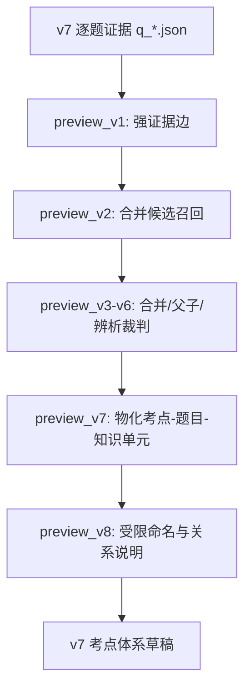

# CAMS v7 考点绑定工作区

本目录用于承接 CAMS v7 教材下的“考点 - 题目 - 知识单元”绑定工作。

当前阶段已经完成正式 v7 知识单元资产冻结，但尚未进入题目绑定和考点生成。v7 与 v6 的关键差异是：v7 教材本质上来自英文教材，并带有中英对照内容；中文题目、中文教研表达和英文原始概念之间可能存在翻译词不一致。因此，v7 不能简单沿用 v6 的“中文句卡直接召回”口径。

## 输入资产

当前已知的 v7 原始与中间资产：

- 原始 PDF：
  `D:\守正公司工作区\cams考试\教材、答疑记录、习题与参考文献\教材原文\v7\CAMS英文版7.0（中英对照版）.pdf`
- 已抽取源文：
  `D:\守正公司工作区\cams考试\核心数据\源文\source\v7_extracted.md`
- 中文正文：
  `D:\守正公司工作区\cams考试\核心数据\源文\source\v7_中文.md`
- 英文正文：
  `D:\守正公司工作区\cams考试\核心数据\源文\source\v7_英文.md`
- v7 卡池：
  `D:\守正公司工作区\cams考试\核心数据\pools\v7_cards.json`
- v7 清理卡池：
  `D:\守正公司工作区\cams考试\核心数据\pools\v7_full_cards_clean.json`
- 中文拆分 PDF：
  `D:\守正公司工作区\cams考试\cams工作台（重构版）\v7\work\sources\v7_zh_split.pdf`
- 英文拆分 PDF：
  `D:\守正公司工作区\cams考试\cams工作台（重构版）\v7\work\sources\v7_en_split.pdf`
- 拆分页码映射：
  `D:\守正公司工作区\cams考试\cams工作台（重构版）\v7\work\sources\v7_split_page_map.json`
- MinerU 中文/英文合并正文：
  `D:\守正公司工作区\cams考试\教材、答疑记录、习题与参考文献\教材原文\v7\mineru提取\中文\v7_zh_mineru_merged.md`
  `D:\守正公司工作区\cams考试\教材、答疑记录、习题与参考文献\教材原文\v7\mineru提取\英文\v7_en_mineru_merged.md`
- MinerU block 页码回填：
  `D:\守正公司工作区\cams考试\cams工作台（重构版）\v7\work\sources\v7_mineru_block_page_matches.json`
- 页级中英对齐文本：
  `D:\守正公司工作区\cams考试\cams工作台（重构版）\v7\work\sources\v7_page_aligned_text.json`

这些资产是否可直接使用，需要先做数据清理验收。不能默认它们一定完整、粒度合适或中英完全对齐。

知识基础单元切分与处理的详细设计见：

`D:\守正公司工作区\cams考试\cams工作台（重构版）\v7\知识基础单元切分与处理\README.md`

当前正式知识单元产物：

- 双语知识单元：`D:\守正公司工作区\cams考试\cams工作台（重构版）\v7\work\base_units\units\v7_bilingual_units.json`
- card adapter：`D:\守正公司工作区\cams考试\cams工作台（重构版）\v7\work\base_units\units\v7_units_as_cards.json`
- 冻结 manifest：`D:\守正公司工作区\cams考试\cams工作台（重构版）\v7\work\base_units\units\unit_freeze_manifest.json`
- 排除/复核清单：`D:\守正公司工作区\cams考试\cams工作台（重构版）\v7\work\base_units\units\excluded_or_review_manifest.json`

冻结结果：

| 指标 | 数量 |
|---|---:|
| formal units | 4973 |
| direct leaf units | 4702 |
| parent/context units | 271 |
| excluded/review items | 10 |
| duplicate unit_ids | 0 |
| duplicate direct sentence_ids | 0 |
| missing knowledge_zh | 0 |

注意：“知识图谱提取”是后续独立环节，负责题目证据边、考点聚合与图谱关系构建，不与本阶段混用。

## 核心原则

### 1. 不直接复用 v6 绑定

v6 的考点、题目、句卡绑定可以作为参考，但不能直接迁移为 v7 正式绑定。

正式绑定必须回到 v7 教材原文。最终依据必须能追溯到 v7 的双语知识单元，不能只继承 v6 的句卡或考点名。

### 2. 中英结合，中文为主

v7 采用以下口径：

- 检索：中英结合。
- 裁判：中英结合。
- 前端展示：中文为主。
- 内部复核：保留英文。
- 考点归属：绑定到双语知识单元 `unit_id`。

原因：

- 题目、教研和前端使用场景主要是中文。
- v7 教材概念源头来自英文，英文术语更稳定。
- 中文题目和中文教材翻译可能存在用词不一致。
- 只用中文容易漏召回；只用英文不利于教研审核和前端展示。

### 3. 采用“一层主体 + 内嵌字段”

v7 正式结构层只有一层：双语知识单元 `unit_id`。

不建立独立的 sentence 层或 block/paragraph 层。原因是：

- 中文机翻断句不稳定，句级对齐无法可靠支撑前端展示。
- 段级与知识单元边界高度重合，独立成层会和下游 preview 链路冲突。
- 现有 `tools/考点生成` 后半段以扁平 `card_id` 运转，单层 `unit_id` 更容易复用。

压缩后的结构如下：

```text
unit_id 双语知识单元
├── en_quote          英文原文，作为切分锚点和复核依据
├── zh_context_full   同页或同段完整中文，仅供展开复核
├── zh_display_text   默认等于 knowledge_zh，用于前端摘要展示
├── zh_display_mode   generated_summary|aligned_subspan|context_only
├── knowledge_zh/en   一句话知识摘要，供 seed title、命名和去重使用
├── zh_search_text    中文检索子串，第一版默认 null
├── zh_search_text_status not_available|available
├── en_sentences[]    英文句切片，仅用于检索索引，不进入考点体系
├── context_before    前文摘要或相邻 unit 摘要，仅辅助理解
├── context_after     后文摘要或相邻 unit 摘要，仅辅助理解
├── term_replacements 术语替换留痕
├── page/page_span    教材页码
└── chapter_path      章节路径
```

`en_sentences[]` 命中后必须回映射到所属 `unit_id`。`context_before/after` 不能作为正式证据；如果 context 本身被题目直接考到，应单独切成新的 unit。

第一版不承诺稳定生成英中句内子串对齐。中文检索主索引只使用 `knowledge_zh + terms.zh`，仅在 `zh_search_text_status=available` 时额外使用 `zh_search_text`。大段 `zh_context_full` 不进入主检索索引。

### 4. 先验收数据清理，再生成证据边

第一步不是直接跑题目绑定，而是检查现有 v7 清理产物是否合格：

- PDF 是否完整抽取。
- 中文和英文是否正确分离。
- 章节标题是否完整。
- 页眉、页脚、目录、版权页、重复段落是否已清理。
- 表格和列表是否保留关键内容。
- 中英对照是否错位。
- 卡池是否能追溯到原始教材位置。
- 卡粒度是否适合作为后续知识单元输入。

验收通过后，再进入知识单元构建和题目证据生成。验收不通过，再考虑重新解析 PDF 或重建卡池。

### 5. 题目绑定必须重新跑

v7 迁移的关键不是考点命名，而是重新生成：

```text
题目 -> 选项 -> v7 双语知识单元
```

现有 v6 流程中后半段可以复用：



但前半段必须切换到 v7：

- v7 双语知识单元。
- v7 中英召回。
- v7 证据裁判。
- v7 `unit_id`。

### 6. 英文只增强，不默认前端展示

英文原文主要用于：

- 术语标准化。
- 概念边界判断。
- 翻译不一致时的召回补强。
- 教研内部复核。

默认前端展示使用 `zh_display_text`。第一版多数情况下 `zh_display_text` 是基于 `en_quote` 生成的中文摘要，不冒充教材中文原文。完整中文段落放在 `zh_context_full` 中供展开复核。只有在中文翻译明显不清楚或需要复核时，才显示英文依据。

### 7. 风险要显式标记

v7 绑定过程中应继续保留风险标记，例如：

- `weak_merge`：候选合并边界偏松。
- `parent_direction_uncertain`：父子方向不确定。
- `contrast_uncertain`：错误项/辨析项是否有教学价值不确定。
- `evidence_thin`：证据 quote 或知识单元覆盖偏薄。
- `translation_uncertain`：中文和英文术语映射不稳。
- `zh_en_alignment_uncertain`：中英知识单元对齐不稳。
- `unit_too_broad`：一个 unit 疑似覆盖多个知识点。
- `unit_too_narrow`：一个 unit 疑似被切得过碎。
- `table_structure_uncertain`：表格结构抽取或切分不稳。
- `list_parent_child_uncertain`：列表总述和列表项的父子关系不稳。

## 知识单元设计

### 主体 schema

`unit_id` 是 v7 的唯一正式绑定对象。题目证据边、考点合并、父子关系、命名、前端展示，都只挂 `unit_id`。

知识单元在冻结前只能使用临时编号：

```text
v7u_tmp_N000001  草稿阶段 unit，不允许下游题目绑定
v7u_N000001      验收冻结后的正式 unit，允许进入题目证据绑定
```

LLM 会进入散文句子分组、标题角色判断和摘要生成的关键路径，因此不能宣称语义切分天然可复现。正式工程口径是：规则层可复现，LLM 决策通过 `decision_manifest` 固化后可回放。换模型、换 prompt 或清缓存，视为新版本重切。

```json
{
  "unit_id": "v7u_N000001",
  "unit_status": "draft|frozen|deprecated",
  "unit_order": 1,
  "unit_type": "definition|classification|rule|obligation|process|red_flag|risk_indicator|case_fact|example|exception|topic_parent|list_parent|list_item|table_row|fact|context",
  "type": "definition|classification|process|fact|case|rule|risk_indicator|context",
  "evidence_status": "direct|heading_only|context_only|needs_review",
  "can_be_direct_evidence": true,
  "focus_type_hint": "definition|process_stage|red_flag|rule|case|fact|other",
  "knowledge_zh": "一句话中文知识摘要",
  "knowledge_en": "one-sentence English knowledge summary",
  "zh_cards": ["v7zh_N000001"],
  "en_cards": ["v7en_N000001"],
  "zh_context_full": "同页或同段完整中文，仅供展开复核",
  "zh_display_text": "默认等于 knowledge_zh，用于前端摘要展示",
  "zh_display_mode": "generated_summary|aligned_subspan|context_only",
  "zh_search_text": null,
  "zh_search_text_status": "not_available|available",
  "en_quote": "English source text",
  "heading_text": null,
  "children": [],
  "en_sentences": [
    {
      "sentence_id": "v7en_s000001",
      "text": "English sentence slice",
      "role": "retrieval_only"
    }
  ],
  "context_before": "前文摘要或相邻 unit 摘要",
  "context_after": "后文摘要或相邻 unit 摘要",
  "terms": [
    {
      "en": "politically exposed person",
      "zh": "政治公众人物",
      "source": "manual|term_map|llm"
    }
  ],
  "term_replacements": [
    {
      "source_text": "政治敏感人物",
      "display_text": "政治公众人物",
      "term_key": "PEP",
      "method": "term_map|manual|llm"
    }
  ],
  "page": 63,
  "pdf_page": 63,
  "printed_page": "58",
  "page_span": [63],
  "chapter_code": "CH02",
  "section_code": "2.1",
  "chapter_path_en": ["Chapter 2", "Customer Due Diligence"],
  "chapter_path_zh": ["第二章", "客户尽职调查"],
  "display_chapter_path": ["第二章", "客户尽职调查"],
  "alignment": {
    "method": "same_page_order|heading_match|embedding|manual|llm",
    "confidence": "high|medium|low",
    "score": 0.0,
    "risk_flags": []
  },
  "risk_flags": []
}
```

### unit_type、type、focus_type_hint 的边界

三者不能混用：

- `unit_type`：v7 知识单元自身的细分类，描述教材内容是什么。
- `type`：兼容 v6 preview 链路的粗分类，供旧脚本读取。
- `focus_type_hint`：给题目证据裁判的提示，不是最终 `focus_type`。

`focus_type` 应由 Phase 4 的题目证据裁判根据“题目选项在考什么”生成。它可以参考 `focus_type_hint`，但不能直接照抄。

推荐映射：

| unit_type | type | focus_type_hint |
|---|---|---|
| definition | definition | definition |
| classification | classification | definition |
| rule | rule | rule |
| obligation | rule | rule |
| process | process | process_stage |
| red_flag | risk_indicator | red_flag |
| risk_indicator | risk_indicator | red_flag |
| case_fact | case | case |
| example | case | case |
| exception | rule | rule |
| topic_parent | context | other |
| list_parent | classification | other |
| list_item | fact | other |
| table_row | fact | other |
| fact | fact | fact |
| context | context | other |

### 兼容适配层

为复用现有 `tools/考点生成` 后半段，需要生成一个适配文件：

```text
work/units/v7_units_as_cards.json
```

该文件把 v7 `unit_id` 适配成 v6 风格的 `card_id`：

```json
{
  "schema_version": "v7_units_as_cards_v1",
  "cards": [
    {
      "card_id": "v7u_N000001",
      "quote": "中文摘要或可靠中文子串",
      "citation": "同页或同段完整中文上下文",
      "knowledge": "一句话中文知识摘要",
      "type": "definition|classification|process|fact|case|rule|risk_indicator|context",
      "focus_type_hint": "definition|process_stage|red_flag|rule|case|fact|other",
      "unit_id": "v7u_N000001",
      "zh_context_full": "同页或同段完整中文，仅供展开复核",
      "zh_display_text": "默认等于 knowledge_zh，用于前端摘要展示",
      "zh_display_mode": "generated_summary|aligned_subspan|context_only",
      "zh_search_text": null,
      "zh_search_text_status": "not_available|available",
      "en_quote": "English source text",
      "page": 63,
      "page_span": [63],
      "chapter_code": "CH02",
      "section_code": "2.1",
      "chapter_path_en": ["Chapter 2", "Customer Due Diligence"],
      "chapter_path_zh": ["第二章", "客户尽职调查"],
      "display_chapter_path": ["第二章", "客户尽职调查"],
      "risk_flags": []
    }
  ]
}
```

编号要求：

- `unit_id` 必须使用 `v7u_N000001` 这类格式。
- `N` 后数字必须按教材顺序连续生成。
- 原因是现有 preview_v2 会用 `N(\d+)$` 计算相邻编号距离，编号顺序如果失真，`near_card_distance` 会变成噪声。
- 冻结前使用 `v7u_tmp_N000001`，不得进入正式题目证据绑定。

### 切分标准

知识单元切分必须防止 unit 过宽，但不能假装完全靠规则判断语义边界。详细规则见 `知识基础单元切分与处理/README.md`。总原则如下：

- 英文 MinerU block 是主切分来源。
- 规则层负责 block 标准化、页码回填、heading stack、英文拆句、列表/表格结构定位和 source span。
- LLM 层负责散文句子分组、标题是否可考、多断言判断和 `knowledge_zh/en` 摘要。
- LLM 不能生成依据原文；`en_quote` 必须由句子编号或 source span 回填。
- `topic_parent` 只能是 `heading_only`，没有正式 `en_quote`，不能作为 `direct_single` 证据。
- `list_parent` 只有在原文存在明确列表总述句时，才能使用该总述句作为 `en_quote`。
- 图谱深度最大为 2，即 `parent -> leaf`，不允许 `topic_parent -> list_parent -> list_item`。
- 表格必须先识别内容表与非内容表；致谢、版权、人员名单表不进入知识单元。
- 词数只能作为辅助风险信号，不能作为过宽判断的核心标准。

验收指标：

- 抽样 50 个 unit，人工检查是否一 unit 一知识点。
- 检查列表项、红旗项、表格行是否被拆开。
- 检查 `knowledge_zh` 是否能忠实概括 `en_quote`，不能凭空扩写。
- 检查 `zh_display_text` 是否是摘要或可靠子串，没有把整段中文冒充精确证据。
- 检查 `zh_context_full` 是否只作为展开复核文本，没有进入主索引。
- 检查 `knowledge_zh + terms.zh` 是否能支撑中文召回。

## 环节与产物接口规范

v7 工作流分为 Phase 0-8，并额外包含 Phase 3.5“题库准备与章节对齐”。每个环节都要有可复跑输入、结构化输出和人读报告。后续脚本只要遵守这些接口，就可以替换内部实现。

### Phase 0：数据清理验收

目的：确认现有 v7 PDF 抽取、中文/英文正文和卡池是否可用。

输入：

```text
教材原文/v7/CAMS英文版7.0（中英对照版）.pdf
核心数据/源文/source/v7_extracted.md
核心数据/源文/source/v7_中文.md
核心数据/源文/source/v7_英文.md
核心数据/pools/v7_cards.json
核心数据/pools/v7_full_cards_clean.json
cams工作台（重构版）/v7/work/sources/v7_zh_split.pdf
cams工作台（重构版）/v7/work/sources/v7_en_split.pdf
教材原文/v7/mineru提取/中文/v7_zh_mineru_merged.md
教材原文/v7/mineru提取/英文/v7_en_mineru_merged.md
cams工作台（重构版）/v7/work/sources/v7_mineru_block_page_matches.json
```

输出：

```text
work/audit/
├── v7_source_inventory.json
├── v7_card_quality_sample.json
├── v7_granularity_decision.json
├── v7_mineru_inventory.json
├── v7_mineru_quality_report.md
└── v7_data_audit_report.md
```

验收标准：

- 能明确中文正文、英文正文、清理卡池是否可用。
- 能判断是否需要重新解析 PDF。
- 能判断现有卡池粒度是否适合作为后续知识单元输入。
- 能明确 Phase 1 是复用现有卡池做字段标准化，还是从 MinerU 中英文合并 md 重新切分。
- 能给出中英页级/段位顺序对齐是否可靠的证据。

`v7_granularity_decision.json` 格式：

```json
{
  "schema_version": "v7_granularity_decision_v1",
  "decision": "reuse_existing_cards|resplit_from_md|reparse_pdf",
  "existing_card_granularity": "unit_like|block_level|page_level|mixed|unknown",
  "reason": "现有 v7_cards.json 为块级，无法直接作为知识单元",
  "phase1_input": "existing_cards|source_md|source_pdf",
  "risk_flags": []
}
```

### Phase 1：源文标准化与候选切片生成

目的：根据 Phase 0 的粒度判定，生成可进入 Phase 2 的中文/英文候选切片。

Phase 1 有三条实现路径：

```text
Phase 0 decision = reuse_existing_cards
  -> 复用现有 v7 清理卡池，只做字段标准化。

Phase 0 decision = resplit_from_md
  -> 从 MinerU 中英文合并 md 出发，以英文为主切分锚点，结合 block 页码回填与 LLM decision manifest 构建知识单元草稿。

Phase 0 decision = reparse_pdf
  -> 暂停本流程，先重做 PDF 解析和源文清理。
```

输出：

```text
work/cards/
├── v7_zh_cards.json
├── v7_en_cards.json
├── v7_card_normalization_report.md
├── v7_resplit_report.md
└── rejected_cards.json

work/base_units/
├── v7_en_blocks.json
├── v7_zh_blocks.json
├── llm_decision_manifest.json
├── llm_decisions/
├── v7_units_draft.json
└── block_normalization_report.md
```

核心字段：

```json
{
  "schema_version": "v7_cards_v1",
  "lang": "zh",
  "items": [
    {
      "card_id": "v7zh_N000001",
      "text": "中文教材原文",
      "chapter_code": "CH01",
      "section_code": "1.1",
      "chapter_path_en": ["Chapter 1"],
      "chapter_path_zh": ["第一章"],
      "display_chapter_path": ["第一章"],
      "source": {
        "pdf_path": "D:\\...",
        "source_md": "D:\\...",
        "page": 63,
        "char_start": null,
        "char_end": null
      },
      "quality_flags": []
    }
  ]
}
```

Phase 1 的输出仍然是候选切片和草稿 unit，不是冻结知识单元。草稿 unit 使用 `v7u_tmp_*`，不得进入题目证据绑定。冻结后的正式 `unit_id` 在 Phase 2 中生成。

### Phase 2：双语知识单元构建

目的：把中文卡和英文卡对齐，形成 v7 的最小知识依据单位。

输出：

```text
work/units/
├── v7_bilingual_units.json
├── v7_units_as_cards.json
├── v7_unit_alignment_candidates.json
├── v7_term_map.json
├── term_replacements.json
├── unit_freeze_manifest.json
└── unit_build_report.md
```

`v7_bilingual_units.json` 使用上文“主体 schema”。

`term_replacements.json` 用于记录术语校订：

```json
{
  "schema_version": "v7_term_replacements_v1",
  "items": [
    {
      "unit_id": "v7u_N000001",
      "source_text": "政治敏感人物",
      "display_text": "政治公众人物",
      "term_key": "PEP",
      "method": "term_map|manual|llm",
      "review_status": "auto|reviewed|needs_review"
    }
  ]
}
```

### Phase 3：检索索引构建

目的：为题目证据生成提供中英混合召回。

输出：

```text
work/index/
├── v7_bm25_zh.pkl
├── v7_bm25_en.pkl
├── v7_embedding_index_meta.json
├── v7_unit_lookup.json
└── index_build_report.md
```

索引规则：

- 中文主索引使用 `knowledge_zh + terms.zh`。
- 仅当 `zh_search_text_status=available` 时，中文索引才额外使用 `zh_search_text`。
- 大段 `zh_context_full` 不进入中文主索引，只用于前端展开和人工复核。
- 英文 BM25 索引使用 `en_sentences[].text + knowledge_en + terms.en`。
- 英文向量索引优先使用 `en_sentences[].text`，不把 `en_quote` 作为唯一向量粒度。
- 检索命中 `en_sentences[]` 时，返回所属 `unit_id`。
- `context_before/after` 默认不进正式证据索引；如需用于召回，只能作为低权重上下文字段，并在结果中标明 `support_type=context`。

### Phase 3.5：v7 题库准备与章节对齐

目的：在正式生成题目证据前，准备 v7 可用题库，并把题目章节、题型、答案来源和质量风险标准化。

如果没有 v7 题库，Phase 4 不能正式开始，只能做迁移试验或样例验证。

输入来源可以包括：

- v7 官方题库或教研题库。
- 从旧版题库迁移而来的题目。
- 临时测试题。

输出：

```text
work/questions/
├── v7_questions.json
├── v7_question_section_map.json
├── v7_question_quality_report.md
└── rejected_or_needs_review_questions.json
```

`v7_questions.json` 格式：

```json
{
  "schema_version": "v7_questions_v1",
  "items": [
    {
      "question_id": "v7_q_000001",
      "source_question_id": "2.1_1",
      "section_code": "2.1",
      "chapter_code": "CH02",
      "chapter_path_en": ["Chapter 2", "Customer Due Diligence"],
      "chapter_path_zh": ["第二章", "客户尽职调查"],
      "display_chapter_path": ["第二章", "客户尽职调查"],
      "question_type": "single|multiple|unknown",
      "stem": "题干",
      "options": {
        "A": "选项A",
        "B": "选项B"
      },
      "answer": "A",
      "answer_source": "official|teacher|legacy|unknown",
      "risk_flags": []
    }
  ]
}
```

题库质量门：

- `question_type` 必须能区分单选、多选和 unknown。
- `answer_source=legacy|unknown` 时，后续证据生成可以运行，但结果必须保留风险标记。
- 章节映射不确定时标记 `section_alignment_uncertain`。
- 题目疑似来自 v6 旧章节但 v7 章节已变化时，标记 `legacy_section_mapping`。

### Phase 4：v7 题目证据生成

目的：对每道题、每个选项召回并裁判 v7 双语知识单元，生成后续考点管线可使用的逐题 JSON。

输入：

```text
work/questions/v7_questions.json
work/index/v7_unit_lookup.json
work/units/v7_bilingual_units.json
```

输出：

```text
work/question_evidence/
├── questions/q_*.json
├── question_option_unit_bindings.jsonl
├── summary.json
└── evidence_generation_report.md
```

`questions/q_*.json` 必须兼容现有 `preview_v1_seed_points.py`，核心字段放在 `final.option_explanations[].evidence_cards[]`，而不是只放在自定义 `option_evidence` 下：

```json
{
  "schema_version": "v7_question_evidence_v1",
  "question_id": "2.1_1",
  "section": "2.1",
  "question_type": "single|multiple|unknown",
  "stem": "题干",
  "options": {
    "A": "选项A",
    "B": "选项B"
  },
  "answer": "A",
  "pipeline": {
    "validate": {
      "validation_status": "passed|needs_review|failed",
      "reasons": []
    }
  },
  "final": {
    "ai_answer": "A",
    "standard_answer": "A",
    "answer_match": true,
    "needs_teacher_review": false,
    "option_explanations": [
      {
        "option": "A",
        "option_text": "选项A",
        "judgement": "correct|incorrect|insufficient|needs_review",
        "evidence_status": "direct|indirect|none|needs_review",
        "evidence_grade": "direct_single|direct_multi|semantic_direct|negative_direct|indirect_context|none|needs_manual",
        "focus_type": "definition|process_stage|red_flag|rule|case|fact|other",
        "evidence_cards": [
          {
            "card_id": "v7u_N000001",
            "unit_id": "v7u_N000001",
            "quote": "中文摘要或可靠中文子串",
            "citation": "同页或同段完整中文上下文",
            "knowledge": "一句话中文知识摘要",
            "zh_context_full": "同页或同段完整中文，仅供展开复核",
            "zh_display_text": "默认等于 knowledge_zh，用于前端摘要展示",
            "zh_display_mode": "generated_summary|aligned_subspan|context_only",
            "zh_search_text": null,
            "zh_search_text_status": "not_available|available",
            "en_quote": "English evidence",
            "type": "definition|classification|process|fact|case|rule|risk_indicator|context",
            "support_type": "direct|negative|context",
            "relevance": "high|medium|low",
            "risk_flags": []
          }
        ],
        "reason": "为什么该依据支持或反驳该选项"
      }
    ]
  }
}
```

`focus_type` 是题目证据裁判结果，可以参考 unit 的 `focus_type_hint`，但不能直接等同于 `unit_type`。

`question_option_unit_bindings.jsonl` 一行一条边：

```json
{
  "schema_version": "v7_question_option_unit_binding_v1",
  "question_id": "2.1_1",
  "section": "2.1",
  "option": "A",
  "option_text": "选项A",
  "key_is_correct": true,
  "judgement": "correct",
  "evidence_grade": "direct_single",
  "evidence_status": "direct",
  "focus_type": "definition",
  "unit_id": "v7u_N000001",
  "card_id": "v7u_N000001",
  "zh_quote": "术语校订后的中文依据",
  "en_quote": "English evidence",
  "knowledge": "一句话中文知识摘要",
  "support_type": "direct",
  "relevance": "high",
  "risk_flags": []
}
```

### Phase 5：v7 种子点与强证据边

目的：把 Phase 4 的逐题证据转成考点生成的干净底座。

输出：

```text
work/exam_points/preview_v1/
├── seed_points.json
├── strong_edges.json
├── flagged_questions.json
├── evidence_gaps.json
├── weak_signals.json
└── report.md
```

`strong_edges.json` 格式：

```json
{
  "schema_version": "v7_strong_edges_v1",
  "items": [
    {
      "question_id": "2.1_1",
      "section": "2.1",
      "option": "A",
      "option_text": "选项A",
      "role": "core|contrast",
      "key_is_correct": true,
      "judgement": "correct",
      "evidence_grade": "direct_single",
      "evidence_status": "direct",
      "focus_type": "definition",
      "card_id": "v7u_N000001",
      "unit_id": "v7u_N000001",
      "quote": "术语校订后的中文依据",
      "zh_quote": "术语校订后的中文依据",
      "en_quote": "English evidence",
      "knowledge": "一句话中文知识摘要",
      "support_type": "direct",
      "relevance": "high",
      "question_flagged": false,
      "source_edge_key": "2.1_1::A::v7u_N000001::core",
      "risk_flags": []
    }
  ]
}
```

`seed_points.json` 格式：

```json
{
  "schema_version": "v7_seed_points_v1",
  "items": [
    {
      "seed_id": "SEED-v7u_N000001",
      "card_id": "v7u_N000001",
      "unit_id": "v7u_N000001",
      "seed_title": "一句话中文知识摘要",
      "card": {
        "card_id": "v7u_N000001",
        "quote": "术语校订后的中文依据",
        "knowledge": "一句话中文知识摘要",
        "citation": "原始中文或术语校订后的中文"
      },
      "question_ids": ["2.1_1"],
      "core_question_ids": ["2.1_1"],
      "contrast_question_ids": [],
      "question_count": 1,
      "sections": {"2.1": 1},
      "focus_type_distribution": {"definition": 1},
      "risk_flags": []
    }
  ]
}
```

### Phase 6：候选合并、父子、辨析裁判

目的：从种子点生成候选关系，再裁判为同一考点、父子点、并列子点或保持分开。

输出：

```text
work/exam_points/preview_v2_to_v6/
├── merge_candidate_pairs.json
├── candidate_components.json
├── relation_draft.json
├── contrast_draft.json
├── relation_judgement_records.jsonl
├── contrast_judgement_records.jsonl
└── structure_draft_report.md
```

候选召回约束：

- `same_question`、`near_card_id_same_section`、`same_focus_type_soft` 仍可使用。
- `same_focus_type_soft` 只是软信号，不能作为硬合并依据。
- `near_card_id_same_section` 依赖 `unit_id` 编号顺序，Phase 2 必须保证编号连续且按教材顺序。
- LLM 或子代理只在候选组内裁判合并、父子、并列或保持分开，不能脱离题目证据边和教材 unit 自由发明考点。

`relation_draft.json` 核心格式：

```json
{
  "schema_version": "v7_relation_draft_v1",
  "items": [
    {
      "pair_id": "v7u_N000001__v7u_N000002",
      "unit_a_id": "v7u_N000001",
      "unit_b_id": "v7u_N000002",
      "label": "merge_same_point|parent_child|sibling_under_parent|keep_separate|needs_review",
      "confidence": "high|medium|low",
      "rationale": "判断依据",
      "risk_flags": []
    }
  ]
}
```

### Phase 7：物化考点-题目-知识单元

目的：生成可追溯的 v7 考点体系草稿。

输出：

```text
work/exam_points/preview_v7_materialized/
├── exam_point_system_materialized.json
├── exam_point_question_unit_edges.json
├── materialize_conflicts.json
└── materialize_report.md
```

`exam_point_question_unit_edges.json` 格式：

```json
{
  "schema_version": "v7_exam_point_question_unit_edges_v1",
  "items": [
    {
      "exam_point_id": "V7EP-000001",
      "edge_scope": "direct|subtree",
      "question_id": "2.1_1",
      "section": "2.1",
      "option": "A",
      "option_text": "选项A",
      "role": "core|contrast",
      "key_is_correct": true,
      "judgement": "correct",
      "evidence_grade": "direct_single",
      "evidence_status": "direct",
      "focus_type": "definition",
      "unit_id": "v7u_N000001",
      "card_id": "v7u_N000001",
      "zh_quote": "术语校订后的中文依据",
      "en_quote": "English evidence",
      "knowledge": "一句话中文知识摘要",
      "support_type": "direct",
      "relevance": "high",
      "question_flagged": false,
      "source_seed_id": "SEED-v7u_N000001",
      "source_edge_key": "2.1_1::A::v7u_N000001::core",
      "child_exam_point_id": null,
      "risk_flags": []
    }
  ]
}
```

`exam_point_system_materialized.json` 格式：

```json
{
  "schema_version": "v7_exam_point_system_materialized_v1",
  "items": [
    {
      "id": "V7EP-000001",
      "title": "临时标题或原文占位",
      "title_status": "placeholder|agent_named|manual_named",
      "point_type": "高频考点|普通考点|结构父点|易错/辨析点",
      "is_high_frequency": true,
      "tags": ["易错/辨析"],
      "parent_id": null,
      "children": [],
      "unit_ids": ["v7u_N000001"],
      "question_ids": ["2.1_1"],
      "question_count": 1,
      "core_question_count": 1,
      "contrast_question_count": 0,
      "subtree_question_count": 1,
      "evidence_quotes": [
        {
          "unit_id": "v7u_N000001",
          "zh_quote": "术语校订后的中文依据",
          "en_quote": "English evidence",
          "knowledge": "一句话中文知识摘要",
          "page": 63
        }
      ],
      "build_method": "v7_from_question_unit_edges",
      "review_status": "draft|needs_review|approved",
      "risk_flags": []
    }
  ]
}
```

### Phase 8：受限命名与关系说明

目的：只在已有题目、选项、v7 双语知识单元和 relation 记录内做命名，不自由发明考点。

输出：

```text
work/exam_points/preview_v8_named/
├── agent_prompt.md
├── agent_naming_input.json
├── agent_naming_output.json
├── validation.json
├── named_exam_points.json
├── naming_records.jsonl
└── naming_report.md
```

命名边界：

- 可以命名考点。
- 可以写 `teaching_focus`，统一以“考查学生能否……”开头。
- 可以说明 unit 角色：`definition / rule / example / red_flag / contrast / detail / parent / child / alias / other`。
- 可以说明题目角色：`direct_test / discrimination_test / scenario_application / definition_recall / other`。
- 可以提出 `split_recommendation`，但脚本不自动改结构。
- 不允许脱离输入题目、选项、知识单元和 relation 记录自由生成新考点。

`named_exam_points.json` 格式：

```json
{
  "schema_version": "v7_named_exam_points_v1",
  "items": [
    {
      "id": "V7EP-000001",
      "title": "短考点名",
      "title_status": "agent_named",
      "point_type": "高频考点",
      "tags": [],
      "parent_id": null,
      "children": [],
      "unit_ids": ["v7u_N000001"],
      "question_ids": ["2.1_1"],
      "question_count": 1,
      "evidence_quotes": [
        {
          "unit_id": "v7u_N000001",
          "zh_quote": "术语校订后的中文依据",
          "en_quote": "English evidence",
          "knowledge": "一句话中文知识摘要"
        }
      ],
      "teaching_focus": "考查学生能否……",
      "relation_summary": "说明该考点如何由题目和 v7 知识单元支撑",
      "unit_roles": [
        {
          "unit_id": "v7u_N000001",
          "role": "definition|rule|example|red_flag|contrast|detail|parent|child|alias|other",
          "reason": "简短理由"
        }
      ],
      "question_roles": [
        {
          "question_id": "2.1_1",
          "role": "direct_test|discrimination_test|scenario_application|definition_recall|other",
          "reason": "简短理由"
        }
      ],
      "split_recommendation": {
        "should_split": false,
        "reason": "理由"
      },
      "naming_confidence": "high|medium|low",
      "risk_flags": []
    }
  ]
}
```

## 当前优先级

Phase 0 的拆分 PDF、MinerU 合并正文、页码回填和质量报告已经具备第一版基础。当前不要直接跑题目绑定，下一步进入 `知识基础单元切分与处理` 小样本实现：

1. 标准化英文/中文 MinerU block。
2. 以 PEP、BO/UBO、APAC 案例三段做小样本。
3. 实现英文拆句和 prose sentence grouping 的 LLM decision manifest。
4. 生成 `v7u_tmp_*` 草稿 unit。
5. 抽审 `topic_parent/list_parent/leaf`、中文检索字段、术语字段和页码。
6. 抽样通过后再冻结 `v7u_N*`，生成 `v7_bilingual_units.json` 和 `v7_units_as_cards.json`。

在 `v7u_tmp_*` 冻结为正式 `v7u_N*` 前，不允许进入正式题目证据绑定。

## 2026-07-03 知识基础单元归档记录

v7 知识基础单元正式产物仍保留在：

`D:\守正公司工作区\cams考试\cams工作台（重构版）\v7\work\base_units\units`

旧脚本、缓存、早期试验产物和冻结前中间产物已归档到：

`D:\守正公司工作区\cams考试\cams工作台（重构版）\v7\历史归档\20260703_v7_base_units_archive`

目录含义：

- `A1_safe`：安全归档，主要是缓存、旧 prompt、早期 sample/stratified 试验与 v1/sample 产物。
- `B2_trace_part1`、`B2_trace_part2`：追溯归档，主要是冻结前分片 pilot、旧原始响应目录、已应用修复队列和旧支持脚本。

归档内容不再作为当前主流程入口；正式链路优先使用 `units`、`patched`、`llm_inputs`、v2/final decisions 和当前 README 中保留的主流程脚本。
