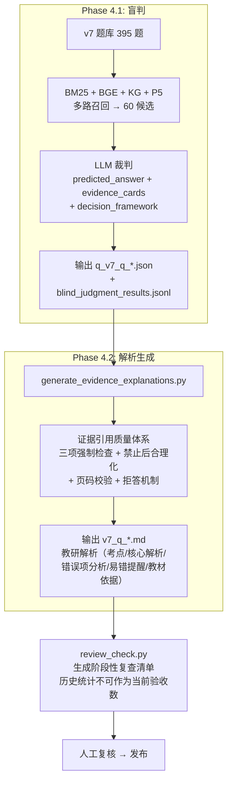

# CAMS v7 考点绑定工作区

> 2026-07-30 交接口径：本目录的正式成果是 4,973 个冻结 unit、检索/KG 底座、395 题证据与解析及 63 个软件小节。Phase 5-8/P7 属于未完成实验；旧前端发布不再是正式主线。出现冲突时以 `选项证据与解析生成/README.md` 和仓库根 `项目交接/正式资产与SOP索引.md` 为准。

本目录用于承接 CAMS v7 教材下的"考点 - 题目 - 知识单元"绑定工作。v7 教材本质上来自英文教材，并带有中英对照内容；中文题目、中文教研表达和英文原始概念之间可能存在翻译词不一致，因此 v7 不能简单沿用 v6 的"中文句卡直接召回"口径。

---

## 当前状态摘要

| Phase | 名称 | 状态 | 关键产物 |
|---|---|---|---|
| 0 | 数据清理验收 | 已完成 | `work/audit/` 下验收报告 |
| 1 | 源文标准化与候选切片 | 已完成 | 合并到 Phase 2 统一输出 |
| 2 | 双语知识单元构建 | 已完成 | `work/base_units/units/v7_units_as_cards.json`（4973 units） |
| 3 | 检索索引构建 | 已完成 | `选项证据与解析生成/phase3_index/output/index/v7_index_5614abb1c4bf.pkl` |
| 3.5 | 题库准备与章节对齐 | 已完成 | `选项证据与解析生成/phase3.5_questions/output/v7_questions.json`（395 题） |
| 4.1 | 盲判（多路召回 + LLM 裁判） | 已完成 | 见下方 Phase 4.1 |
| 4.2 | 解析生成（教研解析撰写） | 已完成 | 见下方 Phase 4.2 |
| 5 | 种子点与强证据边 | 未开始 | 待基于 v7 盲判产物重跑 |
| 6 | 候选合并/父子/辨析裁判 | 未开始 | 待基于 v7 盲判产物重跑 |
| 7 | 物化考点-题目-知识单元 | 未开始 | 待基于 v7 盲判产物重跑 |
| 8 | 受限命名与关系说明 | 未开始 | 待基于 v7 盲判产物重跑 |

Phase 5-8 的设计 schema 保留在本文档"环节与产物接口规范"中，作为未来实施参考（标注为设计稿）。

---

## 输入资产

当前已知的 v7 原始与中间资产：

以下 `核心数据/` 下的五个早期源文/卡池路径已经不存在，仅作为历史记录；当前教材来源是后列 PDF、MinerU 中英文 MD 和 `work/sources/` 中的页码对齐资产。

- 原始 PDF：
  `D:\守正公司工作区\cams考试\教材、答疑记录、习题与参考文献\教材原文\v7\CAMS英文版7.0（中英对照版）.pdf`
- 已抽取源文：
  `D:\守正公司工作区\cams考试\核心数据\源文\source\v7_extracted.md`
- 中文正文：
  `D:\守正公司工作区\cams考试\核心数据\源文\source\v7_中文.md`
- 英文正文：
  `D:\守正公司工作区\cams考试\核心数据\源文\source\v7_英文.md`
- v7 卡池：
  `D:\守正公司工作区\cams考试\核心数据\pools\v7_cards.json`
- v7 清理卡池：
  `D:\守正公司工作区\cams考试\核心数据\pools\v7_full_cards_clean.json`
- 中文拆分 PDF：
  `D:\守正公司工作区\cams考试\cams工作台（重构版）\v7\work\sources\v7_zh_split.pdf`
- 英文拆分 PDF：
  `D:\守正公司工作区\cams考试\cams工作台（重构版）\v7\work\sources\v7_en_split.pdf`
- 拆分页码映射：
  `D:\守正公司工作区\cams考试\cams工作台（重构版）\v7\work\sources\v7_split_page_map.json`
- MinerU 中文/英文合并正文：
  `D:\守正公司工作区\cams考试\教材、答疑记录、习题与参考文献\教材原文\v7\mineru提取\中文\v7_zh_mineru_merged.md`
  `D:\守正公司工作区\cams考试\教材、答疑记录、习题与参考文献\教材原文\v7\mineru提取\英文\v7_en_mineru_merged.md`
- MinerU block 页码回填：
  `D:\守正公司工作区\cams考试\cams工作台（重构版）\v7\work\sources\v7_mineru_block_page_matches.json`
- 页级中英对齐文本：
  `D:\守正公司工作区\cams考试\cams工作台（重构版）\v7\work\sources\v7_page_aligned_text.json`

正式知识单元产物：

| 指标 | 数量 |
|---|---:|
| formal units | 4973 |
| direct leaf units | 4702 |
| parent/context units | 271 |
| excluded/review items | 10 |
| duplicate unit_ids | 0 |
| duplicate direct sentence_ids | 0 |
| missing knowledge_zh | 0 |

---

## 核心原则

### 1. 不直接复用 v6 绑定

v6 的考点、题目、句卡绑定可以作为参考，但不能直接迁移为 v7 正式绑定。正式绑定必须回到 v7 教材原文。最终依据必须能追溯到 v7 的双语知识单元，不能只继承 v6 的句卡或考点名。

### 2. 中英结合，中文为主

v7 采用以下口径：

- 检索：中英结合。
- 裁判：中英结合。
- 前端展示：中文为主。
- 内部复核：保留英文。
- 考点归属：绑定到双语知识单元 `unit_id`。

原因：

- 题目、教研和前端使用场景主要是中文。
- v7 教材概念源头来自英文，英文术语更稳定。
- 中文题目和中文教材翻译可能存在用词不一致。
- 只用中文容易漏召回；只用英文不利于教研审核和前端展示。

### 3. 采用"一层主体 + 内嵌字段"

v7 正式结构层只有一层：双语知识单元 `unit_id`。不建立独立的 sentence 层或 block/paragraph 层。

压缩后的结构如下：

```text
unit_id 双语知识单元
├── en_quote          英文原文，作为切分锚点和复核依据
├── zh_context_full   同页或同段完整中文，仅供展开复核
├── zh_display_text   默认等于 knowledge_zh，用于前端摘要展示
├── zh_display_mode   generated_summary|aligned_subspan|context_only
├── knowledge_zh/en   一句话知识摘要，供 seed title、命名和去重使用
├── zh_search_text    中文检索子串，第一版默认 null
├── zh_search_text_status not_available|available
├── en_sentences[]    英文句切片，仅用于检索索引，不进入考点体系
├── context_before    前文摘要或相邻 unit 摘要，仅辅助理解
├── context_after     后文摘要或相邻 unit 摘要，仅辅助理解
├── term_replacements 术语替换留痕
├── page/page_span    教材页码
└── chapter_path      章节路径
```

`en_sentences[]` 命中后必须回映射到所属 `unit_id`。`context_before/after` 不能作为正式证据。

### 4. 先验收数据清理，再生成证据边

验收通过后，才进入知识单元构建和题目证据生成。

### 5. 题目绑定：盲判 + 解析双环节管线

v7 实际形成的题目绑定流程不同于原 v6 的单链 `preview_v1-v8`，而是拆为两个独立环节：



未来 Phase 5-8 将从 Phase 4.1 盲判产物 `q_v7_q_*.json` 出发，按 `unit_id` 重建种子点、合并候选和考点物化。

### 6. 英文只增强，不默认前端展示

英文原文主要用于术语标准化、概念边界判断、翻译不一致时的召回补强和教研内部复核。默认前端展示使用 `zh_display_text`。

### 7. 风险要显式标记

v7 绑定过程中保留风险标记，例如：

- `weak_merge`：候选合并边界偏松。
- `parent_direction_uncertain`：父子方向不确定。
- `contrast_uncertain`：错误项/辨析项是否有教学价值不确定。
- `evidence_thin`：证据 quote 或知识单元覆盖偏薄。
- `translation_uncertain`：中文和英文术语映射不稳。
- `zh_en_alignment_uncertain`：中英知识单元对齐不稳。
- `unit_too_broad`：一个 unit 疑似覆盖多个知识点。
- `unit_too_narrow`：一个 unit 疑似被切得过碎。
- `table_structure_uncertain`：表格结构抽取或切分不稳。
- `list_parent_child_uncertain`：列表总述和列表项的父子关系不稳。

---

## 新增能力（原设计未覆盖）

以下工具链在 Phase 4 实际实施中新增，未在原 Phase 0-8 设计中覆盖：

### 证据引用质量体系

`phase4_evidence/解析撰写/` 中实现的解析生成包含严格的证据引用质量控制：

- **三项强制检查**：主语一致性校验、时间节点匹配校验、场景限定校验——每条引用都必须通过，否则标记为不可用。
- **禁止后合理化**：禁止从已知答案反推"为什么正确"，必须从教材原文独立裁判选项正误。
- **页码校验**：引用必须能追溯到具体教材页码，不可凭空生成引用。
- **拒答机制**：当可用证据不足以支撑可靠判断时，明确标记为"无法判定"而非强行作答。

### 质量审查

`phase4_evidence/解析撰写/review_check.py` 自动扫描生成的解析并输出阶段性复查清单。历史版本曾给出 91 或 148 题等不同统计，均早于后续终审，不得作为当前 395 题的最终验收数。

### DOCX 导出

`phase4_evidence/md-to-docx/` 支持将解析 Markdown 导出为多种格式：

- `md_to_docx.py`：中文版 DOCX
- `md_to_docx_en.py`：英文版 DOCX
- `md_to_html.py`：HTML 版

### 软件系统导出

`phase4_evidence/解析撰写/export_software_explanations.py` 将解析按章节-题型重新组织，输出到 `software_export/sections/p*-ch*-h*.md`，供软件系统消费。

### 历史前端发布工具

`tools/v7_release/`（位于工作台根目录 `tools/` 下）仅用于旧前端原型追溯：

- `build_textbook_release.py`：构建教材发布包
- `build_release.py`：构建前端发布包

### v7 知识图谱

`v7/知识图谱提取/` 已独立完成 v7 KG 构建（59 章 / 983 点 / 8632 边 / P5 alias），将在后续 Phase 5-8 中作为召回路径之一使用。

### 模拟学生测试

`phase4_evidence/模拟学生/simulate_student.py` 通过扮演不同水平的学生角色，对解析生成结果进行可读性与教学有效性验证。

### 极简测试原型

`v7/极简测试/` 包含早期中英知识点提取的原型实验，用于验证 v7 中英对照场景下的提取可行性。

---

## 知识单元设计（设计稿）

以下 schema 是 v7 知识单元的设计规范，已应用于 Phase 2 产物。部分字段（如 `focus_type_hint` → `focus_type` 的裁判链条）待 Phase 5-8 实施时进一步验证。

### 主体 schema

`unit_id` 是 v7 的唯一正式绑定对象。题目证据边、考点合并、父子关系、命名、前端展示，都只挂 `unit_id`。

```json
{
  "unit_id": "v7u_N000001",
  "unit_status": "draft|frozen|deprecated",
  "unit_order": 1,
  "unit_type": "definition|classification|rule|obligation|process|red_flag|risk_indicator|case_fact|example|exception|topic_parent|list_parent|list_item|table_row|fact|context",
  "type": "definition|classification|process|fact|case|rule|risk_indicator|context",
  "evidence_status": "direct|heading_only|context_only|needs_review",
  "can_be_direct_evidence": true,
  "focus_type_hint": "definition|process_stage|red_flag|rule|case|fact|other",
  "knowledge_zh": "一句话中文知识摘要",
  "knowledge_en": "one-sentence English knowledge summary",
  "zh_cards": ["v7zh_N000001"],
  "en_cards": ["v7en_N000001"],
  "zh_context_full": "同页或同段完整中文，仅供展开复核",
  "zh_display_text": "默认等于 knowledge_zh，用于前端摘要展示",
  "zh_display_mode": "generated_summary|aligned_subspan|context_only",
  "zh_search_text": null,
  "zh_search_text_status": "not_available|available",
  "en_quote": "English source text",
  "heading_text": null,
  "children": [],
  "en_sentences": [
    {
      "sentence_id": "v7en_s000001",
      "text": "English sentence slice",
      "role": "retrieval_only"
    }
  ],
  "context_before": "前文摘要或相邻 unit 摘要",
  "context_after": "后文摘要或相邻 unit 摘要",
  "terms": [
    {
      "en": "politically exposed person",
      "zh": "政治公众人物",
      "source": "manual|term_map|llm"
    }
  ],
  "term_replacements": [
    {
      "source_text": "政治敏感人物",
      "display_text": "政治公众人物",
      "term_key": "PEP",
      "method": "term_map|manual|llm"
    }
  ],
  "page": 63,
  "pdf_page": 63,
  "printed_page": "58",
  "page_span": [63],
  "chapter_code": "CH02",
  "section_code": "2.1",
  "chapter_path_en": ["Chapter 2", "Customer Due Diligence"],
  "chapter_path_zh": ["第二章", "客户尽职调查"],
  "display_chapter_path": ["第二章", "客户尽职调查"],
  "alignment": {
    "method": "same_page_order|heading_match|embedding|manual|llm",
    "confidence": "high|medium|low",
    "score": 0.0,
    "risk_flags": []
  },
  "risk_flags": []
}
```

### unit_type、type、focus_type_hint 的边界

三者不能混用：

- `unit_type`：v7 知识单元自身的细分类，描述教材内容是什么。
- `type`：兼容 v6 preview 链路的粗分类，供旧脚本读取。
- `focus_type_hint`：给题目证据裁判的提示（Phase 4.1 已使用），不是最终 `focus_type`。

### 兼容适配层

`work/base_units/units/v7_units_as_cards.json` 将 v7 `unit_id` 适配成 v6 风格的 `card_id`，供现有工具链读取。

编号要求：

- `unit_id` 必须使用 `v7u_N000001` 这类格式。
- `N` 后数字必须按教材顺序连续生成。
- 原因是现有 preview_v2 会用 `N(\d+)$` 计算相邻编号距离。

---

## 环节与产物接口规范

以下记录各 Phase 的设计意图、实际实现状态和产物路径。

### Phase 0：数据清理验收 -- 已完成

目的：确认现有 v7 PDF 抽取、中文/英文正文和卡池是否可用。

产物（`work/audit/` 下）：

```text
work/audit/
├── v7_source_inventory.json
├── v7_card_quality_sample.json
├── v7_granularity_decision.json
├── v7_mineru_inventory.json
├── v7_mineru_quality_report.md
└── v7_data_audit_report.md
```

验收结论：通过，Phase 1 从 MinerU 中英文合并 md 重新切分。

### Phase 1-2：源文标准化与双语知识单元构建 -- 已完成

Phase 1（源文标准化与候选切片）和 Phase 2（双语知识单元构建）合并实施。以英文 MinerU block 为主切分锚点，结合 block 页码回填与 LLM decision manifest 构建知识单元。

正式产物：

- `work/base_units/units/v7_units_as_cards.json` — 4973 formal units（card adapter 格式，兼容下游工具）
- `work/base_units/units/v7_bilingual_units.json`
- `work/base_units/units/unit_freeze_manifest.json`
- `work/base_units/units/excluded_or_review_manifest.json`

### Phase 3：检索索引构建 -- 已完成

产物（`选项证据与解析生成/phase3_index/output/index/`）：

- `v7_index_5614abb1c4bf.pkl` — 主检索索引
- `v7_embedding_index_meta.json`
- `v7_unit_lookup.json`
- `index_build_report.md`

索引规则与设计稿一致：中文主索引使用 `knowledge_zh + terms.zh`，英文 BM25 使用 `en_sentences[].text + knowledge_en + terms.en`。`zh_context_full` 不进入主索引。

### Phase 3.5：v7 题库准备与章节对齐 -- 已完成

产物（`选项证据与解析生成/phase3.5_questions/output/`）：

- `v7_questions.json` — 395 题正式题库
- `v7_question_section_map.json`
- `v7_question_quality_report.md`
- `rejected_or_needs_review_questions.json`

### Phase 4.1：盲判（多路召回 + LLM 裁判） -- 已完成

**目的**：对每道题独立裁判各选项正误，不依赖已知答案（blind adjudication），确保裁判结果能从教材原文独立验证。

**脚本**：`phase4_evidence/盲判流程/blind_adjudication.py`

**流程**：

1. **多路召回**：BM25 + BGE 向量 + KG（知识图谱）+ P5（段落级上下文），每选项召回最多 60 个候选 unit。
2. **LLM 裁判**：基于召回的候选证据，独立判断每个选项的正确/错误/不确定，输出：
   - `predicted_answer`：模型预测答案
   - `evidence_cards`：引用的证据 unit 列表
   - `decision_framework`：裁判推理框架（用于后续解析生成）
3. **校验**：`retrieval_validation.py` 对召回质量做抽样校验。

**产物**：

```text
phase4_evidence/output/
├── questions/q_v7_q_*.json       逐题盲判结果（兼容后续 preview 链路）
└── blind_judgment_results.jsonl  全量裁判记录
```

`q_v7_q_*.json` 核心字段：

```json
{
  "question_id": "v7_q_000001",
  "options": { "A": "...", "B": "..." },
  "answer": "A",
  "predicted_answer": "A",
  "answer_match": true,
  "option_explanations": [
    {
      "option": "A",
      "judgement": "correct",
      "evidence_grade": "direct_single",
      "focus_type": "definition",
      "evidence_cards": [
        {
          "unit_id": "v7u_N000001",
          "card_id": "v7u_N000001",
          "quote": "中文摘要",
          "en_quote": "English evidence",
          "knowledge": "一句话中文知识摘要",
          "support_type": "direct",
          "relevance": "high"
        }
      ],
      "decision_framework": "LLM 推理过程"
    }
  ]
}
```

`blind_judgment_results.jsonl` 一行一条裁判记录，包含召回候选列表、裁判结果和置信度。

### Phase 4.2：解析生成（教研解析撰写） -- 已完成

**目的**：基于盲判结果，生成面向教研和学员的结构化解析。

**脚本**：`phase4_evidence/解析撰写/generate_evidence_explanations.py`

**解析结构**：每题的解析包含：
- 考点定位
- 核心解析（正确选项为什么对，错误选项为什么错）
- 错误项分析
- 易错提醒
- 教材原文依据（含页码引用）

**证据引用质量体系**：
- 三项强制检查：主语一致性、时间节点匹配、场景限定
- 禁止后合理化：不依赖已知答案反推理由，必须从原文独立裁判
- 页码校验：每条引用可追溯到具体教材页码
- 拒答机制：证据不足时标记"无法判定"

**产物**：

```text
phase4_evidence/output/
├── explanations/v7_q_*.md               逐题教研解析
└── explanations_export/v7_q_*.md        导出版（供发布使用）
```

**关联工具**：

| 工具 | 路径 | 说明 |
|---|---|---|
| review_check.py | `phase4_evidence/解析撰写/review_check.py` | 自动扫描生成阶段性复查清单；旧统计不可作为当前验收数 |
| quality_review.py | `phase4_evidence/质量审查/quality_review.py` | 深度质量审查 |
| export_software_explanations.py | `phase4_evidence/解析撰写/export_software_explanations.py` | 导出为软件系统格式 |
| md_to_docx.py | `phase4_evidence/md-to-docx/md_to_docx.py` | 中文 DOCX 导出 |
| md_to_docx_en.py | `phase4_evidence/md-to-docx/md_to_docx_en.py` | 英文 DOCX 导出 |
| md_to_html.py | `phase4_evidence/md-to-docx/md_to_html.py` | HTML 导出 |
| simulate_student.py | `phase4_evidence/模拟学生/simulate_student.py` | 模拟学生测试 |
| build_release.py | `tools/v7_release/build_release.py` | 历史前端原型发布构建 |
| build_textbook_release.py | `tools/v7_release/build_textbook_release.py` | 教材发布构建 |

### Phase 5-8：未开始（设计稿，待基于 v7 盲判产物重跑）

以下 Phase 5-8 的设计 schema 保留作为未来实施的参考规范。所有输入从 Phase 4.1 盲判产物 `q_v7_q_*.json` 出发，按 `unit_id` 重建。

---

#### Phase 5：v7 种子点与强证据边（设计稿）

目的：把 Phase 4 的逐题证据转成考点生成的干净底座。

输出（计划）：

```text
work/exam_points/preview_v1/
├── seed_points.json
├── strong_edges.json
├── flagged_questions.json
├── evidence_gaps.json
├── weak_signals.json
└── report.md
```

`strong_edges.json` 格式：

```json
{
  "schema_version": "v7_strong_edges_v1",
  "items": [
    {
      "question_id": "2.1_1",
      "section": "2.1",
      "option": "A",
      "role": "core|contrast",
      "key_is_correct": true,
      "judgement": "correct",
      "evidence_grade": "direct_single",
      "focus_type": "definition",
      "card_id": "v7u_N000001",
      "unit_id": "v7u_N000001",
      "quote": "中文依据",
      "en_quote": "English evidence",
      "knowledge": "一句话中文知识摘要",
      "support_type": "direct",
      "relevance": "high",
      "source_edge_key": "2.1_1::A::v7u_N000001::core",
      "risk_flags": []
    }
  ]
}
```

---

#### Phase 6：候选合并、父子、辨析裁判（设计稿）

目的：从种子点生成候选关系，再裁判为同一考点、父子点、并列子点或保持分开。

候选召回约束：

- `same_question`、`near_card_id_same_section`、`same_focus_type_soft` 仍可使用。
- `same_focus_type_soft` 只是软信号，不能作为硬合并依据。
- `near_card_id_same_section` 依赖 `unit_id` 编号顺序。
- LLM 只在候选组内裁判合并、父子、并列或保持分开，不能脱离题目证据边和教材 unit 自由发明考点。

---

#### Phase 7：物化考点-题目-知识单元（设计稿）

目的：生成可追溯的 v7 考点体系草稿。

`exam_point_system_materialized.json` 格式：

```json
{
  "schema_version": "v7_exam_point_system_materialized_v1",
  "items": [
    {
      "id": "V7EP-000001",
      "title": "临时标题或原文占位",
      "title_status": "placeholder|agent_named|manual_named",
      "point_type": "高频考点|普通考点|结构父点|易错/辨析点",
      "is_high_frequency": true,
      "parent_id": null,
      "children": [],
      "unit_ids": ["v7u_N000001"],
      "question_ids": ["2.1_1"],
      "question_count": 1,
      "evidence_quotes": [
        {
          "unit_id": "v7u_N000001",
          "zh_quote": "中文依据",
          "en_quote": "English evidence",
          "knowledge": "一句话中文知识摘要",
          "page": 63
        }
      ],
      "build_method": "v7_from_question_unit_edges",
      "review_status": "draft|needs_review|approved",
      "risk_flags": []
    }
  ]
}
```

---

#### Phase 8：受限命名与关系说明（设计稿）

目的：只在已有题目、选项、v7 双语知识单元和 relation 记录内做命名，不自由发明考点。

命名边界：

- 可以命名考点。
- 可以写 `teaching_focus`，统一以"考查学生能否……"开头。
- 可以说明 unit 角色：`definition / rule / example / red_flag / contrast / detail / parent / child / alias / other`。
- 可以说明题目角色：`direct_test / discrimination_test / scenario_application / definition_recall / other`。
- 可以提出 `split_recommendation`，但脚本不自动改结构。
- 不允许脱离输入题目、选项、知识单元和 relation 记录自由生成新考点。
