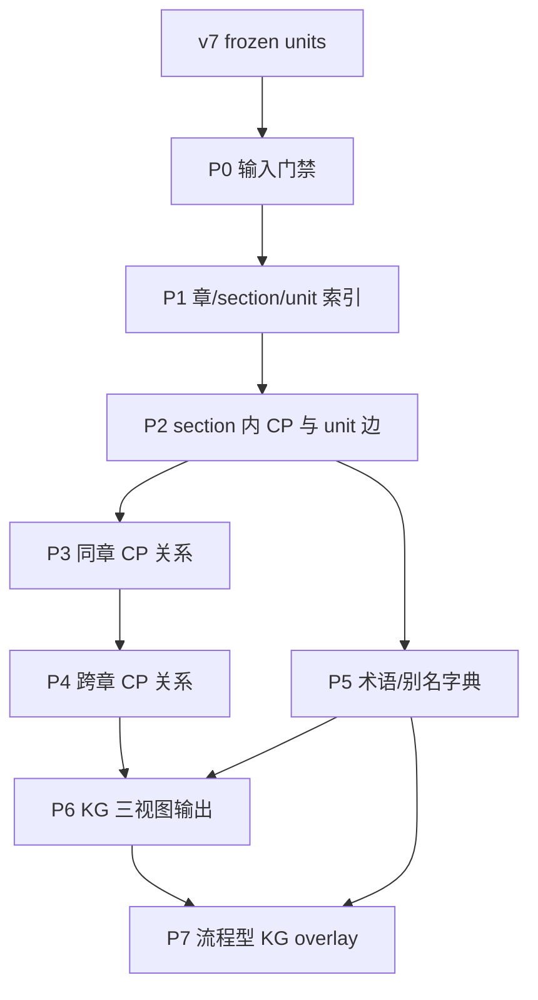

# v7 知识图谱提取

本工作区用于把 v7 冻结知识单元组织成一张“教材复习导图式”的知识图谱。第一目标是让教研和考生能看懂教材结构；后续才服务题目绑定、证据召回和答疑检索。

旧版长 README 已归档到 [README.full-before-split-2026-07-04.md](archive/README.full-before-split-2026-07-04.md)。以后不要继续把讨论记录、阶段日志、脚本细节都塞进入口 README。

## 当前口径

```text
v7 KG = 以章节为主线的教材复习思维导图
```

核心层级：

```text
章 -> section -> core_point -> unit
```

- `unit`：冻结知识基础单元，唯一正式绑定对象是 `unit_id`。
- `core_point`：教材复习骨架里的核心知识点，不等于考试考点。
- `section`：P1 生成的教材小节片段，由 `section_id` 稳定标识。
- `edge`：unit 归属边、同章 CP 关系、跨章 CP 关系和术语索引线索，必须保留来源和证据。

## 基本原则

- 只使用冻结后的 `v7u_N*` unit，不使用临时 unit。
- 英文 `en_quote` 是证据核查锚点；中文 `knowledge_zh` 主要用于展示和中文检索。
- KG 不替代 evidence judge。题目证据最终仍要回到具体 unit 原文。
- 章内关系优先忠实教材结构；跨章关系必须经过 P4 判断和 review 后进入主图。
- LLM 可以给标题建议、关系建议和审核建议，但不能静默覆盖源表。
- 人工在聊天框里的拍板必须写入配置或决策表，不能写成 Python 特判。

## 入口文件

- 全流程阶段说明：[kg各环节职责与概况.md](kg各环节职责与概况.md)
- 项目结构契约：[项目结构契约.md](项目结构契约.md)
- 当前全书 KG 状态与产物：[status.md](status.md)
- 规则治理草稿：[RULE_BOOK_DRAFT.md](RULE_BOOK_DRAFT.md)
- 历史长文档归档：[README.full-before-split-2026-07-04.md](archive/README.full-before-split-2026-07-04.md)

## 当前状态

当前基础 KG 主线已收敛到 P0-P6，且 P6 全书 KG 已构建完成；P7 流程型/操作型 KG overlay 已建立阶段骨架，尚未进入全书抽取：

```text
P0 输入门禁
P1 章/section/unit 索引
P2 section 内 core point 与 unit 边
P3 同章跨 section CP 关系
P4 跨章 CP 关系
P5 术语/别名/缩写字典
P6 KG 总装与三视图输出
P7 流程型/操作型 KG overlay（新建，待抽取）
```

当前 P6 母版产物覆盖全书 59 章、339 个 section、983 个 core point、4973 个 unit、7308 条 edge。P5 术语索引独立保留为选项证据生成的检索辅助索引，不作为 KG 主图节点或边。

旧 phase07/08/09/10 已归档到 `phases/archive/legacy_after_p6_20260706/`，不再作为当前执行入口。当前 `phase07_procedural_layer` 是新的流程型 overlay 阶段。

## 总体流程



## 关键路径

```text
phases/phase06_kg_views/
phases/phase07_procedural_layer/
```

主要输入：

```text
../work/base_units/units/v7_bilingual_units.json
../work/base_units/units/unit_freeze_manifest.json
```

主要输出：

```text
phases/phase06_kg_views/outputs/kg_retrieval_graph.json
phases/phase06_kg_views/previews/kg_study_tree.md
phases/phase06_kg_views/previews/kg_reading_vault/
```

## 维护规则

- 入口 README 只放稳定定义、当前状态和导航。
- 阶段流程只改 [kg各环节职责与概况.md](kg各环节职责与概况.md)。
- 当前状态和重要验收结果记录在 [status.md](status.md)。
- 旧讨论不删，放归档；但不再作为当前执行口径。
