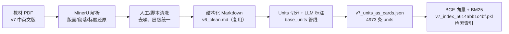
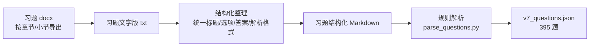
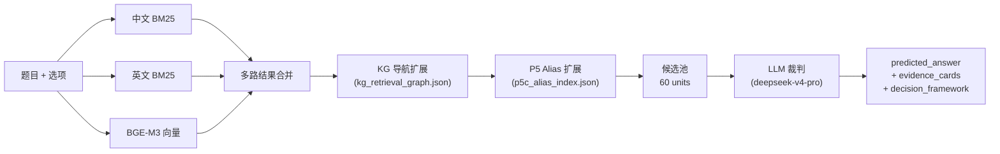
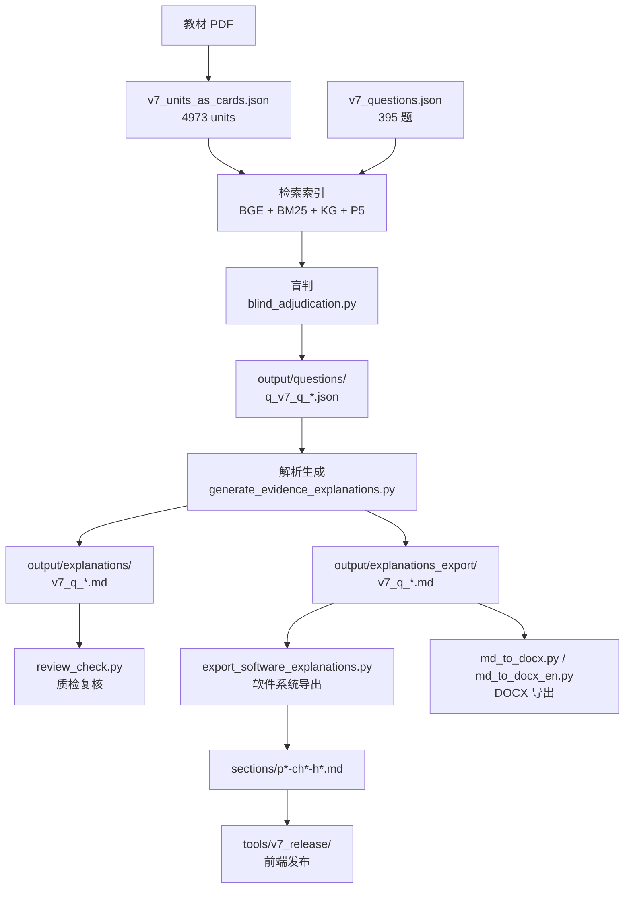

# CAMS 全书技术路线总图

> **当前适用版本：v7 管线**
> 最后更新：2026-07-23
> v6 历史版本资产已归档至 `v6_归档/`

本文件记录从教材 PDF 到题库、教材知识图谱、盲判 + 解析生成、多格式导出、质检复核的全链路技术路线。当前以 `cams工作台（重构版）/v7/选项证据与解析生成/` 为主工作区。

---

## 1. 教材 PDF → 结构化 Markdown → Units 证据池

v7 的教材证据底座从 v6 的"句卡"体系升级为 **units** 体系。units 不再按句子粒度切分，而是按知识点语义做结构化切块，包含中英文摘要、原文引语、章节路径、页码、术语标签等完整元数据。

### 总体链路



### 核心资产

| 层级 | 文件/目录 | 作用 |
|---|---|---|
| 原始教材 | `教材、答疑记录、习题与参考文献/教材原文/v6/CAMS中文版教材-V6.51.pdf` | 人读版教材 |
| 清洗底稿 | `核心数据/源文/source/v6_clean.md` | 结构化教材底稿（v6 clean 仍被 v7 复用） |
| Units 池 | `v7/work/base_units/units/v7_units_as_cards.json` | 4973 条结构化教材知识单元 |
| 检索索引 | `v7/选项证据与解析生成/phase3_index/output/index/v7_index_5614abb1c4bf.pkl` | BGE(1024d) + 中文BM25 + 英文BM25 |

每一条 unit 的结构：

```json
{
  "unit_id": "v7u_N000001",
  "knowledge_zh": "洗钱及金融犯罪概述",
  "knowledge_en": "Introduction to money laundering and financial crime",
  "en_quote": "This module serves as an introduction to money laundering...",
  "citation": "CAMS v7 p.14 / PDF p.19",
  "type": "definition",
  "heading_context": ["Money Laundering and Financial Crime", "Introduction"],
  "pdf_page": 19,
  "printed_page": "14",
  "terms": [{"en": "money laundering", "zh": "洗钱"}],
  "can_be_direct_evidence": true
}
```

与 v6 句卡的关键区别：
- **不再是单句切分**：unit 可以是一个自然段、一个概念定义、一个案例段落，语义边界由 LLM 辅助判定
- **中英文并行**：每条 unit 同时包含中文摘要、英文摘要和英文原文引语，支持跨语言检索
- **术语标签**：每条 unit 绑定 LLM 提取的术语对，用于 P5 alias 扩展检索

### 可靠性原则

1. **证据不由模型生成**：`en_quote` 是程序复制的教材原文，LLM 只生成 `knowledge_zh/knowledge_en/type/terms`
2. **可追溯**：每条 unit 有 `unit_id`、`citation`、`heading_context`、`pdf_page`、`printed_page`
3. **可重建**：base_units 管线脚本和中间产物均保留在 `v7/work/base_units/`
4. **可审查**：units 只是证据底座，只有经过盲判绑定后才成为题目证据

---

## 2. 题目材料 → 结构化 Markdown → 题库 JSON

### 总体链路



当前 v7 题库为 **395 题**（从 v6 的 718 题经过去重、筛选和质量审核后精简）。题目 JSON 是盲判、解析、Docx 导出和软件导出的统一输入。

---

## 3. 学生答疑材料 → 结构化 Markdown → 答疑 JSON

本节省略详细描述，当前 v7 管线中答疑模块尚未全面重构，仍沿用 v6 资产：
- 结构化 MD：`教材、答疑记录、习题与参考文献/答疑记录/答疑记录结构化/`
- 解析脚本：`cams工作台（重构版）/tools/学生答疑记录/parse_qa.py`
- 产物：`cams工作台（重构版）/data/source/qa.json`（69 条）

状态：**待迁移到 v7 管线**。

---

## 4. 教材知识图谱（KG）

v7 的知识图谱重构了从节点抽取到关系边构建的整条管线，使用分层架构设计。

### 主线工作区

- `v7/知识图谱提取/`（分为多个 phases）
- 核心产物：`v7/知识图谱提取/phases/phase06_kg_views/outputs/kg_retrieval_graph.json`

### 当前 v7 KG 指标

| 指标 | 数量 |
|---|---:|
| 章节数 (chapters) | 59 |
| 知识点 (core_points) | 983 |
| 挂载 units | 4973 |
| 关系边 (edges) | 8632 |

### 在检索中的角色

KG 在盲判检索中以 **KG 导航扩展** 方式工作：从 BM25/BGE 命中的 unit 出发，沿图谱边扩展相邻 unit，提升召回覆盖率。P5 alias index（`phase05_terms/outputs/p5c_alias_index.json`，184 alias_groups）提供术语同义词/缩写的跨表达匹配。

### 旧版 KG

`tools/知识图谱/提取/` 下的 v6 KG 管线（`01_build_textbook_tree.py` ~ `05_assemble.py`，产物 `data/derived/kg_data.json`，602 nodes / 633 edges）已被 v7 管线替代。旧数据仅保留为历史参考。

---

## 5. 盲判流程（Phase 4.1）

盲判是 v7 管线的核心裁判环节：给定题目和选项，从 4973 条 units 中检索证据，LLM 盲态判断每个选项的正误，输出预测答案和证据卡片。

### 主入口

`v7/选项证据与解析生成/phase4_evidence/盲判流程/blind_adjudication.py`

### 检索链路



### 产物

- `output/questions/q_v7_q_XXXXXX.json`：每题完整盲判过程（候选池、选项分析、裁判结果、证据卡片）
- `output/blind_judgment_results.jsonl`：批量运行的 JSONL 汇总
- `output/blind_judgment_report.md`：运行统计报告

### 裁判规范

盲判 prompt 内置三个推理层级：

- **材料类型权重**：定义/规则 > 核心区分 > 事实陈述 > 案例
- **语境有效性强制检查**（v3 新增）：
  1. 主语一致性：证据主语必须与结论主语一致
  2. 时间节点/业务阶段匹配：证据章节的阶段必须与题干场景一致
  3. 场景限定：特定场景的陈述不能当普遍原则使用
- **自检清单**：每个 evidence_card 引用前必须过三项检查

---

## 6. 解析生成（Phase 4.2）

盲判确定答案后，解析 LLM 将判断结果转化为学生可读的讲解文本。

### 主入口

`v7/选项证据与解析生成/phase4_evidence/解析撰写/generate_evidence_explanations.py`

### 输出内容

每道题的解析包含：
- **考点**（exam_point）：一句话，30 字内
- **核心解析**（core_analysis）：定义/规则 → 题干事实 → 为什么正确答案成立
- **错误项分析**（option_explanations）：在教材框架下解释匹配度差距，不用绝对否定语气
- **易错提醒**（easy_mistake）：概念区分标准
- **教材原文依据**（source_evidence）：每条引用的 unit 原文 + 页码 + 章节路径

### 产物

- `output/explanations/v7_q_XXXXXX.md`：完整解析（含 AI 答案、考点、核心解析、错误项分析、易错提醒、教材原文依据、参考答案对照）
- `output/explanations_export/v7_q_XXXXXX.md`：导入格式（去标题、`「」`→`""`），供软件导出使用
- `output/questions/q_v7_q_XXXXXX.json`：write-back 后的完整 JSON（含 `generated_explanation` 字段）

### 证据引用质量机制（v3 新增）

解析 prompt 内置的质量控制规则：

| 规则 | 内容 |
|---|---|
| **三项强制检查** | 主语一致性、时间节点匹配、场景限定（同盲判） |
| **禁止后合理化** | 引用 unit 前自问"如果没有它，结论会变吗？"——不会变就是装饰性引用 |
| **页码校验** | 页码必须来自材料卡片的 `printed_page` 元数据，禁止自编 |
| **拒答机制** | 当证据 gap 不可弥合时，LLM 有权输出 `deferral` 字段拒答，优于硬写歪曲证据的解析 |

拒答触发条件（满足任一即可）：
- 核心证据缺位：支撑正确项的 unit 与选项存在不可弥合的 gap
- 主语不可调和：所有可用证据的主语/场景与结论不一致
- 时间/阶段不可调和：所有证据的业务阶段与题干时间节点不一致
- 证据整体偏弱：正确项依赖的全部为 indirect/案例/推测性陈述

---

## 7. 质量审查

### review_check.py

`v7/选项证据与解析生成/phase4_evidence/解析撰写/review_check.py`

自动扫描所有 question JSON，生成待复核清单（`output/software_export/review_required.md`）。检查项包括：
- 门禁阻断：schema 版本、内部备注残留、答案为空、选项 judgement 不一致、basis_type 非法、教材短引校验
- 选项证据不足：`basis_type == "insufficient"` 的选项
- 答案冲突：AI 答案 vs 题库最终/中文/英文参考答案

当前全量：395 题，首次扫描需复核 91 题。

### 子代理深度审核

对通过机械校验的题目，使用子代理按五类证据错误模式进行人工级审核：
1. **语境偷换**：证据章节路径与引用目的不匹配
2. **主语借代**：证据主语/对象与结论不一致
3. **后合理化**：引用仅因含关键词，非逻辑必需
4. **页码幻觉**：页码不在材料卡片元数据中
5. **语气放大**：原文措辞被升级（"might"→"应当"）

---

## 8. 多格式导出

### DOCX 导出（教学版试卷）

`v7/选项证据与解析生成/phase4_evidence/md-to-docx/`

| 工具 | 输出 | 用途 |
|---|---|---|
| `md_to_docx.py` | 中文题干 + 中文选项 + 中文解析 | 中文教学 |
| `md_to_docx_en.py` | 英文题干 + 英文选项 + 中文解析 | 英文教学 |
| `md_to_html.py` | HTML 预览 | 题库导入预览 |

支持：试卷名称标题、蓝色底色的解析小节标签（考点/核心解析/错误项分析/易错提醒）、上角标页码 `<sup>PXX</sup>`、加粗 `**bold**`。

### 软件系统导出

`v7/选项证据与解析生成/phase4_evidence/解析撰写/export_software_explanations.py`

将解析产物按 `primary_unit_id → real_chapter → section_code` 映射到小节，生成按 p-ch-h 组织的导入格式 MD 文件。产物：`output/software_export/sections/p*-ch*-h*.md`。

---

## 9. v7 发布工具

`cams工作台（重构版）/tools/v7_release/`

| 工具 | 用途 |
|---|---|
| `build_textbook_release.py` | 发布双语教材 PDF + units 数据到前端阅读器 |
| `build_release.py` | 发布题目证据覆盖层到前端工作台 |
| `rebuild_textbook_structure.py` | 重建教材四层结构映射 |

发布器在写入前校验所有 `unit_id` 与题目引用，前端通过 `active.json` 读取，不直接扫描跑批目录。

---

## 10. v6 到 v7 迁移记录

| 旧资产 | 去向 | 原因 |
|---|---|---|
| `tools/选项证据生成/` | `v6_归档/选项证据生成/` | 被 phase4_evidence 盲判+解析管线替代 |
| `tools/v6句卡生成/` | `v6_归档/v6句卡生成/` | v6 句卡体系被 v7 units 体系替代 |
| `tools/知识图谱/提取/` | 保留参考，主线迁移到 `v7/知识图谱提取/` | v7 KG 重构了全链路 |
| `data/cards/cards_v6_sentence.json` | 保留为历史参考 | 已被 `v7_units_as_cards.json` 替代 |
| `data/derived/kg_data.json` | 保留为历史参考 | 已被 `kg_retrieval_graph.json` 替代 |

---

## 全链路总图



---

## 已知待办

- [ ] 答疑模块从 v6 迁移到 v7 管线
- [ ] 考点生成（图谱化考点）基于 v7 盲判产物重跑
- [ ] `rebuild_textbook_structure.py` 适配 v7 四层结构
- [ ] `tools/题库记录/parse_questions.py` 确认适配 v7 输出路径
- [ ] v7 units 页码映射方案确认（替代 `card_page_map_v6.json`）
