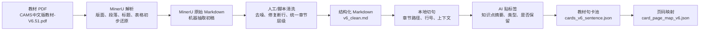
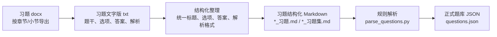
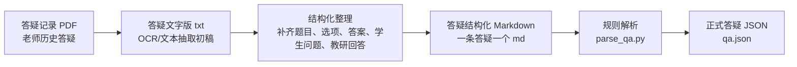
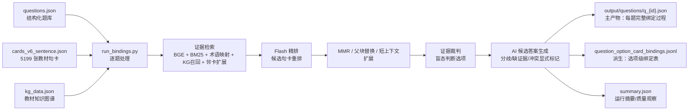
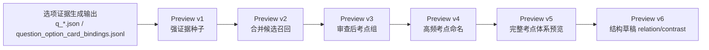
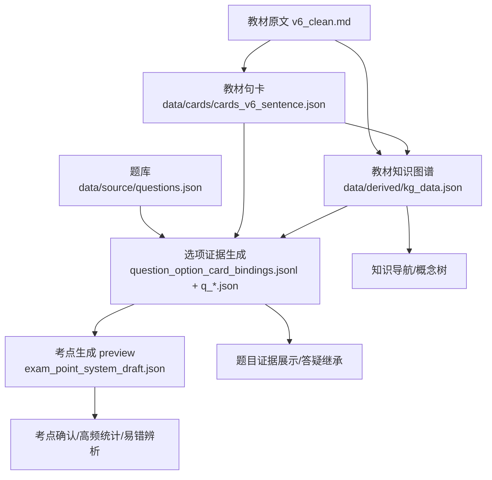

# CAMS 全书技术路线总图

> 本文件用于逐步沉淀全书技术路线。当前以 `cams工作台（重构版）` 为准，记录从教材、题库、答疑到底层句卡、教材知识图谱、题目证据绑定和后续考点生成的主线。

## 1. 教材 PDF -> 结构化 Markdown -> 句卡

### 总体链路



这条链路的核心原则是：**教材原文始终是最终依据，模型只做标注和摘要，不改写证据本身**。因此，后续题目解析、考点旁注、学生答疑都可以通过 `card_id` 回到教材原句，而不是依赖模型记忆。

### 第一步：PDF 变成可处理的 Markdown

原始教材是固定版式 PDF：

- `教材、答疑记录、习题与参考文献/教材原文/v6/CAMS中文版教材-V6.51.pdf`

PDF 适合人阅读，但不适合程序稳定检索：章节层级、段落边界、页眉页脚、表格、列表和换行都混在版面里。我们先用 MinerU 做版面解析，把 PDF 转成 Markdown 初稿：

- `教材、答疑记录、习题与参考文献/教材原文/v6/MinerU_markdown_CAMS中文版教材-V6.51_2063263774833127424.md`
- `教材、答疑记录、习题与参考文献/教材原文/v6/MinerU_markdown_CAMS中文版教材-V6.51_2063263870807191552.md`

MinerU 的作用不是直接产出最终证据，而是完成“从版面文件到文本结构”的第一跳：尽量恢复标题、段落、列表和表格，使教材从 PDF 变成可清洗、可切分、可追溯的文本。

### 第二步：Markdown 清洗成稳定教材底稿

MinerU 产物仍然会有 PDF 抽取噪声，所以我们再做一层清洗，形成正式底稿：

- `教材、答疑记录、习题与参考文献/教材原文/v6/v6_clean.md`
- `核心数据/源文/source/v6_clean.md`

这一层解决的是“结构稳定性”：

- 去掉页码、页眉页脚、目录点线、版权页等低价值噪声。
- 修复 PDF 抽取造成的断行、残缺标题、列表粘连和异常空白。
- 统一章节层级，让 `##`、`###` 等标题能被程序识别为章节路径。
- 尽量保留教材原文措辞，不在清洗阶段做教研式改写。
- 保留行号位置，使后续句卡能记录 `source_line_start/source_line_end`。

也就是说，`v6_clean.md` 是后续所有教材证据资产的“可计算教材原文”。

### 第三步：从结构化 Markdown 切成候选原句

句卡生成脚本读取 `v6_clean.md`，本地完成断句和定位：

- 主线工具：`cams工作台（重构版）/tools/v6句卡生成/build_v6_sentence_cards.py`

程序逐行扫描 Markdown：

- 遇到 `##`、`###` 标题时更新当前章节路径。
- 普通正文行按中文句末标点、项目符号、编号列表等规则切成句子。
- 过滤页码、版权、目录点线、过短噪声等无证据价值文本。
- 对过长句子做保守切分，避免一张卡包含过多证据。
- 给每个候选句记录章节路径、原文行号、前一句和后一句上下文。

这一步是确定性的，边界由本地规则控制。模型不负责决定原文怎么切，也不能把多句话合成一条证据。

### 第四步：LLM 只做句卡标注，不接管原文证据

候选原句会被批量送入 DeepSeek/OpenAI 兼容接口。提示词要求模型只返回：

```json
{
  "i": 0,
  "keep": true,
  "knowledge": "一句话知识点",
  "type": "事实"
}
```

关键约束：

- 不允许模型输出或改写 `citation`。
- 不允许模型合并、拆分或重写教材原句。
- `knowledge` 只能忠实概括原句，方便检索和展示。
- `type` 只能落在固定枚举：`定义`、`分类`、`流程`、`事实`、`案例`、`法规`、`风险指标`、`context`。
- 对目录、页码、乱码、残缺标题等内容返回 `keep=false`。

所以模型在这里的角色是“句卡标注员”，不是“证据作者”。真正的教材引用由程序直接从候选原句复制到 `citation` 字段。

### 第五步：合并成全书句卡池

最终合并出的正式资产是：

- `cams工作台（重构版）/data/cards/cards_v6_sentence.json`
- 样本副本：`cams工作台（重构版）/重要资产以及构建方式/cards_v6_sentence.json`

每张句卡都有稳定结构：

```json
{
  "card_id": "v6s_N00001",
  "knowledge": "ACAMS的使命是促进反洗钱专业人员知识技能提升及推动反洗钱政策实施。",
  "citation": "ACAMS 的使命是促进全球范围内专门从事洗钱侦测与防范工作的人员的专业知识、技能和经验的提升，推动反洗钱政策和措施的妥善制定及实施。",
  "context_before": "",
  "context_after": "为实现这一目标，ACAMS 致力于：。",
  "type": "事实",
  "source_asset": "D:\\守正公司工作区\\cams考试\\核心数据\\源文\\source\\v6_clean.md",
  "source_line_start": 33,
  "source_line_end": 33,
  "chapter_path": "关于公认反洗钱师协会 (ACAMS)",
  "evidence_scope": "v6_sentence"
}
```

当前正式全书句卡池约 5199 张，采用 `v6s_N#####` 坐标系。主批次统计显示从 5379 条候选教材句子中生成 5174 张句卡，另有后续审阅补入的补充卡，因此前端正式资产总数为 5199 张。

### 第六步：句卡再映射回 PDF 页码

为了让教研人员在工作台中看到句卡对应教材页码，我们又用 PDF 文本匹配生成页码映射：

- 工具：`cams工作台（重构版）/tools/句卡页码映射/build_v6_card_page_map.py`
- 输入：`cards_v6_sentence.json` + `CAMS中文版教材-V6.51.pdf`
- 输出：`cams工作台（重构版）/data/page_maps/card_page_map_v6.json`

页码映射用 PyMuPDF 逐页读取 PDF 文本，通过 `citation`、上下文和短文本片段匹配定位句卡所在页。这样一张句卡既能回到 Markdown 行号，也能回到 PDF 页码。

### 这条链路的可靠性设计

1. **证据不由模型生成**：`citation` 是程序复制的教材原句，模型只生成 `knowledge/type/keep`。
2. **可追溯**：每张卡都有 `card_id`、`source_asset`、`source_line_start/source_line_end`、`chapter_path`，后续还可通过页码映射回到 PDF。
3. **可重建**：清洗文本、句卡生成脚本、批次输出、正式 JSON 都保留在仓库里，教材或规则变化时可以重跑。
4. **可审查**：句卡不是天然考点，只是教材证据底座。只有经过题目、选项、答疑和教研判断绑定后，才进入候选考点或正式考点链路。
5. **可复用**：同一套句卡池被题目证据绑定、新题解析、学生答疑、阅读区高亮、考点详情共同使用。

### 当前相关资产速查

| 层级 | 文件/目录 | 作用 |
|---|---|---|
| 原始教材 | `教材、答疑记录、习题与参考文献/教材原文/v6/CAMS中文版教材-V6.51.pdf` | 人读版教材，也是最终页码追溯对象 |
| PDF 抽取初稿 | `教材、答疑记录、习题与参考文献/教材原文/v6/MinerU_markdown_CAMS中文版教材-V6.51_*.md` | MinerU 从 PDF 抽出的 Markdown 初稿 |
| 清洗底稿 | `教材、答疑记录、习题与参考文献/教材原文/v6/v6_clean.md` | 结构化教材原文底稿 |
| 主线源文镜像 | `核心数据/源文/source/v6_clean.md` | 句卡主线脚本读取的源文 |
| 句卡生成工具 | `cams工作台（重构版）/tools/v6句卡生成/build_v6_sentence_cards.py` | 从结构化 Markdown 生成全书句卡 |
| 全书句卡池 | `cams工作台（重构版）/data/cards/cards_v6_sentence.json` | 全书教材证据底座 |
| 页码映射工具 | `cams工作台（重构版）/tools/句卡页码映射/build_v6_card_page_map.py` | 把句卡映射回 PDF 页码 |
| 页码映射资产 | `cams工作台（重构版）/data/page_maps/card_page_map_v6.json` | 前端展示句卡页码 |

### 小结

我们做的不是“把 PDF 丢给模型总结”，而是先用 MinerU 把 PDF 变成可计算文本，再把文本清洗成稳定 Markdown，再由程序确定句子边界和来源坐标，最后让 LLM 只做轻量标注。这样得到的句卡既适合检索和展示，又不会丢掉教材原文这个证据锚点。

## 2. 题目材料 -> 结构化 Markdown -> 题库 JSON

### 总体链路



题目材料的目标不是先做智能推理，而是先把散落在 docx/txt 里的题目变成稳定、可审阅、可重复解析的 Markdown。也就是说，结构化 MD 是人能检查的中间层，`questions.json` 是工作台和证据绑定程序读取的运行层。

### 第一步：题目原始文件集中保存

题目原始材料主要放在：

- `教材、答疑记录、习题与参考文献/习题/习题docx/`
- `教材、答疑记录、习题与参考文献/习题/习题文字版/`

`习题docx` 保留原始导出文件，`习题文字版` 是从 docx 导出的纯文本。纯文本中已经包含题号、题干、选项、答案和解析，但格式不稳定：有的选项紧贴字母，有的解析跨多段，有的多选题答案写作 `C D` 或 `A,E`，不适合直接进入程序。

### 第二步：整理成结构化 Markdown

正式中间层放在：

- `教材、答疑记录、习题与参考文献/习题/习题结构化/`

结构化 Markdown 统一为下面这种形态：

```markdown
# 2.1 习题

## 第1题
欧盟反洗钱指令的关键目标是什么?

### 选项
- A. 在整个欧盟建立一致的监管环境，以防止洗钱
- B. 解决欧盟国家的支付控制问题，以减少洗钱
- C. 允许成员国与欧盟金融情报机构合作讨论立法草案
- D. 建立一个金融机构（FIs）网络，共同防止整个欧盟的洗钱活动

### 答案
答案:A

### 解析
解析:具体知识点:
……
```

这一层做了几件事：

- 按章节或主题拆分文件，例如 `2_1_习题.md`、`3.1_习题集.md`、`6.空壳银行_习题集.md`。
- 每道题统一使用 `## 第N题` 作为题目边界。
- 题干放在题号标题下方，或者直接跟在 `## 第N题` 后。
- 选项统一放入 `### 选项`，并标准化为 `- A. ...`、`- B. ...`。
- 标准答案统一放入 `### 答案`。
- 题库解析统一放入 `### 解析`，保留原解析中的知识点、选项分析和补充说明。
- 用 `---` 分隔题目，方便人工阅读，也方便程序切块。

这一步保留题目原貌，不把题目解析改写成教材证据。题干、选项、答案、原解析只是题库事实，后面还需要再和教材句卡绑定，才能成为“有教材依据的解析”。

### 第三步：结构化 Markdown 解析成正式题库

解析脚本是：

- `cams工作台（重构版）/tools/题库记录/parse_questions.py`

它读取：

- `教材、答疑记录、习题与参考文献/习题/习题结构化/*_习题*.md`

输出：

- `cams工作台（重构版）/data/source/questions.json`

脚本做的是规则解析：

- 用文件名或一级标题推断 `section`。
- 用 `## 第N题` 切出题目块。
- 用正则识别 `A-K` 选项。
- 归一化答案为 `A`、`A,B` 或判断题的 `正确/错误`。
- 提取 `### 解析` 作为题库原解析。
- 生成稳定题目 ID，例如 `2.1_1`、`3.1_44`。

当前正式解析结果为 718 道题。题目 JSON 是工作台展示、题目检索、选项级证据绑定和新题解析对照的基础输入。

## 3. 学生答疑材料 -> 结构化 Markdown -> 答疑 JSON

### 总体链路



学生答疑和题库不同：它不是成批规范题库，而是一条条历史问答记录。每条记录通常围绕一道题展开，包含学生真正卡住的点，以及教研老师给出的解释。因此我们把它整理成“一条答疑一个 Markdown 文件”，既方便人工复核，也方便后续绑定到题目和教材句卡。

### 第一步：答疑原始文件和文字版

答疑原始材料主要放在：

- `教材、答疑记录、习题与参考文献/答疑记录/答疑记录pdf/`
- `教材、答疑记录、习题与参考文献/答疑记录/答疑记录文字版/`

`答疑记录pdf` 保留原始答疑文件，文件名通常带有章节、题号或题干片段。`答疑记录文字版` 是从 PDF 抽取或 OCR 得到的文本初稿。文字版可能存在换行混乱、选项表格散开、页码残留、答案和解释混在一起等问题，所以不能直接作为结构化数据读取。

### 第二步：整理成一条答疑一个 Markdown

正式中间层放在：

- `教材、答疑记录、习题与参考文献/答疑记录/答疑记录结构化/`

结构化 Markdown 统一为下面这种形态：

```markdown
# 第二章 2.1 洗钱会对金融机构FI造成哪些后果?(选择两个。)

## 题目
洗钱会对金融机构FI造成哪些后果?(选择两个。)

## 选项
- A. 盈利业务的减少或损失
- B. 代理银行设施的增加
- C. 雇员人数减少
- D. 公司税的增加
- E. 调查费用和罚金的增加

## 答案
答案：A,E

## 学生提出的问题
题库19题为什么不选D？……

## 教研的回答
洗钱的核心目的是隐匿和"漂白"非法资金，而非创造真实的应税收入。……
```

这一层的作用是把历史答疑拆成五类稳定信息：

- `题目`：答疑对应的原题题干。
- `选项`：原题选项，便于和正式题库匹配。
- `答案`：该题标准答案。
- `学生提出的问题`：学生真实困惑，是易错点和教学价值的来源。
- `教研的回答`：老师已经给出的解释，可作为教研材料和答疑展示内容。

答疑记录不是教材证据本身。它更像“学生为什么错、老师怎么讲”的教研信号。后续进入工作台时，仍然需要通过题目绑定或教材句卡检索，把它连接回教材原文。

### 第三步：结构化 Markdown 解析成正式答疑数据

解析脚本是：

- `cams工作台（重构版）/tools/学生答疑记录/parse_qa.py`

它读取：

- `教材、答疑记录、习题与参考文献/答疑记录/答疑记录结构化/*.md`

输出：

- `cams工作台（重构版）/data/source/qa.json`

脚本做的是规则解析：

- 从一级标题或文件名提取章节号。
- 按 `##` 标题拆出 `题目`、`选项`、`答案`、`学生提出的问题`、`教研的回答`。
- 解析选项为 `{A: ..., B: ...}`。
- 归一化答案字母。
- 用文件名生成稳定 `qa_id`。
- 保留 `source_file`，方便从 JSON 追溯回结构化 Markdown。

当前正式解析结果为 69 条答疑记录，且解析问题数为 0。后续工作台会把这些答疑作为易错信号、教研复盘材料和学生答疑模块的历史素材，但不会让它们替代教材句卡依据。

## 4. 这两条结构化路线的共同原则

1. **Markdown 是人工可审阅层**：先把题目和答疑整理成肉眼能检查的结构，再交给脚本解析。
2. **JSON 是程序运行层**：工作台、新题解析、题目绑定和答疑绑定读取的是 `questions.json`、`qa.json`。
3. **题库解析和教研回答不是教材证据**：它们可以帮助理解学生卡点和题目意图，但关键结论仍要回到教材句卡。
4. **字段边界要清楚**：题干、选项、答案、解析、学生问题、教研回答各归各位，后续才能稳定匹配。
5. **可追溯**：JSON 保留章节、ID、源文件等信息，可以回到结构化 Markdown；结构化 Markdown 又能回到原始 docx/pdf/txt。

## 5. 图谱是怎么建构的

这里的“图谱”和“匹配”有三层，不能混在一起：

- **教材知识图谱**：回答“教材里的知识点、法规、机构、风险信号之间是什么关系”。
- **题目与教材匹配**：回答“每道题、每个选项到底能回到哪些教材句卡”。
- **图谱化考点**：回答“正式题库反复通过哪些题目、选项、句卡考查同一类知识单元”。

当前口径以 `cams工作台（重构版）` 为准。旧 `cams工作台` 和旧“四角色法”目录只作为历史追溯，不再作为主线技术路线。顺序上，先有教材原文、教材句卡和教材知识图谱，再做题目到教材句卡的证据匹配，最后才从“题目-选项-句卡”边里聚出图谱化考点。

共同底线是：任何结论都要尽量回到教材原文句卡，不能靠模型记忆凭空编概念。

## 5.1 教材知识图谱：从教材原文抽取知识节点和关系

教材知识图谱已经完成一版可用资产。它不是题目证据绑定，也不是考点生成，而是把教材自身组织成“知识节点-概念关系-句卡挂载”的结构。

主线工作区是：

- `cams工作台（重构版）/tools/知识图谱/提取/`
- 主线说明：`cams工作台（重构版）/tools/知识图谱/提取/readme.md`
- 最终资产：`cams工作台（重构版）/data/derived/kg_data.json`

旧路径 `cams工作台（重构版）/tools/知识图谱/模拟高代提取/` 已不是当前主线。旧工作台里的 `cams工作台/data/teaching_assets/kg_data.json` 也是旧版前端资产，不作为新版 KG 的准口径。

### 总体链路



```mermaid
flowchart LR
  A["v6_clean.md\n结构化教材原文"] --> B["01_build_textbook_tree.py\n教材树/叶子节"]
  B --> C["02_section_summaries.py\nsummary/skip_reason"]
  C --> D["03_extract_nodes.py\nLLM 显式节点抽取"]
  D --> E["03a_audit_nodes.py\n节点审核"]
  E --> F["04_extract_edges.py\nLLM 显式关系边"]
  F --> G["04a_audit_edges.py + 04b_ai_review.py\n边审核/待审终审"]
  G --> H["04c_hidden_edges.py\nBGE + LLM 隐式边增强"]
  H --> I["05_mount_cards.py\n句卡挂载候选"]
  I --> J["05a_audit_mount.py\n句卡挂载审核"]
  J --> K["05_assemble.py\n组装 kg_data.json"]
```

### 当前完成状态

当前以 `data/derived/kg_data.json` 为准：

| 指标 | 数量 |
|---|---:|
| 去重后知识节点 | 602 |
| 概念关系边 | 633 |
| 其中隐式边 | 228 |
| 已挂载句卡 | 3719 |
| 全书句卡总数 | 5199 |

`kg_data.json` 已包含显式边和筛选后的隐式边。隐式边在 `_edges` 中保留 `source: "hidden"`、`strength` 等字段。需要注意的是，隐式边来自跨章节节点之间的语义关系评估，不像显式边那样有教材原文中的连续 `evidence_span`，所以它是图谱增强产物，不应被当成原文证据边使用。

### 构建步骤

1. **教材树**：`01_build_textbook_tree.py` 机械读取 `v6_clean.md` 的 H2/H3 结构，生成 `leaf_sections.jsonl`。这一步不调用 LLM，只把教材切成适合阅读的小节。
2. **节概要**：`02_section_summaries.py` 只生成 `summary` 和 `skip_reason`。实践中已取消 `key_terms`，也不在这一阶段做节点发现或关系抽取。
3. **显式节点抽取**：`03_extract_nodes.py` 让 LLM 阅读每个 H2 节原文，自主发现 `KnowledgePoint`、`Regulation`、`RiskIndicator`、`CaseStudy`、`Institution` 五类节点。每个节点必须带 `title`、`definition`、`node_type`、`evidence_span`。
4. **节点审核**：`03a_audit_nodes.py` 校验标题、类型、重复度和 `evidence_span` 是否能回到原文，通过的节点才入图。
5. **显式关系边抽取与审核**：`04_extract_edges.py` 抽取 `包含`、`并列`、`导致`、`缓解`、`前提`、`依据` 六类关系；`04a_audit_edges.py` 和 `04b_ai_review.py` 对方向、类型、detail 和待审项做审核。
6. **隐式边发现**：`04c_hidden_edges.py` 用 `definition + title` 做 BGE 向量预筛，再由 LLM 判断跨章节点之间是否存在六类关系之一，只保留强度达标的关系。
7. **句卡挂载**：`05_mount_cards.py` 先用 `citation/knowledge` 与节点证据文本做确定性匹配，再用 BGE 兜底；`05a_audit_mount.py` 对低置信度挂载交给 LLM 或规则审核。
8. **最终组装**：`05_assemble.py` 收集审核后的节点、显式边、隐式边和句卡挂载，输出 `cams工作台（重构版）/data/derived/kg_data.json`。

### 可靠性边界

- 教材 KG 的节点和显式边必须能追溯到教材原文片段。
- 隐式边是跨章增强关系，必须保留 `source: "hidden"`，不能和显式原文证据边混用。
- 句卡挂载只说明“这张教材句卡归属哪个知识节点”，不等于这张卡已经成为某道题的证据。
- 重跑 `05_assemble.py` 时要确认隐式边合入策略，否则可能把 228 条隐式边洗掉。

## 5.2 题目与教材的匹配：题目-选项-句卡绑定

教材知识图谱完成之后，下一步不是直接生成考点，而是先把题库和教材证据接起来。这里的主目标是“题目-选项-句卡绑定”：为每道题、每个选项寻找可追溯的教材句卡依据，同时生成 AI 候选答案，供后续教研复核和考点生成使用。

更准确地说，这一步做两件事：

- **证据寻找**：从 5199 张教材句卡中，为题目选项定位强证据和候选证据。
- **AI 候选答案生成**：基于候选证据让模型给出盲态判断，并把分歧、证据不足、多证据冲突等情况显式标出来。

当前主线工作区是：

- `cams工作台（重构版）/tools/选项证据生成/`
- 主入口：`cams工作台（重构版）/tools/选项证据生成/新题解析模块复用/run_bindings.py`
- 详细说明：`cams工作台（重构版）/tools/选项证据生成/新题解析模块复用/README.md`

旧 `run_step1.py` 和 `run_step2_option_mapping.py` 保留在 `cams工作台（重构版）/tools/选项证据生成/` 外层，属于历史系统：四角色法主流程和 step1 输出格式化。当前主线已经由 `run_bindings.py` 内置逐题 JSON 与绑定表导出，不再依赖旧 step2。

### 总体链路



### 主产物：每题 JSON

当前正式主产物是：

```text
cams工作台（重构版）/tools/选项证据生成/新题解析模块复用/output/questions/q_{question_id}.json
```

每个 `q_{id}.json` 保留的是一题的完整过程，而不只是最终卡片列表。它通常承担这些职责：

- 保存题干、选项、题库答案等题目上下文。
- 保存检索候选池、精排结果、父块/邻卡上下文等证据寻找过程。
- 保存每个选项的证据裁判结果，包括强证据、候选证据、证据不足和需要人工复核的原因。
- 保存 AI 候选答案，以及它与题库答案不一致时的诊断信息。
- 作为后续考点生成 Preview v1 的主要输入来源。

`question_option_card_bindings.jsonl` 是从逐题 JSON 导出的选项级绑定表，适合批量统计、下游导入和快速查询；但在技术路线口径里，它不是替代 `q_{id}.json` 的主产物。

### 核心机制

1. **查询口径**：主要用选项文本做查询，减少题干噪声；题干和全部选项仍会进入证据裁判上下文。
2. **多路召回**：BGE 与 BM25 取并集，再用术语映射扩展 `exact_phrase`，叠加 KG 召回和邻卡扩展。
3. **精排与去冗余**：DeepSeek Flash 对候选句卡打分；再结合检索分和来源权重形成复合分，用 MMR 去掉重复候选。
4. **补足上下文**：句卡太短时，用父块替换和邻卡上下文扩展，避免裁判只看到孤立句子。
5. **证据裁判**：盲态裁判只基于题目、选项和候选教材句卡判断选项，不看题库答案。
6. **AI 候选答案生成**：规则层根据选项裁判结果生成候选答案；如果出现证据不足、多 direct 冲突、AI 候选答案与题库答案不一致，则标记复核。
7. **Plan B 补证据**：`plan_b.py` 可在个别题上手动开启 `--plan-b`，让答案知情流程扩大候选池并反向定位证据。它是补证据工具，不是默认主流程，也不改写主轨盲判结果。

### 输出与字段

主线输出目录：

```text
cams工作台（重构版）/tools/选项证据生成/新题解析模块复用/output/
  questions/q_{question_id}.json        # 主产物：每题完整绑定过程
  question_option_card_bindings.jsonl    # 派生：选项级绑定表
  summary.json                          # 运行摘要/质量观察
  cache/retrieval_*.pkl                 # BGE/BM25 检索缓存
  candidate_cache/                      # 候选池缓存
```

绑定字段要点：

| 字段 | 含义 |
|---|---|
| `evidence_card_ids` | 高置信、可直接进入解析的教材证据卡 |
| `evidence_cards` | 证据卡详情，包括 quote、reason、support_type、relevance |
| `candidate_card_ids` | 弱关系或候选关系，不直接当强证据 |
| `card_ids` | 混合绑定字段，通常强证据在前、候选在后 |
| `relation_strengths` | 逐卡强弱标注，例如 `strong_evidence`、`weak_candidate` |
| `needs_teacher_review` | 需要教师复核的题目或选项标记 |
| `teacher_review_reason` | 复核原因，例如答案分歧、证据不足、多 direct 冲突 |

### 实验与辅助路径

除了当前主线，目录里还保留了几类实验和辅助产物，作用不同：

| 路径/文件 | 定位 |
|---|---|
| `cams工作台（重构版）/tools/选项证据生成/weknora复用/` | WeKnora 检索思想复用实验，用来借鉴 RAG 召回、精排、上下文组织方式。 |
| `cams工作台（重构版）/tools/选项证据生成/run_step1.py` | 历史四角色法主流程，已被 `run_bindings.py` 替代。 |
| `cams工作台（重构版）/tools/选项证据生成/run_step2_option_mapping.py` | 历史 step1 输出整理脚本；当前新管线已内置绑定表导出。 |
| `新题解析模块复用/agent/` | Agentic Retrieval 旁路实验：先生成解题假设和检索任务，再做证据缺口审查。当前未接入主流程。 |
| `新题解析模块复用/agent/prompts/`、`agent/schemas/`、`agent/experiments/` | Agent 实验的 prompt、schema 和实验记录。 |
| `新题解析模块复用/plan_b.py` | 答案知情的补证据工具，手动用于个别分歧题。 |
| `新题解析模块复用/rerank_server.py` | 本地 Cross-Encoder 精排服务备选；默认主线使用 Flash 精排。 |
| `新题解析模块复用/formal_quality_report.py` | 独立质量报告生成工具，用于观察运行质量，不是绑定主入口。 |
| `新题解析模块复用/项目冗余测试/` | 死代码/冗余检测相关工具。 |

这些路径可以解释为什么当前方案长成现在这样，但技术路线主干仍然是 `run_bindings.py -> output/questions/q_{id}.json`。

### 质量观察

当前 README 里记录过第 2-5 章的全量运行基准和一致率，用来观察证据寻找与 AI 候选答案生成的质量。技术路线总图不展开具体数字，只保留口径：

- 一致率用于评估 AI 候选答案与题库答案的接近程度，不等于自动上线率。
- 分歧题、证据不足题、多 direct 冲突题都应进入 `needs_teacher_review`。
- 质量报告和抽样复核用于改进检索、精排、术语映射、Plan B 和人工复核策略。

### 可靠性边界

1. **选项级绑定优先**：一题有多个选项，每个选项可能命中不同句卡，不能只用题目级知识点粗略替代。
2. **题库解析不是教材证据**：解析可以帮助检索和理解题意，但不能替代教材句卡。
3. **card_id 必须真实存在**：输出只允许引用候选池中的真实句卡。
4. **强证据和弱候选分开**：`evidence_card_ids` 与 `candidate_card_ids` 不能混同使用。
5. **错误项也保留证据关系**：错误项的教材依据、反例和常见误区，是后续辨析型考点的重要信号。
6. **AI 候选答案只是候选**：候选答案、题库答案和教师复核结论要分层保存，不能把模型输出直接当作最终教研结论。
7. **证据不足显式标记**：没有直接依据时标 `insufficient`、`needs_manual` 或 `needs_teacher_review`，不硬凑证据。
## 5.3 图谱化考点：从题目-选项-句卡边聚出考点

有了题目与教材句卡的证据匹配之后，才进入图谱化考点。教材知识图谱回答“教材怎么组织”；题目与教材匹配回答“这道题、这个选项引用了哪些教材句卡”；图谱化考点进一步回答：哪些教材句卡被题目反复考，哪些正确项和错误项其实都在围绕同一个可教学知识单元打转。

当前重构版工作区是：

- `cams工作台（重构版）/tools/考点生成/`
- 主线说明：`cams工作台（重构版）/tools/考点生成/README.md`

旧文档中提到的 `cams工作台/考点确认/图谱化考点提取/` 和 `option_evidence_map.json` 属于早期口径。当前逻辑输入是选项证据生成产生的“题目-选项-句卡”强证据边；实现上，Preview v1 先从 `output/questions/q_*.json` 重建干净强证据底座，`question_option_card_bindings.jsonl` 则是当前管线对外导出的选项级绑定表。

### 当前预览链路



### 当前有效口径

Preview v1 的目标很保守：只回答“哪些正式句卡已经和题目形成稳定、可追溯的强证据连接”。它暂时排除：

- AI 答案与标准答案不一致的题。
- `validation_status` 未通过的题。
- `needs_teacher_review = true` 的题。
- `indirect_context`、`candidate_card_ids`、`none` 等弱信号。

强证据边进入后，考点生成再做：

1. 以句卡为种子点，而不是让 LLM 自由创造考点。
2. 保留正确项 `core` 与错误项 `contrast` 的角色。
3. 对错误项先判断是否为有效混淆项，避免把普通排除项、无依据项和胡编项变成考点。
4. 召回可能需要合并、父子、兄弟归类的句卡对。
5. 用受限规则或后续受限 LLM 裁判判断 `merge_same_point`、`parent_child`、`sibling_under_parent`、`keep_separate`、`needs_review`。
6. 低频点先做结构预览，标题仍可能是句卡原文占位，后续再统一命名。

### 当前预览产物

当前最新结构草稿以 `work/preview_v6/summary.json` 为准：

| 指标 | 数量 |
|---|---:|
| 候选句卡考点 | 905 |
| 正式预览点位 | 827 |
| 仅待审保留 | 78 |
| 题目上下文点位 | 706 |
| relation 草稿边 | 600 |
| contrast 草稿边 | 443 |

relation 草稿分布：

| 类型 | 数量 |
|---|---:|
| `sibling_under_parent` | 293 |
| `keep_separate` | 236 |
| `parent_child` | 54 |
| `merge_same_point` | 17 |

contrast 草稿动作：

| 动作 | 数量 |
|---|---:|
| `hold_for_review` | 268 |
| `count_in_exam_point` | 167 |
| `trace_only` | 8 |

主要产物：

```text
cams工作台（重构版）/tools/考点生成/work/preview_v6/
  summary.json
  relation_draft.json
  contrast_draft.json
  exam_point_system_draft.json
  report.md
```

这些仍是 preview/草稿资产，不是正式前端考点资产。v6 可以用来观察完整考点体系的结构倾向，辅助挑出下一轮需要人工或受限 LLM 复核的 relation/contrast 边；但不适合直接上线或覆盖正式资产。

### 可靠性边界

1. **先有题目证据边，再有考点**：没有选项证据生成，就不应凭空生成考点。
2. **句卡是考点种子**：节点来自被强证据边命中的教材句卡，不让 LLM 自由发明中间知识点。
3. **正确项和错误项保留角色**：错误项只能作为 `contrast` 或易错/辨析信号，不能被误读为正确答案依据。
4. **弱证据不直接入考点**：候选卡、间接卡、待审题和证据缺口先保留追溯，不混入正式考点候选。
5. **preview 不等于上线**：当前 v6 还需要修正 relation 裁判规则、复核 contrast 有效混淆项、统一低频点命名。

## 5.4 三层资产的关系



教材知识图谱、题目与教材匹配、图谱化考点不是互相替代的关系，而是逐层递进：

- 教材知识图谱帮助我们组织教材内容，让阅读页知道一句话属于哪个概念、概念之间有什么关系。
- 题目与教材匹配帮助我们证明每道题、每个选项依据哪些教材句卡，是考试证据的底座。
- 图谱化考点帮助我们组织考试证据，让教研知道哪些题目、选项和句卡共同指向一个可教学的考点。
- 三者都必须回到教材句卡；句卡仍然是证据底座。

下一段技术路线可以继续补：**学生答疑如何继承题目-句卡绑定，并进一步形成旁注、易错点和教研复盘材料**。

